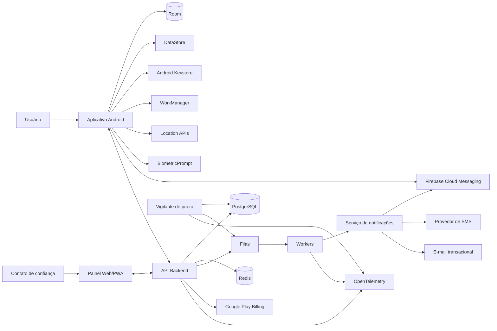
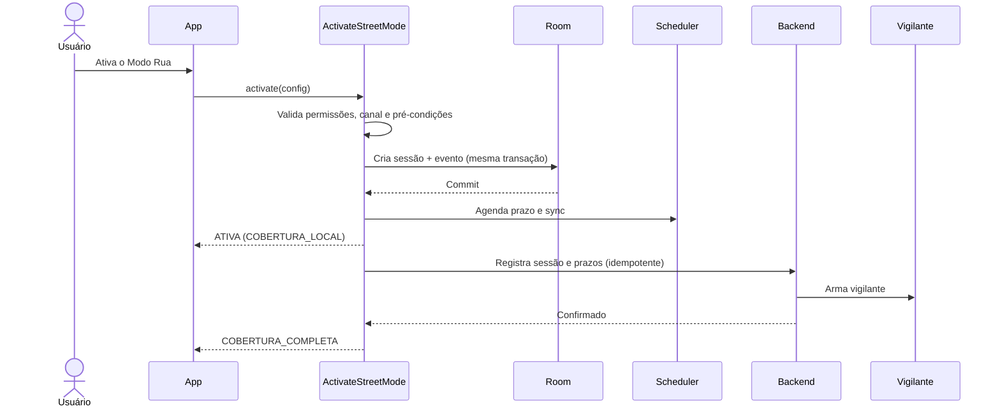
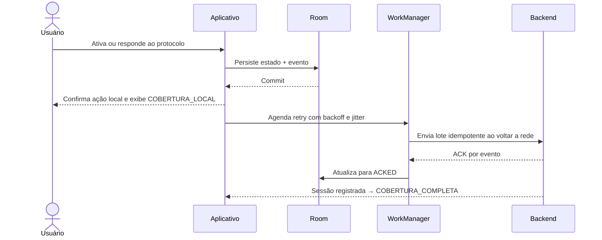
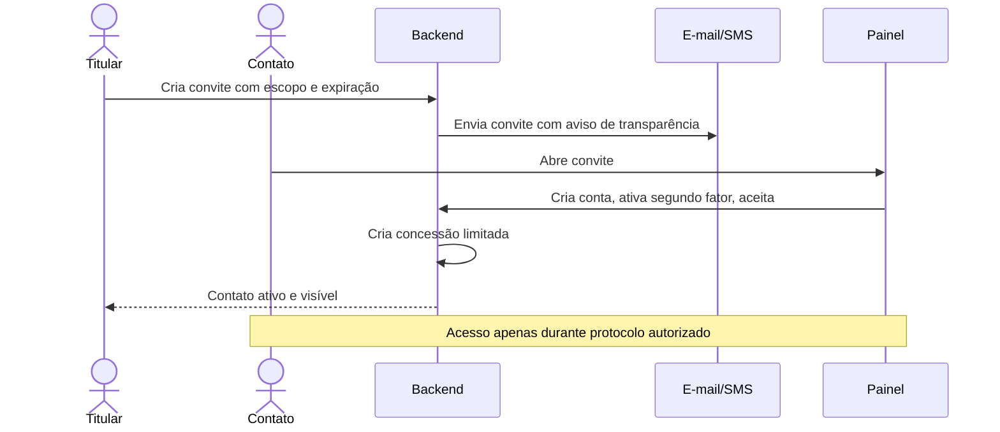
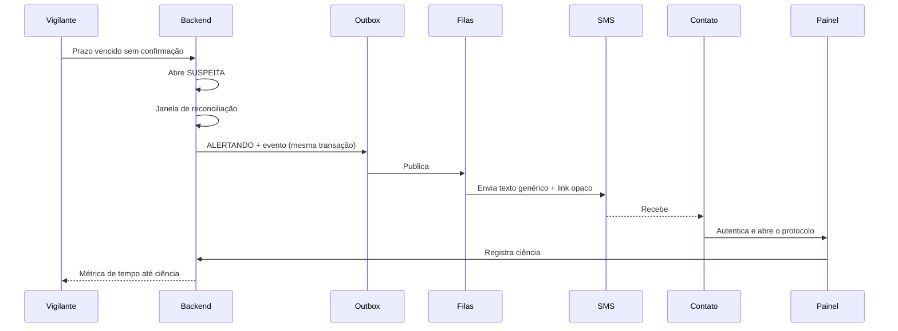

# Documento 2 — Arquitetura Técnica

## 1. Identificação

**Projeto:** Plataforma móvel de proteção pós-roubo
**Nome provisório:** Modo Rua
**Versão:** 2.1 | **Substitui:** versão 1.0, o Adendo A (aqui incorporado) e a versão 2.0
**Status:** Vigente
**Alteração da 2.1:** correções da segunda rodada de revisão (ARB2-001 a ARB2-033, MOD-01, MOD-02, ADD-01 a ADD-07). A numeração de seções da v1.0 permanece preservada; todo conteúdo novo entra como subseção.
**Plataforma inicial:** Android nativo
**Posição na hierarquia:** nível 5 (Documento 4, núcleo §0)

A numeração de seções da versão 1.0 foi **preservada** para não quebrar as referências dos módulos do Documento 4. Seções cujo conteúdo foi substituído mantêm o número original.

Itens marcados **[ABERTO — FASE 0]** não são lacuna: são decisões deliberadamente não tomadas, que só se fecham por ADR com base em medição.

---

# 2. Objetivo arquitetural

A arquitetura sustenta um produto que precisa continuar útil quando o aparelho está bloqueado, sem rede, com processo encerrado, com notificação atrasada, sob fabricante agressivo com bateria, com eventos duplicados ou fora de ordem, com o contato em outro dispositivo, e quando o usuário perde o acesso ao aparelho principal.

O núcleo não é um CRUD: é um **sistema distribuído, orientado a eventos, offline-first e tolerante a falhas parciais**, com duas autoridades distintas — o aparelho, sobre a sessão; o servidor, sobre a emergência.

Prioridades, nesta ordem: confiabilidade; segurança; rastreabilidade; funcionamento offline do que é local; baixo consumo; privacidade; simplicidade operacional; capacidade de evolução; testes em aparelhos reais; aderência às políticas da Google Play.

---

# 3. Glossário canônico

Termo único por conceito. Substitui a seção de personas técnicas da versão 1.0.

| Termo em produto | Identificador em código | Definição |
|---|---|---|
| Modo Rua | `street_mode` | Modo operacional ativado pelo usuário; não é estado de emergência |
| Sessão | `StreetModeSession` | Uma ativação, do início ao encerramento |
| Check-in | `CheckIn` | Pedido e confirmação periódica |
| Confirmação forte | `strong_confirmation` | Confirmação autenticada por biometria **ou pelo credencial de tela de bloqueio do aparelho**, e assinada por `K_confirmacao` (§16.8). Um PIN interno do aplicativo não satisfaz a exigência de autenticação de chave do Keystore (§14.3) |
| Protocolo | `EmergencyProtocol` | Máquina de emergência do servidor; única autoridade sobre terceiros |
| Orientação pós-roubo | `recovery_guide` | Roteiro de instruções; nunca chamado de protocolo |
| Cobertura | `coverage_state` | Se o servidor conhece a sessão e vigia o prazo |
| Vigilante | `deadline_watchdog` | Componente do servidor que avalia prazos vencidos |
| Nível de coleta | `location_tier` | `economico`, `elevado`, `emergencial` |
| Contato de confiança | `TrustedContact` | Pessoa convidada e aceita; nunca administrador |
| Concessão | `Grant` | Autorização temporária e escopada |
| Instalação | `Installation` | Uma instalação do app; identidade técnica |
| Aparelho | `Device` | Agrupamento lógico de instalações no mesmo hardware |
| Chave de confirmação | `K_confirmacao` | Chave do Keystore que assina confirmação de check-in e encerramentos autenticados; exige autenticação a cada uso (§14.3, §16.8) |
| Sem ciência | `SEM_CIENCIA` | Estado do protocolo em que a cascata se esgotou sem ciência de nenhum contato; observável, reversível, e não afirma nada sobre o titular (§10.2) |
| Cobertura indisponível | `COBERTURA_INDISPONIVEL` | Estado de cobertura de build sem backend, exclusivo da Fase 1; nenhum contato será avisado, e não há conexão que mude isso (§11.1, §11.2) |

**Termos abolidos:** "Dead Man Switch", "Modo Suspeito", "nível suspeito", "modo protegido", "destruição progressiva", "painel remoto" (usar "painel web").

---

# 4. Decisões arquiteturais principais

## 4.1 Aplicativo Android nativo

Kotlin nativo, por acesso direto às APIs, controle de ciclo de vida, previsibilidade em serviços, bateria e capacidade de investigar falhas sem camada intermediária. Frameworks híbridos não são usados no núcleo.

## 4.2 Interface com Jetpack Compose

UI declarativa, fluxo unidirecional, integração com ViewModel e StateFlow, testes de componente.

## 4.3 Backend como monólito modular

NestJS com TypeScript. Separação lógica desde o início, permitindo extração posterior. Microserviços antecipados aumentariam custo, complexidade, latência, superfície de falha e trabalho de infraestrutura sem benefício nesta escala.

## 4.4 Banco relacional

PostgreSQL, por transações, integridade referencial, índices, JSONB, RLS, particionamento declarativo, maturidade e backups.

## 4.5 Duas garantias distintas

Esta seção substitui "arquitetura offline-first" da versão 1.0 e é a decisão mais consequente do documento.

| Garantia | Cobre | Depende do backend |
|---|---|---|
| **Local** | ativar Modo Rua, iniciar temporização, criar check-in, registrar ausência, armazenar evento, atualizar estado local, exibir instruções básicas | Não |
| **Externa** | avisar contatos, abrir protocolo, exibir painel, escalonar, cobrar, consolidar histórico | **Sim, sempre** |

O banco local continua sendo a fonte imediata da interface e da máquina de estados do aparelho. O que mudou é a honestidade sobre o limite: **a ausência de resposta só produz efeito externo se o servidor souber que a sessão existe**. Por isso o estado de cobertura (§11.1) é obrigatório na interface, e por isso o registro da sessão no servidor é tentado imediatamente na ativação.

## 4.6 Eventos como registros imutáveis

Eventos críticos são append-only: `street_mode_activated`, `check_in_requested`, `check_in_confirmed`, `check_in_missed`, `coverage_changed`, `location_sampled`, `clock_jump_detected`, `local_key_invalidated`, `protocol_opened`, `protocol_escalated`, `trusted_contact_notified`, `contact_acknowledged`, `account_recovered`. Evento persistido nunca é alterado; correção é novo evento.

## 4.7 Modelo de identidade

```text
User (conta)  1 ──── N  Device (aparelho)  1 ──── N  Installation (instalação)
```

- **`installation_id`**: UUIDv4 gerado no primeiro início. Gravado em diretório excluído do backup. **Nunca reutilizado, nunca restaurado.** A exclusão exige os **dois** mecanismos, porque o `minSdk` é 30: `android:fullBackupContent` para API ≤ 30 e `android:dataExtractionRules` para API ≥ 31, este último com `<cloud-backup>` **e** `<device-transfer>` declarados. `dataExtractionRules` é formato de API 31+ e não protege aparelhos no `minSdk`; `<device-transfer>` omitido transfere **todos** os dados do aplicativo em migração aparelho-a-aparelho. Fonte: Android Developers, *Back up user data with Auto Backup*. Lista de exclusões idêntica nos dois arquivos, verificada por lint (Documento 4, §11).
- **`device_id`**: atribuído pelo servidor no registro da primeira instalação. Vinculação de instalação nova a um `device` existente só por ação autenticada do usuário; na dúvida, cria `device` novo.
- **`device_ref`** (observabilidade): `HMAC(installation_id, chave_de_pseudonimizacao)`. Determinístico, não reversível fora do sistema.
- **MVP: um `device` ativo por `User`.** Troca de aparelho exige elevação de autenticação, revoga a instalação anterior, rotaciona chaves e encerra **sessões de autenticação**. Sessões concorrentes são impedidas por construção.
- **A troca de aparelho não encerra `StreetModeSession` ativa nem protocolo aberto.** Regra espelhada na de cobrança (§27): o prazo já registrado permanece armado sob a sessão anterior até transição autenticada do titular, e a instalação nova **não herda** a sessão. Motivo: o caminho normal do produto é ser roubado, comprar aparelho novo e vincular enquanto o protocolo está aberto — vincular não pode desarmar o vigilante durante o roubo. Teste obrigatório na Fase 2.
- **Entitlement** pertence ao `User`, não à conta Google e não ao `device`.
- **Dados pré-conta:** a instalação anônima é titular local dos próprios dados. Na criação da conta, o vínculo é perguntado explicitamente; recusa implica descarte local registrado em evento. Não existe vinculação implícita.

---

# 5. Princípios arquiteturais

1. **Local first** para a garantia local; explícito sobre a garantia externa.
2. **At-least-once:** mensagens podem chegar mais de uma vez.
3. **Idempotência:** duplicatas não repetem efeitos.
4. **Consistência eventual:** painel e aparelho convergem após atraso, e o atraso é visível.
5. **Fail-safe:** falha nunca gera ação destrutiva.
6. **Menor privilégio** em permissões e acessos.
7. **Privacy by design:** coletar o mínimo, reter o mínimo, local e remotamente.
8. **Observabilidade sem vazamento.**
9. **Configuração remota limitada:** regra remota nunca executa comportamento arbitrário.
10. **Versionamento** de API, eventos e schemas.
11. **Rollback** em toda publicação.
12. **Separação de domínio e infraestrutura.**
13. **Testabilidade:** relógio, localização, rede e notificações abstraídos.
14. **Sem falsa garantia:** push, GPS e execução em segundo plano são best-effort declarado.
15. **Progressividade e reversibilidade** do protocolo.

---

# 6. Visão geral de componentes



---

# 7. Stack recomendada

**Android:** Kotlin; Compose; Material 3; Navigation Compose; Coroutines; StateFlow; Hilt; Room; Proto DataStore; WorkManager; Retrofit ou Ktor Client; Kotlin Serialization; AndroidX Biometric; Android Keystore; FCM; Google Play Billing; Detekt; Ktlint; Version Catalog; Baseline Profiles; Macrobenchmark.

**Backend:** Node.js LTS; TypeScript; NestJS; PostgreSQL; Redis; BullMQ ou fila gerenciada equivalente; Prisma ou TypeORM com SQL explícito nas consultas críticas; OpenAPI; OpenTelemetry; plataforma de erros; object storage compatível com S3; Docker.

**Painel:** Next.js; TypeScript; React; TanStack Query; provedor de mapa abstraído; CSP rigorosa; PWA.

**Infraestrutura:** aplicação em plataforma gerenciada; PostgreSQL e Redis gerenciados; object storage; CDN/WAF; gerenciador de segredos; provedor de SMS brasileiro; CI/CD em GitHub Actions; Terraform após estabilização. A arquitetura evita dependência irreversível de um único provedor.

Play Integrity **não** integra o núcleo (§37).

---

# 8. Estrutura modular Android

```text
android/
├── app/
├── build-logic/
├── core/
│   ├── common/ model/ designsystem/ ui/
│   ├── network/ database/ datastore/
│   ├── security/ location/ notifications/ analytics/ testing/
├── domain/
│   ├── streetmode/ emergency/ trustedcontacts/ account/ subscription/
├── feature/
│   ├── onboarding/ authentication/ home/ streetmode/ checkin/
│   ├── emergency/ contacts/ history/ account/ subscription/
└── sync/
    ├── engine/ workers/
```

**Regras de dependência:** `feature` depende de `domain` e `core`; `domain` depende apenas de Kotlin puro, `core:common` e `core:model`, e não importa `android.*`, Room, Retrofit ou SDKs; a UI não acessa `core:network` nem `core:database`; entidades Room e DTOs nunca chegam à UI; SDK externo é encapsulado; dependência circular é proibida; `app` apenas compõe DI e navegação. A verificação é feita pelo Gradle e falha o build (Documento 4, §11).

---

# 9. Camadas do aplicativo

**Apresentação:** Composables stateless, navegação, `UiState` por tela incluindo estado degradado, acessibilidade.

```text
Composable → ViewModel → Use Case → Repository
```

Estado retorna por `StateFlow`.

**Domínio:** regras independentes do Android. Objetos centrais: `StreetModeSession`, `CheckIn`, `CoverageState`, `TrustedContact`, `Grant`, `DeviceRegistration`, `SubscriptionEntitlement`, `SecurityEvent`.

**Dados:** repositórios, banco local, API, sync, mapeamento de DTO, filas locais.

**Plataforma:** localização, notificações, relógio, WorkManager, biometria, Keystore, conectividade, bateria, boot receiver, FCM, Billing — todos substituíveis por fakes.

---

# 10. Máquinas de estado canônicas

São **duas**, com autoridades distintas. O aparelho nunca decide emergência; o servidor nunca decide sessão. Esta seção é a única fonte de estados do projeto.

## 10.1 `StreetModeSession` — aparelho

Estados: `INATIVA`, `ATIVANDO`, `ATIVA`, `DEGRADADA`, `AGUARDANDO_CONFIRMACAO`, `ENCERRANDO`, `ENCERRADA`.

| # | Estado | Evento | Novo estado | Efeitos |
|---|---|---|---|---|
| 1 | INATIVA | `ativar` | ATIVANDO | grava sessão local |
| 2 | ATIVANDO | `precondicoes_ok` | ATIVA | agenda prazo; tenta registrar no servidor |
| 3 | ATIVANDO | `permissoes_parciais` | DEGRADADA | idem, com capacidades reduzidas declaradas |
| 4 | ATIVANDO | `canal_de_notificacao_ausente` | INATIVA | recusa explicada, com atalho para configurações |
| 5 | ATIVA \| DEGRADADA | `prazo_de_checkin` | AGUARDANDO_CONFIRMACAO | emite `check_in_requested`; notifica |
| 6 | AGUARDANDO_CONFIRMACAO | `confirmacao_forte` | ATIVA | emite `check_in_confirmed` com `next_deadline_at` |
| 7 | AGUARDANDO_CONFIRMACAO | `graca_expirada` | ATIVA | emite `check_in_missed`. **Não escala** |
| 8 | ATIVA \| DEGRADADA | `permissao_alterada` | DEGRADADA \| ATIVA | evento; recalcula capacidades |
| 9 | ATIVA \| DEGRADADA \| AGUARDANDO_CONFIRMACAO | `encerramento_autenticado` | ENCERRANDO | exige confirmação forte |
| 10 | ENCERRANDO | `encerramento_sincronizado` | ENCERRADA | emite `session_ended` |
| 10a | ENCERRANDO | `timeout` **[PENDENTE — DECISÃO DO FUNDADOR]** | ver §10.4 | o encerramento local sem ACK do servidor deixa o vigilante armado sobre um prazo legitimamente encerrado |
| 11 | qualquer | `boot` \| `processo_recriado` | recalculado | reidrata do Room e reavalia prazos vencidos |

Transição inválida gera `invalid_transition_detected` e nunca é ignorada em silêncio.

A linha 7 é a diferença central em relação à versão 1.0: o aparelho registra a ausência; quem decide o que ela significa é o servidor.

## 10.2 `EmergencyProtocol` — servidor

Estados: `NORMAL`, `SUSPEITA`, `RETIDO`, `ALERTANDO`, `SEM_CIENCIA`, `EMERGENCIA`, `FALSO_POSITIVO`, `RESOLVIDO`.

| # | Estado | Evento | Novo estado | Efeitos |
|---|---|---|---|---|
| 1 | NORMAL | `vigilante_detecta_ausencia` | SUSPEITA | abre protocolo; **não notifica ninguém** |
| 2 | NORMAL | `acionamento_manual_do_titular` | ALERTANDO | caminho mais confiável; ignora suspeita |
| 3 | NORMAL | `simulacao_iniciada` | ALERTANDO (`modo_teste=true`) | mensagens marcadas; fora das métricas, da linha de base **e do denominador** da guarda de anomalia (§18.7.1) |
| 4 | SUSPEITA | `confirmacao_tardia_do_titular` | FALSO_POSITIVO | registra causa |
| 5 | SUSPEITA | `janela_de_reconciliacao_esgotada` | ALERTANDO | enfileira cascata de canais |
| 6 | SUSPEITA \| ALERTANDO | `anomalia_correlacionada` | RETIDO | suspende acionamento externo; titular e painel seguem informados |
| 7 | RETIDO | `liberacao_humana` | ALERTANDO | registra operador e motivo |
| 8 | RETIDO | `falha_sistemica_confirmada` | FALSO_POSITIVO | registra incidente |
| 9 | ALERTANDO \| SEM_CIENCIA | `confirmacao_autenticada_do_titular` | FALSO_POSITIVO | notifica contatos do encerramento |
| 10 | ALERTANDO \| SEM_CIENCIA | `confirmacao_de_roubo_pelo_titular` | EMERGENCIA | libera orientação e compartilhamento ampliado |
| 11 | ALERTANDO | `escalonamento_por_tempo` | EMERGENCIA | progressivo, nunca destrutivo |
| 12 | ALERTANDO \| SEM_CIENCIA \| EMERGENCIA | `encerramento_autenticado_do_titular` | RESOLVIDO | revoga concessões ativas |
| 13 | RESOLVIDO | `janela_de_retencao_encerrada` | NORMAL | mantém histórico |
| 14 | ALERTANDO | `teto_de_alertando_atingido_sem_ciencia` | SEM_CIENCIA | encerra a cascata; informa o titular por e-mail e painel; mantém o protocolo aberto e reversível |
| 15 | SEM_CIENCIA | `ciencia_do_contato` | ALERTANDO | retoma a cascata do ponto em que parou; registra ciência e o intervalo sem ciência |
| — | qualquer estado exceto SEM_CIENCIA | `ciencia_do_contato` | sem mudança | registra ciência |

`SEM_CIENCIA` tem três saídas (linhas 9, 10 e 12) mais o retorno da linha 15. Não é terminal, e a tabela agora sustenta a afirmação — na primeira redação desta correção nenhuma linha saía dele, o que fazia do estado criado para *não* ser terminal o único terminal absoluto da máquina.

**Comportamento terminal de `ALERTANDO` (ARB2-025).** A versão 2.0 mandava escalar "para o próximo contato na ordem definida pelo titular" (§25.2) sem que existisse um segundo contato no MVP nem uma funcionalidade de ordenação. Regras agora explícitas:

- teto de tentativas por canal e teto de duração de `ALERTANDO`, ambos com valor provisório declarado, de propriedade do ADR-0005;
- esgotados os tetos sem ciência de ninguém, o protocolo vai para `SEM_CIENCIA` (linha 14) — estado observável, não terminal, que não fecha o protocolo e não afirma nada sobre o titular;
- a métrica "tempo até a primeira ciência" registra explicitamente o caso sem ciência, em vez de ficar indefinida;
- `escalonamento_por_tempo` → `EMERGENCIA` (linha 11) só "libera orientação e compartilhamento ampliado" **se houver ao menos uma ciência registrada**. Sem audiência, ampliar compartilhamento não protege ninguém e aumenta exposição.

**Quantos contatos no MVP [PENDENTE — DECISÃO DO FUNDADOR].** Opção 1: um contato, e a escalada entre contatos sai do §25.2 — menor escopo, e o produto fica dependente de uma única pessoa estar disponível. Opção 2: múltiplos contatos com ordem definida pelo titular, escopados na Fase 3 — mais robusto no cenário real (contato dormindo, número trocado) e acrescenta convite múltiplo, ordenação, antiabuso por contato e custo de SMS multiplicado. O texto atual assume a opção 2 sem a ter escopado; até a decisão, o §25.2 opera com um contato e a linha 14 é o terminal.

## 10.3 Precedência

1. Confirmação ou encerramento autenticado do titular
2. Ação de operador registrada (apenas `RETIDO` → `ALERTANDO`)
3. Automação do vigilante
4. Inferência do aparelho

Empate irresoluto vai para o estado mais seguro e reversível. Nunca `last-write-wins`. **Nenhum caminho de código permite que um contato cause transição de estado.**

### 10.4 Encerramento offline — alerta fantasma [PENDENTE — DECISÃO DO FUNDADOR]

A versão 2.0 permitia `ENCERRANDO → ENCERRADA` por `timeout`: o aparelho desistia de esperar a sincronização e considerava a sessão encerrada. O servidor, que nunca recebeu `session_ended`, mantinha o vigilante armado. Resultado: **o contato é acionado por causa de uma sessão que o titular encerrou corretamente** — o espelho do §4.7, na direção mais embaraçosa possível, porque o produto alerta sobre alguém que está bem e que fez tudo certo.

Três saídas. Nenhuma é gratuita; a escolha é de produto e está pendente.

| Opção | Como funciona | Custo | Limitação residual |
|---|---|---|---|
| **A — sem ACK não encerra** | O estado local permanece em `ENCERRANDO`, visível ao usuário ("Encerrando: aguardando confirmação do servidor"), até o ACK chegar. `timeout` deixa de existir como transição terminal | O usuário que encerra no metrô vê um estado intermediário até voltar a ter rede, e pode achar que não conseguiu encerrar | Se o aparelho nunca voltar a ter rede, o alerta ocorre. O usuário foi informado de que ainda não estava encerrado |
| **B — vigilante exige liveness** | Prazo vencido **sem heartbeat recente** vira verificação dirigida ao titular por e-mail e painel antes de acionar contato (mesmo mecanismo do §12.4, item 3) | Acrescenta um degrau de latência a todo alerta de aparelho inalcançável — que é o cenário principal do produto | Enfraquece exatamente o caso que justifica o vigilante: aparelho desligado por roubo também não tem heartbeat |
| **C — encerramento assinado retroativo** | O encerramento offline gera evento **assinado** (§16.8) que o servidor aceita quando chegar; alerta emitido no intervalo é retratado ao contato com mensagem própria | Exige mensagem de retratação ao contato, que é custo de confiança e de SMS | O contato já foi mobilizado. Retratar reduz o dano, não o elimina |

Recomendação técnica desta revisão: **A**, porque é a única que não introduz latência no caminho principal nem mobiliza terceiros indevidamente, e porque o custo dela é informação honesta ao usuário — que é o padrão do resto do produto.

**Default provisório enquanto a decisão não é tomada: comportamento da opção A**, isto é, `timeout` não é transição terminal e o estado permanece em `ENCERRANDO` visível ao usuário. Isso é interino e está declarado como tal: não é a decisão, é o comportamento seguro na ausência dela, e o agente não deve lê-lo como escolha feita. A decisão é do fundador e continua **[PENDENTE]** — se for B ou C, este parágrafo é substituído.
---

# 11. Ativação e cobertura



**Regra crítica:** a ativação é concluída na persistência local. Falha de rede não impede ativar, e **não é escondida**.

## 11.1 Estado de cobertura

| Estado | Significado | Texto obrigatório na interface |
|---|---|---|
| `COBERTURA_COMPLETA` | servidor conhece a sessão; vigilante armado | "Proteção completa" |
| `COBERTURA_LOCAL` | ativada sem alcançar o servidor | **"Proteção reduzida: seus contatos não serão avisados até o aplicativo conseguir conexão"** |
| `COBERTURA_SUSPENSA` | sessão registrada no servidor, comunicação interrompida depois | **"Sem comunicação com o servidor desde HH:MM. O aviso aos seus contatos segue armado pelo prazo já registrado."** |
| `COBERTURA_INDISPONIVEL` | build sem backend (Fase 1) — não existe servidor para alcançar | **"Esta versão não avisa contatos. Nenhuma pessoa será notificada se você não responder."** |

**A distinção que decide o texto é uma só:** o servidor sabe da sessão? Se não sabe (`COBERTURA_LOCAL`), a ausência de resposta não produz efeito externo e o aviso diz isso. Se sabe (`COBERTURA_SUSPENSA`), o vigilante está armado e **vai** escalar — inclusive porque o aparelho ficou inalcançável (Documento 3, §14.3 e §17.3). Usar o texto de `COBERTURA_LOCAL` em `COBERTURA_SUSPENSA` informa ao usuário que a função central não funciona exatamente no estado em que ela mais funciona. Subprometer aqui é indução a erro na mesma medida que superprometer (Documento 1, §3.1.1).

Toda mudança de cobertura gera evento `coverage_changed`. Cobertura não exibida ao usuário, **ou exibida com texto que não corresponde ao estado**, é bloqueador de release (Documento 3, §51).

## 11.2 Transições de `coverage_state`

Tabela canônica. Cobertura é estado visível, com texto normativo e bloqueio de release: recebe a mesma formalização das máquinas do §10, e a obrigação de teste da Fase 1 ("todas as transições da tabela canônica") passa a alcançá-la.

| # | Estado | Evento | Novo estado | Efeitos |
|---|---|---|---|---|
| 1 | — | `sessao_ativada_sem_registro` | COBERTURA_LOCAL | grava evento; agenda retry de registro |
| 2 | COBERTURA_LOCAL | `registro_confirmado_pelo_servidor` | COBERTURA_COMPLETA | vigilante armado; atualiza interface |
| 3 | COBERTURA_COMPLETA | `silencio_de_comunicacao_excedido` | COBERTURA_SUSPENSA | exibe horário da última comunicação; **não** desarma nada no servidor |
| 4 | COBERTURA_SUSPENSA | `comunicacao_restabelecida` | COBERTURA_COMPLETA | sincroniza pendências; recalcula prazos |
| 5 | COBERTURA_LOCAL \| COBERTURA_SUSPENSA | `perda_de_capacidade_de_disparo_local` | mantém o estado, com capacidade reduzida declarada | evento imediato ao servidor (§12.4, item 6) |
| 6 | qualquer | `sessao_encerrada` | — | encerra a exibição de cobertura |
| 7 | — | `ativacao_em_build_sem_backend` | COBERTURA_INDISPONIVEL | **constante de build**: entra por configuração, não tem transição de saída e é mutuamente exclusivo dos demais estados. Exclusivo da Fase 1 |

**Parâmetro de temporização.** A transição 3 dispara após `silencio_maximo_de_comunicacao`, derivado da cadência de heartbeat (§18.7, item 6): valor provisório **três intervalos de heartbeat consecutivos sem sucesso**, declarado como provisório e de propriedade do **ADR-0005**. O aparelho é quem decide a transição 3, com base na sua própria última comunicação bem-sucedida; o servidor nunca envia comando (§37.2).

**Combinação com a máquina da sessão.** Cobertura e estado de sessão (§10.1) são eixos ortogonais. Combinações válidas e o que a interface diz:

| Sessão | Cobertura | Texto |
|---|---|---|
| ATIVA | COMPLETA | "Proteção completa" |
| ATIVA | LOCAL / SUSPENSA | texto da cobertura, com a sessão descrita como ativa |
| DEGRADADA | qualquer | texto da cobertura **mais** a capacidade que falta, nomeada |
| AGUARDANDO_CONFIRMACAO | qualquer | pedido de confirmação em primeiro plano; cobertura secundária |
| ENCERRANDO | LOCAL / SUSPENSA | "Encerrando: aguardando confirmação do servidor" (ver §10.1, linha 10) |
| INATIVA \| ENCERRADA | — | cobertura não é exibida |
| qualquer | INDISPONIVEL | texto próprio de build sem backend; nenhum outro estado de cobertura é alcançável nesse build |

---

# 12. Temporização

## 12.1 Papel de cada erro

| Falha | Consequência | Controlada por |
|---|---|---|
| Disparo local atrasado | **Falso positivo** — o usuário não foi perguntado a tempo | Precisão do agendador no aparelho + período de graça |
| Aparelho não reporta | **Detecção perdida** | Vigilante do servidor (§18.7) |

Os dois erros são opostos e se ajustam por parâmetros independentes. É por isso que a precisão do agendador deixou de ser risco existencial e passou a ser parâmetro de qualidade.

## 12.2 Candidatos [ABERTO — FASE 0]

| Candidato | Tipo de FGS | Timeout de 6 h/24 h? | Pode subir de `BOOT_COMPLETED`? | Exige declaração e vídeo na loja? | Sujeita WorkManager a cota? | A favor | Contra |
|---|---|---|---|---|---|---|---|
| Foreground service de sessão | `location` | **Não** | **Sim** — `location` não está na lista de tipos proibidos | Sim (tipo + localização em segundo plano) | **Sim**, se os jobs partirem do FGS | Precisão; processo vivo; notificação persistente | Bateria; exige `ACCESS_BACKGROUND_LOCATION` para criar em segundo plano |
| Foreground service de sessão | `dataSync` | **Sim — 6 h por 24 h, com exceção fatal ao estourar** | **Não** | Sim | **Sim** | Não exige permissão de localização | **Inviável para sessão longa e para retomada pós-boot** |
| Foreground service de sessão | `specialUse` | Não documentado | A confirmar | Sim, com subtipo declarado e **sujeito a revisão da Play** | **Sim** | Cobre uso não previsto nos demais tipos | Dependência de aprovação, não só de medição |
| `AlarmManager` exato | — | — | — | Declaração de `SCHEDULE_EXACT_ALARM` | Não | Precisão sem serviço contínuo | Permissão negada por padrão em instalações novas, **revogável pelo usuário e pelo sistema**, e a revogação **cancela os alarmes já agendados** (§12.4, item 6) |
| `WorkManager` + reavaliação em eventos do sistema | — | — | — | Nenhuma adicional | Sujeito às cotas ordinárias | Sem permissão adicional | Sem garantia de precisão ao minuto; **sem notificação persistente** (ver acoplamento abaixo) |

**Restrições de plataforma que a tabela reflete** (fontes em §43): apps que alvejam Android 15+ têm `dataSync` e `mediaProcessing` limitados a 6 h em 24 h, com `Service.onTimeout()` e exceção fatal se o serviço não parar; receptores de `BOOT_COMPLETED` não podem subir `dataSync`, `camera`, `mediaPlayback`, `phoneCall`, `mediaProjection` e `microphone` — `location` **não** está proibido; e, em Android 16+, **para todo aplicativo, independente do `targetSdk`**, jobs iniciados a partir de um serviço em primeiro plano passam a obedecer às cotas de execução, **incluindo os criados por WorkManager**.

**Acoplamento com a política de loja, que a decisão não pode ignorar.** A política de aplicativos de monitoramento exige notificação persistente **todo o tempo em que o aplicativo está em execução**, ícone único e divulgação da funcionalidade na descrição da loja. Se o parecer de classificação (§34.6) concluir que o produto se enquadra — o painel expõe a um terceiro a localização de outra pessoa —, o candidato `WorkManager` puro está **eliminado por política**, não por precisão, porque não sustenta notificação persistente. Por isso o parecer é produzido **antes** do ADR-0007, e não depois.

Decisão por **ADR-0007**, após a Fase 0 medir, por fabricante e por estado de bateria: atraso de disparo (p50/p95/p99), sobrevivência a reboot, sobrevivência a force-stop, custo de bateria, comportamento do tipo escolhido ao aproximar-se de qualquer timeout aplicável, e **latência de execução de worker com o FGS ativo versus sem ele, em Android 16 e 17**. `WorkManager` é a base sempre presente para trabalho diferível: sync, retries, token FCM, limpeza e recuperação pós-boot — sob cota quando disparado a partir de um FGS.

**Texto de produto válido até a decisão:** "O aplicativo pede confirmação em intervalos que você define. O sistema Android pode atrasar esse pedido; por isso existem um período de tolerância e uma verificação no nosso servidor."

## 12.3 Bases de tempo

Todo prazo persiste **três** valores: `deadline_wall_utc`, `deadline_elapsed_ms` e `boot_id`.

- `boot_id` igual ao atual → avalia por relógio monotônico.
- `boot_id` diferente → avalia por tempo de parede, com detecção de salto comparando o delta de parede ao delta monotônico desde o último ponto de sincronismo.
- Salto detectado emite `clock_jump_detected` com a diferença medida.

Regra que substitui a proibição inexequível da versão 1.0: **temporização local é legítima; o proibido é ação externa ou irreversível decidida apenas pelo relógio do aparelho.** A autoridade sobre prazo vencido, para efeito externo, é do servidor.

## 12.4 Canal de notificação como pré-condição

1. Sem permissão de notificação **e** canal `check_in` habilitado, a sessão não inicia. Recusa explicada, com atalho. Isso não é bloquear o aplicativo.
2. O estado do canal é verificado a cada avaliação de prazo, não apenas na ativação.
3. Desativação durante a sessão gera evento imediato ao servidor. Com esse evento registrado, o **primeiro** escalonamento não aciona contato: vira verificação dirigida ao titular por e-mail da conta e pelo painel, com prazo próprio.
4. Somente a ausência de resposta também nessa verificação aciona o contato.

5. **Ação de notificação nunca conclui transição que exija confirmação forte.** A ação de confirmação antecipada na notificação persistente **abre** a tela de confirmação; não registra `check_in_confirmed`. Um toque em notificação é toque simples, e toque simples não conclui check-in (Documento 3, §13.3) — se concluísse, devolveria ao agressor com o aparelho desbloqueado a capacidade que a confirmação forte existe para remover, por um caminho mais curto que abrir o aplicativo. **Assimetria deliberada:** a ação de *acionamento manual de emergência* na mesma notificação pode ser um toque único, porque escala na direção segura e reversível. A assimetria é intencional e não é para ser "corrigida".
6. **Perda de capacidade de disparo local recebe o mesmo tratamento do canal desativado.** São eventos dessa classe: permissão de alarme exato revogada (pelo usuário **ou pelo sistema** — a revogação cancela os alarmes já agendados), isenção de bateria removida, tipo de serviço em primeiro plano indisponível, canal `check_in` desativado. Qualquer um deles gera evento imediato ao servidor, reduz a capacidade declarada na interface, e faz o **primeiro** escalonamento virar verificação dirigida ao titular em vez de acionamento de contato, com prazo próprio. Motivo: nessa classe de falha a temporização local não degrada, ela **desaparece** — e um prazo vencido por ausência de disparo é falso positivo garantido. Verificação a cada avaliação de prazo, como no item 2. A regra vale independentemente do resultado do ADR-0007; qual dos gatilhos existe depende dele. `VERIFICAR:` comportamento observado de revogação por sistema, medido na Fase 0.

Notificação em tela cheia não é premissa: desde **22/01/2025**, entre os aplicativos que alvejam Android 14 ou superior, a permissão correspondente vem habilitada por padrão apenas para os que têm funcionalidade de chamada ou de despertador; os demais precisam obtê-la do usuário. Fonte oficial: Play Console Help, *Understanding foreground service and full-screen intent requirements* (§43, ref. 22). A permissão continua **possível** com concessão explícita do usuário, e essa possibilidade não é premissa de nenhum fluxo: se um dia for usada, entra por ADR com o custo de fricção declarado. A visibilidade vem da notificação persistente da sessão, com tempo restante e ação de confirmação antecipada, nos termos do item 5.

## 12.5 Orçamento de latência ponta a ponta

O produto promete um tempo, e o tempo é uma soma. Cada termo era definido em uma seção diferente por um critério diferente, e nenhuma seção somava. Esta tabela é a soma, e o **ADR-0005** é dono dela.

| # | Termo | Valor | Onde é definido |
|---|---|---|---|
| 1 | Intervalo de confirmação | escolhido pelo usuário, entre limites de `policy_version` | §18.7, item 1; Documento 1, §8.2 |
| 2 | Período de graça (`grace_seconds`) | provisório, limitado no servidor | §18.7, itens 1 e 3 |
| 3 | Atraso de disparo do pedido local | medido; p99 por fabricante | §12.2; Documento 5, Fase 0 |
| 4 | `margem_de_rede` | **[ABERTO — FASE 0]**, mínimo = p99 do termo 3 | §18.7 |
| 5 | Atraso de execução do vigilante | SLO próprio, ver §29 | §18.7 |
| 6 | `janela_de_reconciliacao` | padrão 180 s, provisório | §18.7, item 4 |
| 7 | Outbox, fila e envio | SLO "alerta processado p95 < 10 s" | §20.1, §29 |
| 8 | Entrega do provedor de SMS | medido por operadora na Fase 0 | Documento 5, Fase 0 |
| 9 | **Reagendamento por indisponibilidade própria, com jitter** | aplicável **somente** ao caminho de recuperação; teto próprio, declarado no ADR-0005 | §18.7.1 |

O termo 9 não entra na soma do caminho normal — só existe depois de uma queda nossa. Ele tem teto separado porque a medição de ponta a ponta da Fase 4 inclui a "tempestade de recuperação" como cenário obrigatório, e medir um caminho contra um orçamento que não o contém não prova nada.

**Teto declarado.** A soma dos termos 2 a 8, no intervalo mínimo configurável, tem teto provisório declarado no ADR-0005 e é **medida de ponta a ponta** na Fase 4, do prazo vencido à primeira ciência do contato. Nenhum termo é calibrado isoladamente: reduzir a graça sem olhar a `margem_de_rede` troca detecção perdida por falso positivo, que é o par de erros opostos do §12.1.

**Comunicação.** O teto é número de engenharia. Nenhum material, tela ou peça declara minutos exatos enquanto a medição da Fase 0 não autorizar (Documento 1, §8.2).

---

# 13. Localização

## 13.1 Coleta por níveis

- **`economico`:** cerca de proximidade, última localização conhecida, baixa frequência.
- **`elevado`:** amostragem temporariamente mais frequente, precisão balanceada, duração limitada.
- **`emergencial`:** alta precisão quando permitida, serviço em primeiro plano visível quando exigido, **expiração automática**.

## 13.2 Dados armazenados

Latitude, longitude, precisão, timestamp, origem, nível e classe de retenção. Nada além disso. Nunca rota contínua por padrão.

## 13.3 Regras

Localização em segundo plano é função central declarada e explicada; permissões progressivas e em contexto; negação leva a modo degradado funcional; localização antiga é sempre marcada com idade e precisão e nunca apresentada como atual; o painel exibe idade, precisão e fonte.

## 13.4 Limites conhecidos

O Android limita atualizações em segundo plano e fabricantes limitam mais. Localização é dado eventualmente disponível, nunca garantia contínua. Cercas de proximidade têm latência da ordem de minutos e entram na matriz de capacidade da Fase 0.

---

# 14. Armazenamento local

## 14.1 Room

Sessões, check-ins, eventos, fila de sincronização, contatos, estados, localizações necessárias, configurações de domínio e recibos de processamento. Escrita de evento e de estado na mesma transação. Migrations versionadas e testadas. **`fallbackToDestructiveMigration` é proibido em produção.**

"Comandos remotos recebidos" foi **removido** do modelo (§37.2).

## 14.2 Proto DataStore

Preferências tipadas, flags, versão de onboarding e configuração de notificações. **Não** armazena identidade de instalação nem contador de sequência, porque participa de backup.

## 14.3 Hierarquia de chaves

A versão 2.0 especificava um mecanismo sem implementação possível: "o PIN interno autoriza o uso de `K_leitura`, cuja limitação de tentativas é imposta pelo hardware", combinado com a exigência de que o PIN interno fosse diferente do PIN do aparelho. No Android, a exigência de autenticação de uma chave do Keystore é satisfeita **apenas** por biometria ou pelo credencial de tela de bloqueio do próprio aparelho; um segredo do aplicativo não a satisfaz. Restavam derivar a chave do PIN (o PIN passa a ser chave — proibido em §41) ou contar tentativas em software (perde-se o hardware, que era a premissa). A hierarquia abaixo substitui aquele desenho.

**Três chaves, por artefato e não por assunto.**

| Chave | Configuração | Protege | Desbloqueio | Invalidável por novo cadastro biométrico |
|---|---|---|---|---|
| `K_dados` | Keystore, **sem** exigência de autenticação | Fila de saída pendente de ACK — **incluindo payload de amostras de localização ainda não sincronizadas** —, estado operacional, prazos, contador de `sequence` | não requer | **Não** |
| `K_leitura` | Keystore, `setUserAuthenticationRequired(true)`, `setUserAuthenticationParameters(0, BIOMETRIC_STRONG \| DEVICE_CREDENTIAL)` — **autenticação a cada uso, sem janela de validade** | Cofre, áreas seguras e **cache local do histórico vindo do servidor** — a fonte do histórico é o servidor (§14.4), e o que fica sob esta chave é apenas a cópia em cache, descartável | `BiometricPrompt` com credencial de dispositivo permitida | `VERIFICAR:` semântica de invalidação em chave que aceita `DEVICE_CREDENTIAL`; medir na Fase 0 |
| `K_confirmacao` | Keystore, EC P-256, `setUserAuthenticationRequired(true)`, autenticação a cada uso | Assina confirmação de check-in e encerramento autenticado (§16.8) | idem | idem |

**Por que autenticação a cada uso e não janela de tempo.** Uma janela de validade de autenticação faz com que quem está com o aparelho desbloqueado e recém-autenticado leia o histórico sem autenticar de novo — que é exatamente o cenário de referência do Documento 3, §13. Custo de experiência declarado: **cada abertura do histórico pede biometria ou o PIN do aparelho.** É o custo de o histórico não ser legível por quem tomou o aparelho.

**Por que a localização pendente fica sob `K_dados`.** A sincronização roda em worker, sem usuário presente. Chave que exige autenticação não pode ser usada por worker — a amostra ficaria ilegível para quem precisa enviá-la, e a localização de emergência nunca sairia do aparelho roubado. A fila inteira, incluindo coordenadas pendentes, fica sob `K_dados`.

**Ciclo de vida da amostra local (ADD-02):** capturada e cifrada sob `K_dados` → sincronizada → **apagada no ACK**. Não há reencriptação para `K_leitura` e não há amostra de localização armazenada sob `K_leitura`: o histórico legível vem do servidor, sob autenticação (§14.4). Isso elimina um job de rechaveamento, encurta a janela de exposição e remove a única razão pela qual amostras precisariam existir sob chave autenticada.

**Limitação declarada, que substitui a ilusão anterior:** entre a captura e o ACK, as coordenadas pendentes estão sob chave sem exigência de autenticação e são legíveis por quem controla o aparelho desbloqueado. O que limita essa exposição é a retenção do §14.4 ("24 h ou até ACK, o que vier primeiro") — que passa a ser **controle de segurança**, não regra de espaço em disco, e por isso o job de purga é funcionalidade crítica.

- Todo registro carrega `key_version`; rotação por job de releitura e regravação.
- Invalidação detectada emite `local_key_invalidated`, envia diagnóstico e solicita revinculação. **Nunca falha em silêncio.**
- StrongBox quando disponível; ausência é limitação declarada, não bloqueio.
- **O PIN interno não é chave e não desbloqueia chave.** O fallback de `K_leitura` e de `K_confirmacao` quando a biometria está indisponível — inclusive após reinício, cenário normal — é o **credencial de tela de bloqueio do aparelho**, cuja limitação de tentativas é, de fato, imposta pelo hardware.

**Exigência de tela de bloqueio segura [PENDENTE — DECISÃO DO FUNDADOR].** Sem tela de bloqueio configurada não existe chave protegida por autenticação, não existe confirmação forte e não existe proteção do histórico. Verificável por `KeyguardManager#isDeviceSecure()`. Opção 1: exigir no onboarding e recusar a ativação sem ela — protege o desenho inteiro e exclui a parcela do público brasileiro que não usa bloqueio de tela, no mercado em que o produto será lançado. Opção 2: permitir a operação sem bloqueio em modo degradado declarado, sem confirmação forte, sem histórico legível protegido e sem assinatura de confirmação — mantém alcance e cria uma classe de usuário para a qual o Documento 3 §13.3 não vale. A opção 1 é a recomendação técnica; a decisão é de produto e o dado de mercado precisa ser levantado na Fase 0. Até decidir, nenhum agente implementa nenhuma das duas.

**O que aconteceu com o PIN interno.** Ele deixa de ter papel criptográfico. Seu destino — segundo caminho de confirmação forte implementado como assinatura (§16.8), ou remoção do MVP — é parte da mesma decisão pendente, porque "PIN interno obrigatório no cadastro" (Documento 1, §15.1 e §21.1) hoje promete uma função que ele não sustenta.

## 14.4 Retenção local

| Dado local | Retenção |
|---|---|
| Amostras de rotina (`economico`) | 24 h ou até ACK, o que vier primeiro |
| Amostras de emergência | até o protocolo `RESOLVIDO` + 24 h |
| Eventos | até ACK + 7 dias |
| Histórico legível pelo usuário | vem do servidor, sob autenticação |
| Áreas seguras | centro arredondado, raio mínimo de 200 m, sob `K_leitura` |

**A amostra local é apagada no ACK, não reencriptada.** Não existe migração de amostra de `K_dados` para `K_leitura`: o histórico legível vem do servidor (§14.3). Job local de purga em WorkManager, classificado como funcionalidade crítica — e, por conta da janela de exposição do §14.3, é **controle de segurança**, não housekeeping.

Banco, identidade de instalação e material criptográfico são excluídos do backup pelos **dois** mecanismos exigidos pelo `minSdk` 30: `fullBackupContent` (API ≤ 30) e `dataExtractionRules` com `<cloud-backup>` e `<device-transfer>` (API ≥ 31). Ver §4.7.

---

# 15. Modelo local resumido

```text
street_mode_sessions
- id UUID, state, coverage_state, activated_at, ended_at
- configuration_json, created_at, updated_at

security_events
- event_id UUID, installation_id, session_id?, sequence BIGINT
- event_type, schema_version, occurred_at_utc, occurred_at_elapsed_ms, boot_id
- payload_encrypted (K_dados), key_version, sync_state, retry_count, created_at

check_ins
- id UUID, session_id, requested_at
- deadline_wall_utc, deadline_elapsed_ms, boot_id, grace_deadline_at
- confirmed_at?, confirmation_type?, attempt_count, state

location_samples
- id UUID, event_id?, latitude_encrypted (K_dados), longitude_encrypted (K_dados), key_version
- accuracy, captured_at, source, tier, retention_class
- (registro apagado no ACK; nenhuma amostra de localização é armazenada sob K_leitura)

sync_receipts
- event_id UUID, server_received_at, server_sequence?
```

---

# 16. Sincronização

## 16.1 Modelo

Domínio cria evento → evento salvo no Room → transação concluída → estado `PENDING` → WorkManager envia lote → servidor valida → ACK por evento → `ACKED`.

## 16.2 Envelope do evento

```json
{
  "event_id": "uuidv7",
  "installation_id": "uuid",
  "session_id": "uuid|null",
  "sequence": 128,
  "event_type": "check_in_missed",
  "schema_version": 1,
  "occurred_at_utc": "2026-07-25T22:31:04Z",
  "occurred_at_elapsed_ms": 90731044,
  "boot_id": "uuid",
  "payload": {}
}
```

`sequence` é contador por instalação, persistido no Room, iniciado em 1, que nunca reinicia. `occurred_at_utc` é informativo.

## 16.3 Idempotência

Chave natural `(installation_id, event_id)`, verificada na tabela `event_dedup` (§19.5). Reenvio devolve o mesmo ACK sem repetir efeito.

Toda operação mutante tem linha nesta tabela. Endpoint mutante sem linha é PR reprovada (Documento 4, §11) — a proibição do núcleo §6 é absoluta e por isso a tabela não pode ser parcial.

| Caso | Método e caminho | Mecanismo | Retenção |
|---|---|---|---|
| Ingestão de eventos | `POST /events/batch` | chave natural em `event_dedup` | ver §16.7 |
| Ativação e encerramento de sessão | `POST /street-mode/sessions`, `POST /street-mode/sessions/{id}/end` | `Idempotency-Key = session_id` | 7 dias |
| **Confirmação de check-in** | `POST /street-mode/sessions/{id}/checkin` | `Idempotency-Key = check_in_id` | maior que a janela de retry do aparelho |
| **Alteração de parâmetro de temporização** | `PATCH /street-mode/sessions/{id}/timing` | `Idempotency-Key` do cliente; a resposta devolve o `policy_version` vigente, para o aparelho não aplicar localmente valor que o servidor rejeitou | 24 h |
| **Atualização de instalação** | `PATCH /installations/{id}` | `Idempotency-Key` do cliente | 24 h |
| **Exclusão de conta** | `DELETE /me` | `Idempotency-Key` do cliente; repetição devolve o estado do pedido já registrado, nunca segundo pedido | 30 dias |
| **Heartbeat** | `POST /street-mode/sessions/{id}/heartbeat` | sem efeito acumulável por construção; repetição atualiza `last_seen_at` e nada mais | — |
| **Acionamento manual de emergência** | `POST /emergencies` | `Idempotency-Key` do cliente, **gerada antes do primeiro envio** e reusada em todo retry | 24 h |
| **Confirmação e encerramento de protocolo** | `POST /emergencies/{id}/confirm`, `POST /emergencies/{id}/resolve` | chave natural `(protocol_id, transição, actor)`; conflito resolvido pela precedência do §10.3, nunca por last-write-wins | 30 dias |
| **Ciência do contato** | `POST /emergencies/{id}/acknowledge` | chave natural `(protocol_id, contact_id)` | 30 dias |
| **Simulação de protocolo** | `POST /emergencies/simulate` | mesma regra do acionamento manual, mais o rate limit do §21.3 | 24 h |
| Convite, concessão, revogação | `POST /trusted-contacts/invites`, `POST /trusted-contacts/invites/{token}/accept`, `DELETE /trusted-contacts/{id}` | `Idempotency-Key` do cliente | 24 h |
| **Registro de token de push, transferência de aparelho** | `POST /installations/{id}/push-token`, `POST /devices/transfer` | `Idempotency-Key` do cliente | 24 h |
| **Recuperação e step-up** | `POST /auth/recovery/start`, `POST /auth/recovery/confirm`, `POST /auth/step-up` | token de uso único, que já é a garantia | — |
| Billing | `POST /billing/google-play/notifications` | id da notificação | 30 dias |

O caso mais sensível é o acionamento manual: é o caminho de emergência mais confiável do produto (Documento 1, §12), acionado por alguém em pânico, em rede ruim, com retry automático. Sem chave gerada **antes** do primeiro envio, dois envios viram dois protocolos e dois SMS.

Armazenar `(chave, usuário, hash do corpo, resposta)`. Repetição idêntica devolve a resposta original; mesma chave com corpo diferente devolve `409`.

## 16.4 Ordem

O servidor nunca decide por `occurred_at` do aparelho. Usa `sequence`, horário do servidor, `schema_version` e regras de reconciliação do domínio.

## 16.5 Conflitos

Resolvidos pela precedência do §10.3. Comandos e estados de emergência **nunca** por `last-write-wins`.

## 16.6 Detecção de lacunas

O servidor mantém, por instalação, `last_contiguous_sequence`, `highest_sequence` e `gaps`. Lacuna aberta além do limiar gera evento `SECURITY` e métrica; o painel exibe "período sem dados" em vez de omitir.

Teste obrigatório: enviar 1, 2, 4, 5 e provar a detecção; entregar o 3 atrasado e provar a reconciliação.

## 16.7 Idade máxima de evento aceita

A versão 2.0 definia a retenção de `event_dedup` como "maior que a janela máxima de retry" e, em §17, declarava que "evento crítico não expira por política genérica" — retenção maior que uma janela ilimitada é retenção infinita, em uma tabela que a §19.5 descreve como pequena.

- Existe **idade máxima de evento** aceita pelo servidor, medida por `server_received_at` (o servidor nunca decide por `occurred_at` do aparelho, §16.4). Valor provisório declarado: **30 dias**, de propriedade do ADR-0009.
- Evento acima da idade máxima é rejeitado com `EVENT_TOO_OLD`, registra lacuna (§16.6) e emite métrica. O aparelho descarta e registra evento local.
- `event_dedup` retém pelo mesmo prazo, o que a mantém pequena e limitada.
- A regra do §17 passa a ser: evento crítico não expira **dentro da idade máxima**. É o que se pode implementar.

## 16.8 Assinatura de eventos que alteram prazo ou estado de proteção

Motivo. O Documento 3, §7.2 promete detectar a falsificação de uma confirmação de check-in. Até a versão 2.0 o único controle era o prompt biométrico no cliente, e `confirmation_type` era campo **autodeclarado** no envelope: quem obtivesse o token de acesso do aparelho desbloqueado chamaria o endpoint diretamente, informando confirmação por biometria, sem nunca ver um prompt. A infraestrutura para o controle correto já existia sem uso — `device_keys` (§18.2, §19.1).

### Correção da v2.1 → v2.1.1: por que não existe nonce no caminho do check-in

A primeira redação desta seção exigia `nonce do servidor` na tupla assinada de **todos** os quatro eventos, inclusive a confirmação de check-in. Isso era uma contradição de requisito, não um detalhe: um nonce é, por definição, emitido pelo verificador, e a confirmação de check-in é justamente o ato que o núcleo §2.2 declara não poder depender de rede. Consequências que a redação anterior produzia: na Fase 1, que não tem backend, o critério de aceite era inatingível; em `COBERTURA_SUSPENSA` — o caso do metrô — o usuário legítimo não conseguiria confirmar, a graça expiraria e o vigilante acionaria o contato de alguém que confirmou corretamente.

Opções avaliadas e por que foram descartadas:

| Opção | Por que não |
|---|---|
| Nonce online por confirmação | Mata a garantia local. É a redação anterior |
| Lote de nonces emitido no registro da sessão | **Nenhum ganho de segurança** contra o atacante local: o lote fica no aparelho, e quem obtém um momento autenticado usa o cache exatamente como usaria sem ele. Acrescenta esgotamento offline, que reintroduz a quebra da garantia local por outra porta |
| Semente com derivação encadeada, ou contador temporal com segredo compartilhado | Idêntico ao lote: o segredo está no aparelho, os valores futuros são deriváveis |
| Remover a assinatura | Reabre o furo: quem tem o token confirma sem autenticar |

### 16.8.1 Mecanismo adotado

`K_confirmacao` (§14.3) é par EC P-256 no Keystore, com autenticação exigida a cada uso; a chave pública é registrada no vínculo da instalação (§18.2). O servidor **verifica** a assinatura, e `confirmation_type` passa a ser **derivado** da verificação em vez de declarado pelo cliente.

**Confirmação de check-in — sempre produzível offline.** Assinatura sobre material que o aparelho já possui:

```text
assinatura = Sign_K_confirmacao(
  installation_id, session_id, check_in_id, sequence,
  expected_next_checkin_at, boot_id,
  desafio_de_sessao?           // presente quando existe; ver 16.8.2
)
```

- **Proteção contra replay:** `event_dedup(installation_id, event_id)` (§19.5) já rejeita reenvio, e a linha de idempotência por `check_in_id` (§16.3) garante que uma assinatura capturada só satisfaz o check-in que ela nomeia, e só uma vez. Nenhum mecanismo novo, nenhuma tabela nova.
- **Ordem (corrigido na 4ª rodada — ARB4-001).** Antirreplay e ordenação são controles distintos e não se confundem: o antirreplay é a alínea acima, e é suficiente. `sequence` **não é critério de rejeição**. A confirmação assinada é **aceita** quando o `check_in_id` está sem uso e a `sequence` está dentro da janela de idade máxima do §16.7; quando a `sequence` não for contígua, o servidor **registra lacuna** (§16.6) e segue aceitando. `sequence` é monotônico por instalação e nunca reinicia (§16.2), e `highest_sequence` é grandeza **por instalação**, nunca por `check_in_id`.

  Motivo da correção: a redação anterior mandava rejeitar assinatura cuja `sequence` não avançasse "em relação ao `highest_sequence` conhecido para aquele `check_in_id`". Lida por `check_in_id`, a regra era vazia — a idempotência já admite uma única confirmação por `check_in_id`. Lida por instalação, rejeitava confirmação legítima fora de ordem, contra o §16.4, contra o **teste obrigatório** do §16.6 (enviar 1, 2, 4, 5; entregar o 3 atrasado e reconciliar) e contra o módulo 40 §2, que faz de desordem caso obrigatório para todo código de sync. O cenário concreto: o titular confirma o check-in *k* no metrô, confirma *k+1* ao sair, o outbox entrega *k+1* primeiro, e a confirmação *k* é recusada — justamente a confirmação de que a janela de reconciliação depende para fechar a `SUSPEITA`. O contato seria acionado por causa de quem confirmou corretamente duas vezes. Este transporte é declaradamente offline-first e fora de ordem (§16.1 e §17); rejeição por monotonicidade importava uma premissa que a arquitetura não tem. **Alínea correspondente obrigatória no ADR-0013.**

**Encerramento de sessão, encerramento de protocolo e alteração de parâmetro de temporização — nonce do servidor.** Esses três já são online por natureza: o último exige step-up (§22.3) e os outros dois envolvem o servidor por definição. Nonce fresco, de uso único, obtido na mesma requisição. Aqui o nonce é grátis e é a proteção correta.

### 16.8.2 Desafio de sessão — frescor quando houver rede, degradação declarada quando não houver

Mecanismo opcional que fortalece a confirmação sem custar a garantia local:

1. Toda resposta do servidor a um registro de sessão ou a uma confirmação devolve um `desafio_de_sessao` de uso único, destinado à confirmação **seguinte**, junto com o `policy_version` vigente (§18.7.2).
2. O aparelho inclui o último desafio conhecido na tupla assinada.
3. O servidor aceita desafio **conhecido mas não corrente** enquanto `sequence` avança e o `check_in_id` está sem uso. Rejeita desafio desconhecido.
4. **Ausência de desafio é válida** quando a instalação nunca registrou sessão no servidor — o caso da Fase 1 e da ativação em `COBERTURA_LOCAL`.

**Efeito, redigido no escopo exato do que a regra 3 entrega (corrigido na 4ª rodada — ARB4-002).** O desafio de sessão prova que a instalação já se comunicou com o servidor e **amarra a assinatura àquela sessão**. Ele **não** limita a pré-assinatura a um intervalo: com um desafio conhecido em mão, ainda que vencido, o atacante assina *k+1*, *k+2*, *k+3* — todos aceitos pela regra 3, porque cada um nomeia um `check_in_id` sem uso. O que limita a pré-assinatura continua sendo **a configuração da chave**: autenticação a cada uso, uma autenticação por assinatura (§16.8.3). Sem rede nunca, cai no mecanismo do §16.8.1, que é o piso.

A redação anterior afirmava que "o atacante consegue pré-assinar no máximo a confirmação seguinte, não uma sequência delas" — controle mais forte que o controle, na seção que existe para corrigir exatamente esse defeito. A tensão é real e não se resolve por redação: aceitar desafio vencido é **necessário** para a garantia local, e é o que destrói o efeito pretendido. Limitar a aceitação a uma janela de *n* desafios atrás é a alternativa, e é **decisão de desenho — cabe ao ADR-0013**, não a este documento.

### 16.8.3 O que a assinatura prova, e o que não prova

- **Prova:** houve autenticação validada pelo sistema, na instalação vinculada, para aquele `check_in_id` específico. Eleva a barra de *quem tem o token* para *quem passa pela tela de bloqueio do aparelho*.
- **Não prova o instante.** Sem nonce online, a assinatura não fixa o momento da autenticação. O que limita a pré-assinatura é a configuração da chave: com autenticação exigida **a cada uso** (§14.3), **uma autenticação produz exatamente uma assinatura**. `VERIFICAR:` confirmar em fonte oficial e em aparelho, na Fase 0, que `setUserAuthenticationParameters` com tempo zero implica autenticação por operação criptográfica e não por sessão de chave — toda a garantia contra pré-assinatura repousa nisso e a afirmação ainda não foi conferida. Pré-assinar N confirmações exige N autenticações coagidas, e quem tem esse acesso confirmaria ao vivo de todo modo.
- **Não cobre coação.** Sob coerção, a assinatura é válida. Limitação declarada em Documento 3, §13.5, e não contornada por redação otimista.
- **Não cobre pré-assinatura ilimitada, e é isso que a chave garante:** implementar cache de assinatura, assinatura em lote ou janela de validade em `K_confirmacao` remove o único limite existente e é violação.
- Decisão registrada em **ADR-0013**. Substitui a redação "assinatura de requisição para eventos críticos quando justificada" do §36, que não dizia quando.

A promessa do Documento 3, §7.2 é redigida nesse escopo, e a limitação fica registrada junto ao §13.5, que já declara o limite do cenário desbloqueado. Trocar um exagero por outro mais sutil não seria correção.

---

# 17. Fluxo offline



**Política de retry:** backoff exponencial com jitter; limite por janela; prioridade por severidade; evento crítico não expira por política genérica; telemetria pode ser descartada.

---

# 18. Backend — módulos de domínio

```text
backend/src/modules/
├── identity/ users/ devices/
├── street-mode/ events/ emergency/ watchdog/
├── trusted-contacts/ notifications/ locations/
├── subscriptions/ billing/ audit/ support/ privacy/ administration/
```

**18.1 Identity:** login, refresh com rotação, recuperação, MFA, sessões, revogação.
**18.2 Devices:** registro de instalação e de aparelho, **chave pública de `K_confirmacao` (§16.8) — é este o propósito de `device_keys`**, token FCM, versão, fabricante, última comunicação, revogação.
**18.3 Events:** ingestão, validação, deduplicação, ordenação, cursor, lacunas, despacho.
**18.4 Emergency:** máquina de estados do §10.2, escalonamento, confirmação, encerramento.
**18.5 Trusted contacts:** convite, aceite, concessões, revogação, compartilhamento temporário, auditoria de acesso.
**18.6 Billing:** produtos, entitlements, validação server-side, webhooks, renovação, cancelamento.

## 18.7 Watchdog — vigilante de prazo

Componente que dá existência à garantia externa.

1. A ativação registra no servidor `session_id`, `activated_at`, `expected_next_checkin_at`, `grace_seconds` e `policy_version`, de forma idempotente por `session_id`.
2. Cada `check_in_confirmed` carrega o próximo `expected_next_checkin_at`. O aparelho é o **agendador da intenção**; o servidor é o **executor do prazo** — executor com limite, ver item 2a.
3. O vigilante agenda avaliação em `expected_next_checkin_at + grace_seconds + margem_de_rede`.

**2a. Limite do servidor sobre os parâmetros vindos do aparelho.** Vale para `expected_next_checkin_at` **e para `grace_seconds`**: os dois vêm do aparelho e os dois estendem o prazo pelo mesmo efeito. Regra:

- ambos são **limitados** pelo `policy_version` vigente **no servidor**; valor além do máximo é rejeitado com código estável (`TIMING_PARAM_OUT_OF_POLICY`) e o prazo anterior permanece armado. Isto vale para parâmetro submetido em **sessão registrada**; a reconciliação inicial de uma sessão armada offline segue a regra própria do §18.7.2, que reduz ao limite em vez de rejeitar;
- **aumento** de intervalo ou de graça só vale **a partir da confirmação seguinte**; a sessão em curso mantém o prazo já registrado. **Redução** vale imediatamente. Assimetria deliberada, na direção segura;
- alterar qualquer parâmetro de temporização é ação de **step-up** (§22.3) e de reautenticação, e durante sessão ativa gera evento `SECURITY` mais notificação por canal externo, conforme o controle de "mudanças sensíveis" do Documento 3, §13.4.

Motivo. Sem esse limite, o agressor com o aparelho desbloqueado não precisa confirmar check-in nenhum — o que a confirmação forte impede: abre as configurações, muda o intervalo ou a graça para 24 h, e o próprio aparelho informa ao servidor um prazo 24 h à frente. O vigilante fica desarmado sem uma única autenticação. Em um modelo de duas autoridades, a autoridade sobre a emergência não aceita sem limite um parâmetro produzido pelo componente que o modelo de ameaças considera capturado.
4. Ao disparar sem confirmação: abre `SUSPEITA` e aguarda a `janela_de_reconciliacao` (padrão 180 s) por eventos atrasados.
5. Sem confirmação ao fim da janela: `ALERTANDO`.
6. Um heartbeat leve durante a sessão distingue "aplicativo vivo e usuário silencioso" de "aparelho inalcançável". Os dois escalam, com texto diferente ao contato. **Cadência:** parâmetro de propriedade do **ADR-0005**, com valor provisório declarado de **15 minutos**, medido na Fase 0 quanto a consumo (com e sem heartbeat) e quanto à latência de detecção de aparelho inalcançável. A cadência alimenta o `silencio_maximo_de_comunicacao` do §11.2 e entra no orçamento do §12.5. **Ausência de heartbeat fora de sessão ativa não gera protocolo algum** (Documento 3, §18.4).
7. O vigilante é idempotente: reexecução não duplica protocolo nem alerta.
8. **Mecanismo de execução.** Fila com entrega retardada por `session_id`, mais varredura periódica de `check_in_schedules` como rede de segurança. Motivo de serem os dois: a varredura sozinha não sustenta o p99 sob carga sazonal, e a fila sozinha perde prazos em falha de broker. A varredura é idempotente contra a fila pelo item 7. Consulta crítica com `EXPLAIN` registrado (Documento 4, mód. 20 §1). Teste de carga próprio na Fase 4, em dois cenários: pico sazonal de deslocamento e **tempestade de recuperação** (§18.7.1).

**`margem_de_rede` é parâmetro derivado de medição:** seu valor mínimo é o p99 do atraso de disparo do pedido de confirmação medido na Fase 0, por fabricante. [ABERTO — FASE 0]

### 18.7.1 Guarda de anomalia

**Dois critérios, avaliados em conjunto.** A versão 2.0 tinha apenas o relativo, que é indefinido no regime em que o produto vai operar durante todo o MVP: 20 a 50 usuários no Beta A, até 100 no Beta B, 1% de rollout na Fase 7. Segmentar 30 usuários por região × operadora × versão × fabricante produz células com zero ou um elemento — a guarda nunca dispara ou dispara sempre. E o cenário que ela existe para conter, uma queda de operadora no Rio de Janeiro, atinge **quase toda** a base quando a base é pequena: o risco é maior em escala pequena, não menor.

1. **Limite absoluto**, que funciona com n=20: no máximo *N* acionamentos externos por janela de *M* minutos no sistema inteiro, e no máximo *K*% das **sessões protegidas ativas** na janela. Ultrapassado qualquer um, novos protocolos entram em `RETIDO`. Valores provisórios declarados, de propriedade do ADR-0005.
2. **Linha de base relativa**, comparando a taxa de aberturas por janela contra o histórico, segmentada por região, operadora, versão do aplicativo e fabricante, **com mínimo de observações declarado por célula**; abaixo do mínimo a segmentação é ignorada e vale só o critério 1.

Em `RETIDO`: o titular continua vendo tudo, o contato não é acionado, e um humano libera ou classifica, com registro (Documento 3, §34.1).

**Simulações ficam fora dos três lugares (ADD-06):** fora do numerador, fora da linha de base e **fora do denominador**. Sessão de simulação não é sessão protegida e não pode inflar a base que autoriza mais acionamentos. Sem isso, uma campanha que traga 200 cadastros em um dia — a simulação é obrigatória no onboarding, Documento 1 §15.1 — produz 200 aberturas em `ALERTANDO` na mesma janela, mesma região e mesmas operadoras: a assinatura exata de uma falha correlacionada. O sucesso de marketing colocaria protocolos **reais** em `RETIDO`. Métrica nova exigida: número de sessões protegidas ativas por janela, que é o denominador que não era coletado.

**Supressão por indisponibilidade do próprio backend — com mecanismo.** A regra existia em quatro documentos e em nenhum deles com mecanismo, e o componente que registraria a queda é o mesmo que caiu.

- **Fonte de verdade externa:** monitor independente, fora da mesma infraestrutura, grava janelas em `service_outages(started_at, ended_at, scope, source)`. `scope` distingue API, banco, fila, worker e provedor de SMS, porque não são a mesma coisa.
- **Na volta:** prazo que venceu **dentro** de uma janela não abre protocolo; é reagendado para `agora + margem_de_rede + jitter`, com jitter dimensionado para espalhar a fila ao longo da janela de recuperação.
- **Teto de taxa na recuperação**, independente da guarda de anomalia. Motivo: sem espalhamento, a recuperação **é** o evento de falha correlacionada — o vigilante encontra de uma vez todos os prazos vencidos das últimas horas —, e a guarda responderia colocando tudo em `RETIDO`, exigindo liberação humana em massa no exato momento em que a operação de uma pessoa está restabelecendo o serviço.
- **Auditoria:** um evento por prazo suprimido, com o id da janela. Sem isso, "supressão indevida de alertas verdadeiros" (Documento 3, §36.2, SEV-1) é indetectável, e o §21.1 exige que a auditoria permita detectá-la.
- **Runbook** próprio (Documento 3, §36.4), incluindo liberação em lote de protocolos `RETIDO`.

Ausência de confirmação durante uma queda nossa não é evidência sobre o usuário.

## 18.7.2 `policy_version`

Existia como referência em três regras — limite de parâmetros de temporização (§18.7, item 2a), tetos de `ALERTANDO` (§10.2) e cadência de heartbeat (§18.7, item 6) — sem que nenhuma seção dissesse o que é. Definição:

**Conteúdo.** Um registro versionado, servido pelo backend, com os limites que o servidor aceita: intervalo de confirmação mínimo e máximo; `grace_seconds` máximo; cadência de heartbeat; `janela_de_reconciliacao`; `margem_de_rede` por fabricante; tetos de tentativa por canal e de duração de `ALERTANDO`; limites absolutos da guarda de anomalia (§18.7.1).

**Versionamento.** Inteiro monotônico. Mudança de qualquer limite gera versão nova; versões antigas continuam válidas para sessões já registradas sob elas, e é por isso que a sessão persiste o `policy_version` com que foi armada (§18.7, item 1). Alteração de limite **nunca** encurta o prazo de uma sessão **registrada no servidor**.

**Os dois regimes, que a redação anterior confundia (corrigido na 4ª rodada — ARB4-003).** Sessão **registrada** e sessão **armada offline** não recebem o mesmo tratamento, e é o recorte que faltava:

| Regime | Regra | Onde |
|---|---|---|
| **Sessão registrada no servidor** | O prazo já armado é **imutável** por mudança de limite. Parâmetro novo submetido além do máximo é **rejeitado** com `TIMING_PARAM_OUT_OF_POLICY` e o prazo anterior permanece armado | §18.7, item 2a |
| **Sessão armada offline, ainda não registrada** | Na primeira comunicação há **reconciliação**, e ela **pode encurtar**: valor local acima do limite vigente é reduzido ao limite, com evento registrado e aviso ao usuário. **Nunca abaixo de um prazo já vencido**, e nunca o contrário (o servidor não estende por reconciliação) | este parágrafo |

Sem esse recorte, as três regras eram incompatíveis entre si e o módulo 40 §2 exigia como teste obrigatório **duas asserções que se excluem** no mesmo cenário — uma suíte que não podia passar. O caso concreto: o titular ativa em `COBERTURA_LOCAL` com intervalo de 8 h sob o `policy_version` em cache, o servidor vigente limita a 4 h, e na primeira comunicação o aparelho reduz. O aviso mitiga; o prazo mudou — e essa é a resposta correta, porque a sessão nunca esteve sob a proteção que o versionamento oferece.

**Como o aparelho descobre os limites.** Devolvidos no registro da sessão e em toda resposta de confirmação, junto com o `desafio_de_sessao` (§16.8.2). Offline, o aparelho opera com a última versão conhecida e reconcilia na primeira comunicação, conforme a linha "sessão armada offline" da tabela acima.

**Fase 1.** Sem backend, existe um `policy_version` local de build, com os mesmos campos e valores provisórios do ADR-0005-A. Isso mantém a Fase 1 implementável sem inventar mecanismo e sem simular servidor.

---

# 19. Banco de dados do servidor

## 19.1 Tabelas principais

`users`, `user_identities`, `sessions`, `refresh_tokens`, `devices`, `installations`, `device_keys`, `device_push_tokens`, `street_mode_sessions`, `check_in_schedules`, `security_events`, `event_dedup`, `installation_cursors`, `event_outbox`, `emergency_protocols`, `emergency_transitions`, `trusted_contact_invites`, `trusted_contact_grants`, `contact_acknowledgements`, `location_samples`, `notification_deliveries`, `subscriptions`, `billing_events`, `audit_logs`, `recovery_requests`, `privacy_requests`, `service_outages` (§18.7.1), `device_keys` com a chave pública de `K_confirmacao` (§16.8).

## 19.2 RLS

RLS só é aceita com o mecanismo completo:

1. Papel de aplicação sem `BYPASSRLS`, distinto do dono das tabelas.
2. `SET LOCAL app.current_user_id` emitido no início de **toda** transação, por interceptor único; consulta fora do interceptor é proibida.
3. Teste de integração que prove isolamento na mesma conexão com dois contextos.

Sem os três, a decisão é remover a RLS por **ADR-0010** e assumir a autorização de aplicação como controle único, declarado e testado. Controle decorativo é pior que controle ausente, porque induz confiança.

## 19.3 Criptografia

TLS em trânsito; criptografia de volume; campos sensíveis criptografados na aplicação; chaves em KMS com `key_version` e rotação; envelope encryption para localização; separação por ambiente; backups criptografados.

## 19.4 Retenção

| Categoria | Prazo |
|---|---|
| localização de rotina | horas a poucos dias |
| localização de emergência | 30 a 90 dias, configurável |
| eventos de segurança | 180 dias a 2 anos, por criticidade |
| auditoria | 2 a 5 anos |
| dados de cobrança | prazo fiscal |
| backups | retenção limitada com expiração |

Toda tabela com dado pessoal declara `retention_class`. O job de retenção é funcionalidade crítica.

## 19.5 Particionamento e deduplicação

As tabelas quentes — `security_events`, `location_samples`, `notification_deliveries`, `audit_logs` — nascem com coluna `server_received_at` e **sem índice único que impeça particionamento futuro**, prontas para `ATTACH PARTITION`.

Motivo técnico: em PostgreSQL, o índice único de uma tabela particionada precisa conter a chave de partição. O índice que garante a idempotência é `(installation_id, event_id)`, incompatível com uma chave de partição temporal. Por isso a deduplicação vive fora da tabela gorda:

```sql
event_dedup (
  installation_id uuid not null,
  event_id        uuid not null,
  first_seen_at   timestamptz not null default now(),
  primary key (installation_id, event_id)
)
```

Tabela pequena, não particionada, com retenção própria maior que a janela máxima de retry.

O particionamento declarativo por tempo é ativado antes do beta público ou quando o teste de carga sintético da Fase 2 indicar necessidade, o que vier primeiro. A retenção passa a ser `DROP PARTITION`; `DELETE` fica reservado a exclusões por direito do titular.

---

# 20. Filas e outbox

## 20.1 Transactional outbox

Toda operação que persiste mudança e precisa notificar grava o evento em `event_outbox` **na mesma transação** do domínio. Publicar direto na fila dentro da request é proibido.

**Especificação do publisher:** `SELECT ... FOR UPDATE SKIP LOCKED`, lote pequeno, ordenação por `aggregate_id`, marcação idempotente, métrica `outbox_lag` com alerta ao exceder o SLO de alerta. `LISTEN/NOTIFY` é aceleração opcional.

**`modo_teste` é campo obrigatório do envelope** do outbox, das filas, da DLQ, de `notification_deliveries` e da auditoria. Motivo: a flag era declarada só na transição (§10.2, linha 3), e uma DLQ reprocessada manualmente poderia reenviar simulação como alerta real, ou o contrário. Nenhum caminho de notificação lê o payload sem consultar a flag; verificação no CI (Documento 4, §11).

## 20.2 Filas

`critical-alerts`, `sms`, `push-notifications`, `trusted-contact-notifications`, `billing-webhooks`, `email`, `cleanup`, `analytics`, `dead-letter`.

**Prioridade:** emergência; confirmação; contato; cobrança; telemetria. Job de emergência nunca compartilha worker com fila genérica.

## 20.3 DLQ

Alerta, dashboard, motivo, payload **sanitizado** (nunca coordenada ou token), reprocessamento manual auditado.

---

# 21. API

## 21.1 Estilo

REST JSON versionada em `/api/v1`, com OpenAPI como contrato. Dentro de `v1`, apenas mudanças aditivas.

## 21.2 Endpoints ilustrativos

```text
POST   /auth/login            POST /auth/refresh
POST   /auth/recovery/start   POST /auth/recovery/confirm
POST   /auth/step-up

POST   /installations         PATCH /installations/{id}
POST   /installations/{id}/push-token
POST   /devices/transfer

POST   /street-mode/sessions              (registra sessão e prazos)
POST   /street-mode/sessions/{id}/checkin (confirma e informa próximo prazo)
PATCH  /street-mode/sessions/{id}/timing    (intervalo e graça; step-up)
POST   /street-mode/sessions/{id}/heartbeat
POST   /street-mode/sessions/{id}/end

POST   /events/batch

POST   /emergencies                        (acionamento manual)
POST   /emergencies/{id}/confirm
POST   /emergencies/{id}/resolve
POST   /emergencies/{id}/acknowledge       (contato: apenas ciência)
POST   /emergencies/simulate

POST   /trusted-contacts/invites
POST   /trusted-contacts/invites/{token}/accept
DELETE /trusted-contacts/{id}

GET    /dashboard/status
GET    /dashboard/emergencies/{id}
GET    /dashboard/emergencies/{id}/locations
GET    /me/access-log

POST   /billing/google-play/notifications
GET    /subscription/entitlement
DELETE /me                                  (exclusão de conta)
```

`GET /events/sync` foi **removido**: não existe canal de comando do servidor para o aparelho (§37.2).

## 21.3 Regras

HTTPS obrigatório; validação de schema com whitelist em toda entrada; `Idempotency-Key` em operações mutantes; paginação por cursor; limite de payload; `correlation_id` propagado; timeouts explícitos; retry apenas em operação idempotente; rate limiting por usuário e por IP em auth, recuperação, convite, simulação e ingestão; nenhuma informação sensível em mensagem de erro.

## 21.4 Envelope de erro

```json
{ "error": { "code": "CHECK_IN_ALREADY_CONFIRMED",
             "message": "O check-in já foi confirmado.",
             "correlationId": "..." } }
```

`code` estável em SCREAMING_SNAKE; `message` em pt-BR segura para exibição. Proibido stack trace, SQL, caminho interno ou dado sensível.

---

# 22. Autenticação e autorização

## 22.1 Sessão própria

O provedor gerenciado de identidade atua **apenas** como verificação de identidade no login. A sessão é emitida pelo backend, porque os requisitos abaixo não são propriedades nativas do provedor:

- Access token curto (≤ 15 min), assinado pelo backend, com `installation_id` e `acr`.
- Refresh opaco em tabela, com família; **rotação a cada uso**; reuso detectado revoga a família inteira e gera evento `SECURITY`.
- Revogação por linha, efetiva no próximo access token, com teste que prova o efeito.
- Vínculo à instalação; escopos por papel.

ADR-0006 obrigatório antes da Fase 2.

## 22.2 Métodos

E-mail verificado; senha forte ou link seguro; biometria e credencial do aparelho para autorização local (§14.3); segundo fator no painel e na conta do contato; passkeys em fase posterior; códigos de recuperação. **SMS nunca é fator único de autenticação** — o que não impede seu uso como canal de alerta (§25.1).

`VERIFICAR:` o Android 17 introduziu atraso na disponibilidade de mensagens com código para aplicativos que alvejam a versão e leem SMS diretamente. Não afeta o produto hoje, porque o aplicativo não lê SMS e o segundo fator do contato é criado no painel. **Se qualquer fluxo de segundo fator do contato passar a usar código por SMS, este item precisa ser verificado antes**, com fonte oficial, e a alternativa é TOTP ou passkey.

## 22.3 Autorização

RBAC (usuário, contato, suporte, administrador, serviço) somado a verificação por recurso em **todo** endpoint que receba identificador. IDOR é a vulnerabilidade mais provável do produto: todo endpoint com identificador nasce com teste negativo no mesmo PR.

**Step-up** obrigatório para: consultar localização, alterar contato, encerrar protocolo, exportar, excluir conta, mudar e-mail, transferir aparelho e **alterar intervalo de check-in, `grace_seconds` ou qualquer parâmetro de temporização da sessão** (§18.7, item 2a).

O contato de confiança recebe concessões específicas e **nunca** poderes de administrador nem capacidade de alterar estado de protocolo.

---

# 23. Recuperação de conta

Token de uso único e curto, sem revelar existência de e-mail, com rate limit; revogação de sessões e concessões; notificação aos canais existentes; espera ou fator extra para ações críticas; registro de contexto proporcional; procedimento documentado para suporte.

A recuperação **não** depende exclusivamente de SMS, do aparelho perdido, do contato de confiança ou de um atendente.

---

# 24. Contatos de confiança



**Segurança:** convite expira e não é reutilizável; aceite explícito com conta e segundo fator criados **no aceite**, fora da emergência; concessão com escopo e duração; revogação imediata; acesso auditado e visível ao titular; sem monitoramento permanente.

**Pré-aceite:** os dados do convidado são tratados com finalidade declarada e aviso de transparência na primeira mensagem, retenção curta com descarte automático se não houver aceite, limite de convites por janela, respeito à recusa e bloqueio de reenvio.

---

# 25. Alerta



## 25.1 Canais

| Ordem | Canal | Quando | Conteúdo |
|---|---|---|---|
| 1 | **SMS** | imediato ao entrar em `ALERTANDO` | texto genérico + link opaco curto. **Nunca coordenada, endereço ou nome completo** |
| 2 | Push no painel PWA | em paralelo, se instalado | genérico |
| 3 | E-mail | em paralelo, como registro | genérico |
| 4 | WhatsApp oficial | quando a integração existir | template de utilidade aprovado |

SMS é **requisito mínimo da Fase 3**, não canal futuro. Motivo: push web depende de PWA instalada e e-mail não desperta ninguém. Nenhum canal isolado é garantido; por isso existe a cascata.

**Risco que decide o desenho, não o preço (ADD-07).** Operadoras brasileiras filtram e bloqueiam SMS contendo URL, com regras que variam por remetente, por tipo de contratação e por reputação. Todo o desenho acima depende de "texto genérico mais link opaco curto". A Fase 0 mede: envio com link curto para números das três principais operadoras, taxa de entrega e tempo até a entrega, registrados **por operadora**. Se o link for filtrado, este parágrafo cai e é preciso outra affordance — instrução para abrir o aplicativo, ou número para retornar —, decisão que muda o ADR-0011 e a página de emergência. Plano B declarado antes de contratar, não depois.

## 25.2 Ciência

`notification_deliveries` registra canal, `enviado_em`, `entregue_em` e `ciencia_em`. A métrica de produto é **tempo até a primeira ciência**, não tentativa de entrega, e registra explicitamente o caso **sem ciência** em vez de ficar indefinida.

Sem ciência dentro do prazo, a cascata avança pelos canais do §25.1. **A escalada para um segundo contato depende da decisão pendente do §10.2** (um contato ou vários no MVP): enquanto pendente, o produto opera com um contato, e esgotados os tetos de tentativa e de duração o protocolo vai para `SEM_CIENCIA` (§10.2, linha 14), que informa o titular e não afirma nada sobre ele.

## 25.3 E-mail como infraestrutura

Domínio dedicado, SPF, DKIM, DMARC, monitoramento de bounce e reputação, configurados na Fase 2 com verificação automatizada. Para mensagem transacional de segurança, cair em spam equivale a não enviar.

---

# 26. Notificações

**FCM** é usado para aviso de segurança, convite, atualização de protocolo e comando de sincronizar. **Nunca** é o gatilho único de lógica crítica.

**Regras:** payload mínimo; nenhuma coordenada e nenhum segredo em push **ou SMS**; conteúdo real só no aplicativo ou no painel; renovação e tratamento de token inválido; distinção entre envio e entrega; prioridade adequada sem abuso.

**Canais Android:** `street_mode_status`, `check_in`, `emergency`, `trusted_contacts`, `account_security`, `billing`. Canal novo exige ADR. O conteúdo em tela bloqueada é genérico e configurável pelo usuário.

---

# 27. Cobrança

**Google Play Billing** para assinaturas. A Play é fonte do evento de compra; **o backend é fonte do entitlement**, após validação server-side do purchase token.

**Estados:** `trial`, `active`, `grace_period`, `on_hold`, `canceled`, `expired`, `refunded`. Toda transição gera evento auditável. Webhooks idempotentes por id de notificação, com reconciliação periódica.

**Regra de produto com efeito arquitetural:** sessão ativa e protocolo aberto **não são interrompidos** por estado de cobrança. A restrição incide apenas na ativação de nova sessão. Permanecem sempre disponíveis: encerrar protocolo, consultar histórico próprio, exportar e excluir conta.

Nenhum dado completo de cartão em sistema próprio.

---

# 28. Painel web

**Escopo:** login com segundo fator; status e cobertura; última comunicação; protocolo; localização durante protocolo autorizado, com idade e precisão; contatos e acessos recentes; dispositivos; histórico; recuperação; assinatura; **exclusão da conta**.

**Segurança:** CSP; HSTS; cookies `Secure`, `HttpOnly` e `SameSite`; proteção CSRF e XSS; sessão curta para visualização de localização; reautenticação para ações críticas; bloqueio de iframe; `noindex`; logout remoto; auditoria de acesso; nenhuma chave no frontend.

Links de emergência: token opaco, expiração, escopo, revogação, nenhum dado no path, sem navegação lateral.

---

# 29. Observabilidade

**Pilares:** métricas, logs, traces, auditoria, crash reporting e métricas de produto. OpenTelemetry como padrão no backend.

**Correlação:** `correlation_id`, `trace_id`, `event_id`, `device_ref` pseudonimizado, `protocol_id`.

**Métricas Android:** crash-free, ANR, consumo, startup, falha de sync, atraso de agendamento, disponibilidade de localização, perda de token, fabricante, versão.

**Métricas backend:** latência p50/p95/p99; taxa de erro; profundidade de fila; DLQ; `outbox_lag`; eventos processados; duplicatas; **lacunas detectadas**; **atraso do vigilante**; **tempo até ciência do contato**; falha de notificação; recursos.

**SLOs internos** (não são promessa ao consumidor): ingestão 99,9% mensal; confirmação de evento p95 < 1 s; alerta processado p95 < 10 s; **atraso de execução do vigilante p95 ≤ 30 s e p99 ≤ 60 s, valores provisórios de propriedade do ADR-0005**; perda permanente de evento confirmado localmente igual a zero nas condições suportadas; RPO até 15 min; RTO até 4 h.

O conjunto anterior media os dois menores termos da latência até o alerta e ignorava os três maiores. O SLO do vigilante e o orçamento do §12.5 corrigem isso: sem eles, o produto não sabe qual tempo promete.

Esses valores são metas internas de engenharia. Com equipe de uma pessoa, não são compromissos contratuais e não aparecem em material comercial. A indisponibilidade é comunicada ao usuário como cobertura suspensa (§11.1).

**Privacidade dos logs:** proibido registrar PIN, token, senha, chave, localização precisa em texto, corpo completo de requisição sensível, conteúdo de mensagem, documento, áudio ou imagem.

---

# 30. Infraestrutura

Topologia inicial: CDN/WAF → painel e API → PostgreSQL gerenciado, Redis gerenciado, object storage, filas e workers, vigilante, KMS e secret manager, coletor OTel, backups com PITR.

**Alta disponibilidade:** MVP em uma região, com backups, health checks e autoscaling básico; após tração, multi-AZ, réplicas, failover e DR em região secundária.

**Segredos:** secret manager, nenhum `.env` de produção no repositório, rotação, credenciais por ambiente, privilégios mínimos, identidades de workload. **Agentes de IA não recebem credenciais de produção** (Documento 3, §39.3).

**Backups:** automáticos, com PITR, criptografados, com retenção definida e **teste mensal de restauração registrado**. Backup sem teste de restauração não é considerado confiável.

---

# 31. Ambientes

Local, development, staging e production, com projeto cloud, banco, chaves, FCM, domínio, conta de serviço e billing separados. Produção com acesso restrito, deploy aprovado, auditoria e observabilidade. **Nenhum dado real fora de produção**, e nenhum dado de produção em ferramenta de terceiros ou em contexto de agente.

---

# 32. CI/CD

**Android:** lint; Detekt e regras customizadas; unit; build; instrumentados em dispositivo gerenciado; análise de dependências; cobertura; geração e assinatura de AAB; faixa interna; aprovação manual para produção.

**Backend:** lint; typecheck; unit; integração com containers efêmeros; migrations em banco efêmero; scan de imagem e dependências; build; staging; smoke; aprovação; produção; verificação; rollback automático em falha.

**Banco:** migrations versionadas, compatibilidade retroativa, expand-contract, nenhuma alteração destrutiva no mesmo deploy, backup antes de mudança crítica, migration testada em cópia.

Os gates obrigatórios estão no **Documento 4, §11** e falham o build.

---

# 33. Estratégia de testes

**Unitários:** regras, máquinas de estado, tempo, idempotência, autorização, validação, mapeamento, reconciliação.
**Integração:** Room, API, PostgreSQL, Redis, filas, outbox, billing e FCM falsos, vigilante.
**Instrumentados:** Compose, permissões, biometria, notificações, agendamento, reboot, migrations Room.
**E2E:** ativação, ausência, alerta, ciência do contato, recuperação, compra, cancelamento, simulação.
**Manual em aparelho físico:** o que o emulador não prova — fabricante, bateria, tela bloqueada, campo.

**Tempo:** relógio injetável; nunca esperar tempo real; testar mudança de relógio e de fuso, reboot, atraso, eventos fora de ordem e prazo já expirado.

**Rede:** offline, latência alta, perda, DNS, timeout, resposta parcial, 429, 500, certificado inválido (deve falhar fechado), retorno da rede. No backend: banco indisponível, fila indisponível, FCM falhando, provedor de SMS falhando, webhook duplicado.

**Resiliência do vigilante:** alerta com aparelho desligado, em modo avião, com bateria esgotada e após force-stop; falha correlacionada em massa; indisponibilidade do próprio backend durante prazos vencidos; entitlement expirando com protocolo aberto.

**Matriz mínima de aparelhos:** Samsung intermediário; Motorola intermediário; Xiaomi/Redmi; aparelho no `minSdk`; aparelho no Android atual; aparelho com pouca RAM; aparelho em economia extrema.

**Campo:** caminhada, transporte, metrô, garagem, elevador, alternância de rede, modo avião, tela bloqueada, bateria baixa, aplicativo encerrado, aparelho reiniciado.

**Segurança:** OWASP MASVS e ASVS; SAST; DAST; secrets scanning; análise de dependências; threat modeling; teste de autorização negativa; replay; brute force; IDOR; abuso de convite; vazamento de localização; pentest antes do beta público.

**Carga:** ingestão sintética dimensionada para 100 mil usuários; **vigilante dimensionado para 100 mil usuários, em pico sazonal de deslocamento e em tempestade de recuperação (§18.7.1)**; pico de alertas; filas; SMS; painel; webhooks. O vigilante era o único componente sem teste de carga, sendo o único cuja falha produz alerta falso em massa.

---

# 34. Estratégia de publicação

**Fases da loja:** local; teste interno; teste fechado; teste aberto se útil; produção limitada; rollout gradual (1%, 5%, 20%, 50%, 100%); expansão. Formato: Android App Bundle.

**Avanço de faixa** condicionado a crash-free, ANR, bateria, sync saudável, atraso de alerta, reviews e suporte.

**Feature flags** permitem ativar por grupo, desligar função com falha e limitar fabricantes. Flag é configuração de comportamento pré-definido, **nunca** canal para código ou regra arbitrária remota.

## 34.5 Matriz de permissões e políticas

| Permissão / API | Política aplicável | Declaração exigida | Situação |
|---|---|---|---|
| `ACCESS_FINE_LOCATION` | permissões e APIs sensíveis: necessidade para a funcionalidade central | justificativa de funcionalidade central | a redigir na Fase 0 |
| `ACCESS_FINE_LOCATION` persistente | **política de escopo mínimo e botão de localização** (anunciada em abr/2026) | **declaração própria** no Play Console justificando por que o botão de localização e `ACCESS_COARSE_LOCATION` não atendem | a fonte oficial prevê início de fiscalização para o fim de outubro de 2026, **mas apenas para apps que alvejam Android 17 ou superior**. Este produto alveja 36 e só precisa alvejar 37 por volta de ago/2027, então o efeito prático é **gate da Fase 7** — a data de out/2026 não nos alcança por causa do alvo, e não por pertencer a outra política. Pergunta a responder já na Fase 0: "por que o botão de localização e a precisão aproximada não atendem à confirmação de última localização em emergência?" |
| `ACCESS_BACKGROUND_LOCATION` — **o que o produto promove** | localização em segundo plano | pode existir um **conjunto** de recursos centrais, todos documentados e promovidos de forma proeminente na descrição | a cerca de proximidade **não fica barrada** por esta política |
| `ACCESS_BACKGROUND_LOCATION` — **o que o formulário declara** | idem | o formulário pede o **recurso principal**, não a lista; a orientação oficial é escolher o que traz mais benefício ao usuário quando há vários | **[ABERTO — FASE 0]** — decisão por ADR-0008, após verificar o formulário real no Play Console |
| `FOREGROUND_SERVICE_LOCATION` e demais tipos | permissões para serviços em primeiro plano | descrição e vídeo por tipo | depende de ADR-0007 |
| `SCHEDULE_EXACT_ALARM` | alarmes exatos | declaração; a variante auto-concedida é restrita a despertador, timer e calendário e está fora de alcance | depende de ADR-0007 |
| `POST_NOTIFICATIONS` | — | — | pré-condição de sessão |
| Contatos | política de contatos | evitada: entrada manual ou seletor do sistema | decidido |
| Exclusão de conta | dados do usuário | fluxo no aplicativo e página web pública | Fase 2 |

**Duas coisas distintas, que a versão 2.0 juntava em uma regra de exclusão inexistente.** Não é política que "declarar múltiplas funcionalidades é motivo de rejeição": o texto oficial define funcionalidade central como algo que "pode compreender um conjunto de recursos centrais, todos documentados e promovidos de forma proeminente na descrição", sem os quais o aplicativo está quebrado ou inutilizável. O que existe é orientação oficial de, no **formulário**, escolher o recurso principal quando houver vários. Portanto:

- **produto e descrição da loja:** conjunto de recursos centrais, todos promovidos. A cerca de proximidade continua possível;
- **formulário de declaração:** um recurso principal, alinhado a título, descrição, capturas e vídeo. Qual deles é **[ABERTO — FASE 0]**, por ADR-0008, com verificação do formulário real na Fase 0.

Atribuir à loja uma regra mais restritiva que a dela é o mesmo erro que os agentes são proibidos de cometer (Documento 4, núcleo §4.6): afirmação de plataforma se apoia em fonte oficial, e na dúvida escreve-se `VERIFICAR:`.

## 34.6 Entregáveis de loja da Fase 0

Matriz acima preenchida; textos das declarações; roteiro do vídeo; texto de divulgação proeminente; rascunho de Data Safety coerente com a matriz de tratamento do Documento 3; conta de revisão e instruções de teste; parecer escrito sobre a classificação como aplicativo de monitoramento e sobre como o produto se diferencia (ícone visível, notificação, consentimento do titular, ausência de modo oculto).

Acrescente-se, aos entregáveis da Fase 0:

- **decisão sobre a flag `isMonitoringTool`** e sobre a divulgação de funcionalidade de monitoramento na descrição da loja, com a tensão a resolver declarada: a descrição precisa promover a funcionalidade central de localização (exigência da declaração de segundo plano) **e** divulgar o monitoramento (exigência da política de aplicativos de monitoramento) **sem** se posicionar como produto de vigilância (Documento 3, §24.1);
- o parecer de classificação como aplicativo de monitoramento é produzido **antes** do ADR-0007, porque a política exige notificação persistente todo o tempo em que o aplicativo está em execução, mais ícone único — o que elimina candidatos de temporização por política, não por medição (§12.2);
- rascunho da declaração de escopo mínimo de `ACCESS_FINE_LOCATION` (§34.5), mesmo sendo gate da Fase 7.

**Plano B obrigatório:** o produto permanece útil sem localização em segundo plano, em modo degradado real e declarado.

---

# 35. Compatibilidade Android

`minSdk` provisório **30**, fixado por ADR-0002 antes da Fase 0 e revisto após, com base em dados de mercado brasileiro. `targetSdk` **36**, confirmado no momento da criação do projeto: novos aplicativos e atualizações precisam alvejar Android 16 a partir de 31 de agosto de 2026. Isso significa que as restrições comportamentais do Android 15 e 16 valem desde o primeiro release.

**Linha de base de plataforma: Android 15, 16 e 17.** O Android 17 (API 37) é estável desde 16/06/2026; "Android atual" na matriz de aparelhos significa 17, e o prazo de alvo seguinte (API 37) cai por volta de 31/08/2027, dentro do horizonte da Fase 7.

**Restrições que a arquitetura precisa respeitar desde o início:**

- serviço em primeiro plano do tipo `location` não pode ser criado com o aplicativo em segundo plano sem `ACCESS_BACKGROUND_LOCATION`;
- aplicativos que alvejam Android 15 ou superior não podem iniciar, a partir de um receptor de `BOOT_COMPLETED`, serviços em primeiro plano dos tipos `dataSync`, `camera`, `mediaPlayback`, `phoneCall`, `mediaProjection` e `microphone`. **`location` não está na lista** — é o fato que decide se o `BootReceiver` pode ou não retomar a sessão, e a versão 2.0 dizia apenas "determinados tipos";
- aplicativos que alvejam Android 15 ou superior têm `dataSync` e `mediaProcessing` limitados a **6 h por período de 24 h**, com `Service.onTimeout()` e exceção fatal se o serviço não parar;
- em Android 16 ou superior, **para todo aplicativo, independente do `targetSdk`**, jobs iniciados a partir de um serviço em primeiro plano obedecem às cotas de execução, **incluindo os criados por WorkManager**;
- `specialUse` exige subtipo declarado e está sujeito a revisão da Play, como todos os tipos de serviço em primeiro plano;
- force-stop, pelo usuário ou por gerenciador do fabricante, cancela alarmes e trabalho agendado;
- `SCHEDULE_EXACT_ALARM` é negada por padrão em instalações novas, **revogável pelo usuário e pelo sistema**, e a revogação cancela os alarmes já agendados (§12.4, item 6).

**Custo da faixa `minSdk` 30 → `targetSdk` 36.** São seis níveis de API de ramificação, e a ramificação cai justamente no que é mais difícil testar: `POST_NOTIFICATIONS` só existe em API 33+, e em 30–32 a pré-condição de sessão é avaliada por `areNotificationsEnabled()` mais a importância do canal; o atributo de exclusão de backup muda em API 31 (§4.7); tipos e restrições de serviço em primeiro plano mudam em 31, 34, 35 e 36; alarmes exatos mudam em 31, 33 e 34. O **ADR-0002** decide com dois critérios, não um: dados de mercado brasileiro **e** custo de manutenção e de teste desta lista. A matriz mínima passa a exigir **dois** aparelhos abaixo de API 33 — um só não caracteriza três gerações de sistema.

Toda hipótese de retomada é verificada em aparelho e documentada em `docs/fabricantes/<marca>.md`. Retomada impossível gera aviso honesto ao usuário e evento ao servidor, que passa a registrar perda de cobertura.

Adaptações por fabricante (Samsung One UI, Motorola, Xiaomi HyperOS/MIUI, Realme) ficam isoladas em `core:*`. O usuário nunca é instruído a desativar toda a proteção de bateria.

---

# 36. Segurança de rede

TLS moderno; cleartext desabilitado por Network Security Configuration; nenhum certificado ignorado; proteção contra replay com nonce e timestamp; **assinatura de eventos que alteram prazo ou estado de proteção, conforme §16.8** — substitui a redação anterior, que dizia "quando justificada" sem dizer quando; rate limit; WAF; rotação de credenciais; validação de host.

Certificate pinning **apenas por ADR**: pinning mal implementado impede recuperação e rotação.

---

# 37. Integridade e superfícies removidas

## 37.1 Play Integrity

Fora do núcleo do MVP. Se adotado, apenas como **sinal não bloqueante** em vinculação de instalação e ações de risco, elevando autenticação, com fallback offline definido e cota considerada. Nunca bloqueia automaticamente uma vítima com aparelho modificado.

## 37.2 Comandos remotos

**Removidos do MVP**, do modelo local e do contrato de API. Comando remoto é a superfície de maior privilégio de um produto de segurança: quem emite comandos controla o aparelho da vítima. Qualquer comando futuro exige lista fechada, autoria autenticada com step-up, expiração curta, assinatura, idempotência, proibição de efeito irreversível e ADR.

---

# 38. Fases do projeto

As fases, critérios de aceite, gates e condições de bloqueio são definidos **exclusivamente pelo Documento 5**. Este documento não mantém roadmap próprio.

---

# 39. Decisões que exigem ADR

| ADR | Assunto | Prazo |
|---|---|---|
| 0001 | Kotlin nativo, Compose, monólito modular, PostgreSQL — registradas para encerrar a fila | Antes da Fase 0 |
| 0002 | `minSdk` 30 provisório e `targetSdk` 36 — decidido por dados de mercado **e** por custo da faixa de ramificação (§35) | Antes da Fase 0 |
| 0003 | Estrutura descartável da Fase 0 | Antes da Fase 0 |
| 0004 | Hierarquia de chaves locais e política de backup | Antes da Fase 1 |
| 0005 | Autoridade de escalonamento e parâmetros do vigilante. **Dois blocos:** 0005-A, antes da Fase 1, com os parâmetros que nascem provisórios declarados como tais — cadência de heartbeat, silêncio máximo, tetos de `ALERTANDO`, teto do §12.5, limites absolutos da guarda, **`grace_seconds` provisório (§12.5, termo 2)**, **`janela_de_reconciliacao` de 180 s (§12.5, termo 6)**, **teto do termo 9 do §12.5** e **faixa provisória de intervalo de confirmação, mínimo e máximo (§12.5, termo 1)**; 0005-B, após a Fase 0, fechando os que dependem de medição (`margem_de_rede`) | 0005-A antes da Fase 1; 0005-B após a Fase 0 |
| 0006 | Autenticação, sessão própria e step-up | Antes da Fase 2 |
| 0007 | **Arquitetura de temporização** | Após a medição da Fase 0 |
| 0008 | Função única declarada para localização em segundo plano | Após o teste de listagem da Fase 0 |
| 0009 | Particionamento, retenção física e idade máxima de evento (§16.7) | Antes do beta, **ou imediatamente após o teste de carga da Fase 2 se ele indicar necessidade, o que vier primeiro** (§19.5) |
| 0010 | RLS: mecanismo completo ou remoção | Antes da Fase 2 |
| 0011 | Provedor de SMS e política de cascata | **Provisório na Fase 0**, com base no teste de canal; definitivo antes da Fase 3 |
| 0013 | **Mecanismo de prova de autenticação da confirmação** (§16.8): assinatura sobre material do aparelho, desafio de sessão opcional, nonce restrito aos eventos online | Antes da Fase 1 |
| 0012 | Limiares de bateria e falso positivo | Após a Fase 0, revisto após a Fase 6 |
| — | ORM, provedor de nuvem, fila, mapa, analytics, billing, pinning, canal de notificação novo, feature flags | Conforme necessidade |

Modelo: contexto; opções consideradas; decisão; consequências positivas; consequências negativas; evidências; data de revisão. Agente propõe, apenas o fundador aceita, e **segurança nunca é aprovada por silêncio**.

---

# 40. Critérios de aceite arquitetural

A arquitetura está apta ao MVP quando: o Modo Rua ativa offline e o estado de cobertura é exibido; eventos são persistidos antes do envio; duplicatas são idempotentes e lacunas são detectadas; reinício não apaga estado e prazos sobrevivem a reboot e a ajuste de relógio; **o alerta dispara com o aparelho desligado, sem sinal ou após force-stop**; filas têm retry e DLQ; o outbox tem latência medida; contatos têm concessões limitadas e não alteram protocolo; localização está protegida e sempre exibida com idade e precisão; a cobrança é validada no servidor e não interrompe emergência; logs não vazam; ambientes são isolados; backups foram restaurados em teste; releases têm rollback; as máquinas de estado têm teste de todas as transições; o painel exige segundo fator; a publicação tem documentação de permissões; e o comportamento foi testado em aparelhos reais.

---

# 41. Anti-padrões proibidos

**Prazo ou `grace_seconds` aceitos do aparelho sem limite no servidor**; **confirmação de check-in verificada apenas no cliente**; **PIN do aplicativo usado para desbloquear chave do Keystore**; **amostra de localização pendente de sincronização sob chave que exige autenticação de usuário**; **simulação contada no numerador, na linha de base ou no denominador da guarda de anomalia**; **reagendamento em massa sem espalhamento após indisponibilidade própria**; **reenunciação divergente, em módulo do Documento 4, de conteúdo dos Documentos 2 ou 3**; microserviços antes da necessidade; Firebase como único banco de domínio; lógica crítica apenas no frontend; cronômetro apenas em memória; push como única fonte de alerta; **detecção de ausência apenas no aparelho**; **ação externa decidida só pelo relógio do aparelho**; `last-write-wins` para emergência; PIN em texto; PIN como chave; localização em log, push ou SMS; SMS como único fator de autenticação; Accessibility para controlar outros apps; pedir todas as permissões no onboarding; apagar dados por ausência de resposta; **comando remoto genérico**; **índice único global em tabela destinada a particionamento**; **contato que altera estado de protocolo**; **cópia divergente de lista canônica**; **dado de produção em ferramenta de IA**; aceitar código porque compila; testar somente em emulador; deploy direto a 100%; migration destrutiva sem estratégia; compartilhamento permanente com contato; chave no aplicativo; segredo no Git.

---

# 42. Riscos técnicos e mitigação

| Risco | Impacto | Mitigação |
|---|---|---|
| Android encerra o processo | Alto | Room, WorkManager, reidratação, vigilante no servidor |
| Fabricante bloqueia execução em segundo plano | Alto | Matriz por fabricante, modo degradado, aviso honesto |
| Aparelho desligado, sem sinal ou force-stop | **Crítico** | **Vigilante no servidor** |
| Ativação sem cobertura | Alto | Estado de cobertura visível |
| Atraso de disparo local | Alto | Medição na Fase 0; graça; margem do vigilante |
| Falha correlacionada em massa | Alto | Guarda de anomalia, supressão por indisponibilidade própria |
| Canal de alerta inadequado | Alto | SMS contratado, cascata, métrica de ciência |
| Evento duplicado ou fora de ordem | Médio | Idempotência, sequência, reconciliação |
| Perda silenciosa de evento | Alto | Detecção de lacunas, cursor por instalação |
| Invalidação de chave local | Alto | Hierarquia `K_dados` / `K_leitura`, diagnóstico |
| Localização antiga | Alto | Idade, precisão e fonte sempre exibidas |
| Conta comprometida | Alto | Sessão própria, rotação, detecção de reuso, revogação, auditoria |
| Contato abusivo | Alto | Convite, aceite, concessão, auditoria visível, revogação |
| Banco indisponível | Alto | Retries, backup, HA, cobertura suspensa comunicada |
| Crescimento das tabelas quentes | Médio | Schema pronto para particionamento, `event_dedup` separada |
| Mudança de política da loja | Alto | Matriz revisada a cada release, plano B declarado |
| Log sensível | Crítico | Redaction central e revisão |

---

# 43. Referências técnicas oficiais

1. Android Developers — Guide to app architecture — https://developer.android.com/topic/architecture
2. Android Developers — Modularization — https://developer.android.com/topic/modularization
3. Android Developers — Offline-first — https://developer.android.com/topic/architecture/data-layer
4. Android Developers — Background location — https://developer.android.com/develop/sensors-and-location/location/background
5. Android Developers — Location permissions — https://developer.android.com/develop/sensors-and-location/location/permissions
6. Android Developers — Foreground service types — https://developer.android.com/develop/background-work/services/fgs/service-types
7. Android Developers — Restrições de início em segundo plano — https://developer.android.com/develop/background-work/services/fgs/restrictions-bg-start
8. Android Developers — Schedule alarms — https://developer.android.com/develop/background-work/services/alarms
9. Android Developers — Biometric authentication — https://developer.android.com/identity/sign-in/biometric-auth
10. Play Console — Permissões e APIs sensíveis — https://support.google.com/googleplay/android-developer/answer/9888170
11. Play Console — Localização em segundo plano — https://support.google.com/googleplay/android-developer/answer/9799150
12. Play Console — Target API level — https://support.google.com/googleplay/android-developer/answer/11926878
13. PostgreSQL — Row-Level Security — https://www.postgresql.org/docs/current/ddl-rowsecurity.html
14. OpenTelemetry — https://opentelemetry.io/docs/
15. Android Developers — Changes to foreground services (cotas de job em Android 16) — https://developer.android.com/develop/background-work/services/fgs/changes
16. Android Developers — Behavior changes: apps targeting Android 15 (timeout de `dataSync`; lista do `BOOT_COMPLETED`) — https://developer.android.com/about/versions/15/behavior-changes-15
17. Android Developers — Android 17 — https://developer.android.com/about/versions/17
18. Android Developers — Schedule exact alarms are denied by default — https://developer.android.com/about/versions/14/changes/schedule-exact-alarms
19. Android Developers — Back up user data with Auto Backup — https://developer.android.com/identity/data/autobackup
20. Play Console — Malware / aplicativos de monitoramento — https://support.google.com/googleplay/android-developer/answer/9888380
21. Play Console — Minimum Scope: Foreground Location Access and the Location Button — https://support.google.com/googleplay/android-developer/answer/17033915
22. Play Console — Understanding foreground service and full-screen intent requirements — https://support.google.com/googleplay/android-developer/answer/13392821

---

# 44. Conclusão

A arquitetura recomendada continua sendo Android nativo em Kotlin e Compose, modularizado, offline-first e orientado a eventos; backend em monólito modular NestJS; PostgreSQL; Redis e filas; painel Next.js; FCM, SMS e e-mail como canais; Play Billing; autenticação abstraída com sessão própria; observabilidade com OpenTelemetry.

A decisão que organiza todas as outras não é de tecnologia. É de autoridade:

> **O aparelho é a autoridade sobre a sessão. O servidor é a autoridade sobre a emergência. O aparelho registra a ausência; o servidor decide o que ela significa.**

Dessa separação decorrem o vigilante, o estado de cobertura, a precedência de comandos, a remoção dos comandos remotos e a recusa em prometer, na interface, aquilo que depende de um canal que pode não existir no momento em que é necessário.

A arquitetura só será considerada validada após testes reais com tela bloqueada, rede ausente, bateria baixa, reinicialização, force-stop, fabricantes distintos, versões distintas do Android, atraso de notificação, eventos duplicados, recuperação de conta e acionamento de contato de confiança — e depois de o alerta ter disparado, comprovadamente, com o aparelho desligado.
