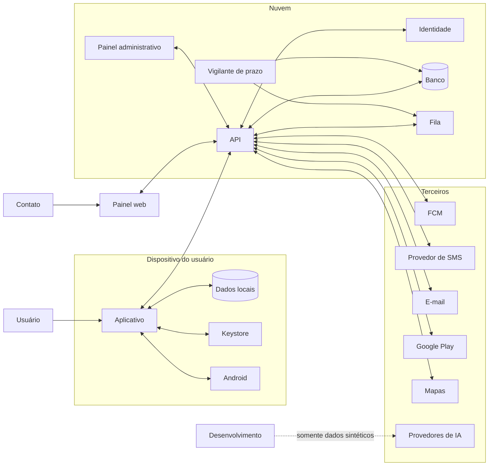

# Documento 3 — Segurança, Privacidade e Ameaças

## 1. Identificação do documento

**Projeto:** Plataforma móvel de proteção pós-roubo
**Nome provisório:** Modo Rua
**Versão:** 2.2 | **Substitui:** versões 1.0, 2.0 e 2.1
**Alteração da 2.1:** correções da segunda rodada de revisão (ARB2). Numeração de seções preservada; conteúdo novo entra como subseção.
**Status:** Vigente
**Plataforma inicial:** Android nativo
**Classificação interna:** Confidencial — Arquitetura e Segurança
**Posição na hierarquia:** nível 2 (Documento 4, núcleo §0). Perde apenas para a lei e para as políticas da Google Play.
**Objetivo:** definir o modelo de ameaças, os ativos protegidos, os controles de segurança, as regras de privacidade, o tratamento de incidentes e os critérios mínimos para desenvolvimento, beta e produção.

A numeração de seções da versão 1.0 foi **preservada** para não quebrar as referências dos módulos do Documento 4.

---

# 2. Finalidade

Este documento estabelece como o produto deve proteger o usuário, seus dados, sua localização, sua conta, seus contatos de confiança, seus dispositivos, a infraestrutura, a reputação da empresa e a continuidade operacional.

O produto é concebido para reduzir danos quando o usuário perde o controle físico do celular.

> **Ele não pode criar uma nova fonte de risco maior que aquela que pretende reduzir.**

O aplicativo pode ser útil em situações de roubo, furto, perda, coação, apropriação indevida, comprometimento de conta, tentativa de fraude, acesso não autorizado e emergência pessoal.

Ao mesmo tempo, os próprios recursos do produto podem ser usados indevidamente para perseguição, vigilância, controle de parceiro, monitoramento familiar abusivo, coleta clandestina de localização, chantagem, engenharia social e invasão de privacidade.

Por esse motivo, **segurança contra abuso é requisito de produto**, não apenas requisito jurídico ou técnico.

## 2.1 Consequência de segurança das duas garantias

O produto opera com duas garantias distintas (Documento 2, §4.5). Isso tem efeito direto no modelo de ameaças:

- a **garantia local** — ativar, registrar, temporizar, sobreviver a reinício — não depende de rede, e sua superfície de ataque é o aparelho;
- a **garantia externa** — alguém fora do aparelho descobrir que o usuário parou de responder — depende do backend, e sua superfície de ataque é o servidor, o vigilante e os canais de alerta.

Nenhum controle deste documento pode ser lido como se a segunda garantia existisse no aparelho. **A ausência de resposta só produz efeito externo se o servidor souber que a sessão existe.** Ocultar isso do usuário é, em si, um risco de segurança: leva a pessoa a confiar em proteção que não está ativa.

---

# 3. Princípio fundamental

> **O produto deve proteger o usuário sem criar uma ferramenta de vigilância oculta.**

Nenhuma funcionalidade é considerada segura apenas porque utiliza criptografia. Segurança envolve finalidade legítima, base legal adequada, controle do titular, transparência, autenticação, autorização, minimização, retenção, rastreabilidade, prevenção de abuso, capacidade de revogação e resposta a incidentes.

---

# 4. Referenciais adotados

Lei nº 13.709/2018 (LGPD); orientações e regulamentos da ANPD; OWASP MASVS; OWASP MASTG; OWASP ASVS para backend e painel; NIST Cybersecurity Framework; NIST SP 800-61 Rev. 3 para resposta a incidentes; boas práticas oficiais de privacidade e segurança do Android; políticas vigentes da Google Play; privacy by design e security by design; menor privilégio; defesa em profundidade; zero trust para acessos administrativos.

A LGPD é observada desde a concepção, e não apenas na elaboração dos termos de uso.

---

# 5. Personas responsáveis pela análise

**5.1 Arquiteto de segurança móvel:** armazenamento local, Keystore, biometria, permissões, IPC, deep links, screenshots, backups, root, engenharia reversa, integridade.

**5.2 Especialista em segurança de aplicações:** API, autenticação, autorização, sessões, injeções, rate limiting, IDOR, SSRF, XSS, CSRF, supply chain.

**5.3 Especialista em privacidade e LGPD:** bases legais, finalidade, necessidade, transparência, direitos do titular, retenção, compartilhamento, encarregado, RIPD, comunicação de incidente.

**5.4 Especialista em violência doméstica e prevenção de stalking:** abuso por parceiro, controle coercitivo, monitoramento oculto, risco de retaliação, exposição do titular, revogação segura, notificações que podem colocar a vítima em risco.

**5.5 Engenheiro de resposta a incidentes:** detecção, triagem, contenção, erradicação, recuperação, comunicação, preservação de evidências, lições aprendidas.

**5.6 Red team:** sequestrar contas, falsificar eventos, abusar de convites, consultar localização alheia, comprometer suporte, extrair dados, quebrar isolamento, manipular protocolos, produzir falsos alertas em massa.

**5.7 Fraud analyst:** criação massiva de contas, chargeback, abuso de teste gratuito, uso criminoso, dispositivos adulterados, automação, engenharia social, insiders.

---

# 6. Escopo de segurança

**6.1 Incluído:** aplicativo Android; bibliotecas; backend; **vigilante de prazo**; banco; filas; painel web; autenticação; contatos de confiança; notificações; **canal de SMS**; cobrança; infraestrutura; CI/CD; suporte; administração; dados pessoais; fornecedores, **incluindo provedores de agentes de IA**; processos internos.

**6.2 Fora do controle integral:** sistema operacional Android; rede móvel; GPS; hardware; operadora; FCM; provedor de SMS; e-mail; bancos; programa Celular Seguro; comportamento do criminoso; disponibilidade do aparelho; funcionamento de apps de terceiros.

Esses componentes são tratados como dependências potencialmente falhas.

---

# 7. Objetivos de segurança

**7.1 Confidencialidade:** somente pessoas e serviços autorizados acessam localização, eventos, contatos, protocolos, dados de conta, dados de cobrança e registros de segurança.

**7.2 Integridade:** o sistema impede ou detecta alteração de eventos, falsificação de localização, manipulação de protocolo, inclusão indevida de contatos, mudança não autorizada de configuração e adulteração de cobrança.

Sobre a confirmação de check-in, a promessa é redigida no escopo exato do que o controle entrega. A confirmação é **assinada** por chave do Keystore que exige autenticação validada pelo sistema a cada uso (Documento 2, §16.8), e o servidor verifica a assinatura. A assinatura é produzível **sem rede**, sobre material do próprio aparelho, porque o ato de confirmar não pode depender de conexão (núcleo §2.2); o frescor relativo ao servidor, quando há rede, vem do desafio de sessão (§16.8.2), e o replay é barrado pela deduplicação que já existe. Isso eleva a barra de *quem tem o token* para *quem passa pela tela de bloqueio do aparelho*, e torna detectável a confirmação forjada por posse de token — que era o furo do desenho anterior, em que `confirmation_type` era campo autodeclarado pelo cliente. **Não** prova que foi a pessoa legítima: sob coação, ou com credencial de bloqueio obtida por coerção, a assinatura é válida. Essa limitação está registrada em §13.5.

**7.3 Disponibilidade:** o produto permanece parcialmente útil durante falha de rede, indisponibilidade do backend, atraso de push, reinicialização, economia de bateria e perda temporária de localização — **declarando ao usuário o que deixou de funcionar** (Documento 2, §11.1).

**7.4 Autenticidade:** o sistema identifica usuário, instalação, aparelho, contato, administrador, serviço e origem de evento.

**7.5 Não repúdio proporcional:** ações críticas produzem evidência suficiente para investigação, sem armazenamento excessivo.

**7.6 Segurança humana:** o produto reduz risco físico, risco de perseguição, risco de exposição, risco de falsa sensação de segurança e risco de destruição indevida de dados. **Acrescenta-se: risco de mobilização indevida de terceiros** — acionar contatos sem motivo é dano, não apenas incômodo.

---

# 8. Ativos protegidos

**8.1 Humanos:** segurança física do usuário e dos contatos, autonomia, privacidade, liberdade de movimento, reputação, integridade psicológica.

**8.2 Digitais:** conta, credenciais, sessões, chaves `K_dados`, `K_leitura` e **`K_confirmacao`**, tokens, códigos de recuperação, eventos, configurações, histórico, **identidade de instalação**. O PIN interno deixou de ser ativo criptográfico: não é chave e não desbloqueia chave (§28.2).

**8.3 Dados de localização:** localização atual, última localização, áreas seguras, endereço residencial, trabalho, rotinas, trajetos, velocidade, horários. **Localização é o ativo de maior criticidade do sistema, e o histórico local no aparelho é o mais exposto** (§26.5).

**8.4 Relacionais:** identidade dos contatos, relação entre usuário e contato, telefone, e-mail, permissões, histórico de alertas e de ciência.

**8.5 Financeiros:** assinatura, purchase tokens, entitlement, recibos, informações fiscais necessárias. O sistema não armazena dados completos de cartão.

**8.6 Empresariais:** código, infraestrutura, segredos, chaves, contratos, documentação, reputação, continuidade, métricas, registros de auditoria.

---

# 9. Classificação de dados

| Classe | Exemplos | Tratamento |
|---|---|---|
| Pública | página comercial, ajuda pública | publicação autorizada |
| Interna | métricas agregadas, documentação não sensível | acesso interno |
| Confidencial | e-mail, contatos, eventos | criptografia e RBAC |
| Altamente confidencial | localização precisa, códigos de recuperação, chaves | criptografia por campo, acesso restrito |
| Segredo | chaves privadas, tokens de serviço | secret manager e KMS |
| Evidência de segurança | auditoria, incidentes | imutabilidade e retenção controlada |

## 9.1 Proibições

Dados altamente confidenciais não podem ser: enviados a analytics genérico; registrados em crash reports; colocados em URLs; incluídos em notificações **ou SMS**; copiados para clipboard sem aviso; exportados sem proteção; exibidos em suporte por padrão; **colocados no contexto de qualquer agente de IA** (§39.3).

---

# 10. Modelo de ameaças

**10.1 Metodologia:** STRIDE para ameaças técnicas; LINDDUN para privacidade; attack trees; misuse cases; matriz probabilidade × impacto; análise por jornada; revisão a cada release relevante.

**10.2 STRIDE:** spoofing (falsificação de usuário, dispositivo, contato **ou confirmação de check-in**); tampering (alteração de eventos ou estados); repudiation; information disclosure; denial of service; elevation of privilege.

**10.3 LINDDUN:** linkability, identifiability, non-repudiation, detectability, disclosure, unawareness, non-compliance.

**10.4 Escala de risco**

Probabilidade: 1 rara, 2 improvável, 3 possível, 4 provável, 5 quase certa.
Impacto: 1 baixo, 2 moderado, 3 relevante, 4 grave, 5 crítico.

```text
risco = probabilidade × impacto
```

| Pontuação | Classificação |
|---:|---|
| 1–4 | Baixo |
| 5–9 | Médio |
| 10–16 | Alto |
| 17–25 | Crítico |

Riscos altos e críticos exigem mitigação antes da produção.

---

# 11. Possíveis atacantes

**11.1 Ladrão oportunista:** vender o aparelho, acessar banco e mensagens, remover chip, desligar, formatar.

**11.2 Criminoso organizado:** engenharia social, desbloqueio, phishing, troca de chip, reset, exploração, uso de documentos.

**11.3 Parceiro abusivo:** vigiar, controlar, localizar, obter acesso, impedir revogação, intimidar.

**11.4 Familiar abusivo:** usar justificativa de segurança para monitorar adulto, limitar autonomia, acompanhar localização, acessar eventos.

**11.5 Contato de confiança malicioso:** consultar alerta, compartilhar localização, tentar manter acesso, abusar de permissões.

**11.6 Atacante remoto:** credential stuffing, phishing, roubo de token, exploração da API, abuso de recuperação.

**11.7 Funcionário ou prestador:** consultar dados, exportar, alterar registros, abusar do suporte, acessar produção.

**11.8 Concorrente:** engenharia reversa, scraping, DDoS, fraude, cópia de fluxos.

**11.9 Usuário fraudador:** simular emergência, acusar falsamente, obter reembolso indevido, abusar de contatos, usar o produto contra terceiros — **inclusive para fabricar álibi ou ocorrência** (§25.5).

**11.10 Malware no aparelho:** capturar tela, usar acessibilidade, roubar token, observar notificações, adulterar tráfego em dispositivo comprometido.

**11.11 Autoridade pública com pedido de dados:** não é atacante, mas é um caminho de acesso a dados de vítimas de crime. Exige política e runbook próprios (§37.4).

---

# 12. Fronteiras de confiança



Cada seta representa uma fronteira que exige autenticação, autorização, validação, criptografia, logging e rate limiting quando aplicável.

**A seta tracejada é a única cuja regra é de exclusão:** nada de produção atravessa a fronteira dos provedores de IA (§39.3).

**Não existe seta de comando da nuvem para o aparelho.** Comandos remotos foram removidos do produto (Documento 2, §37.2): quem emite comandos controla o aparelho da vítima, e essa superfície não é aberta sem ADR.

---

# 13. Cenário: aparelho roubado desbloqueado

## 13.1 Risco

Um dos cenários mais graves. O agressor tem acesso imediato a notificações, e-mail, mensageria, bancos, configurações, SMS e ao próprio aplicativo.

## 13.2 Ameaças

Desativar o Modo Rua; **confirmar check-ins indefinidamente para impedir o escalonamento**; **empurrar o prazo alterando o intervalo de confirmação ou o período de graça, que não exige autenticação nenhuma se o servidor aceitar o parâmetro sem limite**; trocar contato; encerrar alerta; remover permissões; **desativar o canal de notificação**; recuperar conta; acessar painel; apagar eventos; **ler o histórico local de localização e descobrir o endereço seguro**; usar senha salva.

## 13.3 Controles obrigatórios

- **Confirmação de check-in exige confirmação forte:** biometria **ou o credencial de tela de bloqueio do aparelho**, e a confirmação é **assinada** por `K_confirmacao` (Documento 2, §16.8). Toque simples não conclui um check-in. **O PIN interno do aplicativo não satisfaz esta exigência** — ver §28.2, que detalha por quê: um segredo do aplicativo não satisfaz a exigência de autenticação de uma chave do Keystore. Motivo: o agressor com o aparelho desbloqueado pode tocar; não pode autenticar. O método usado é registrado em `confirmation_type` e exibido ao titular — "confirmado com biometria" não é a mesma informação que "confirmado com toque".
- **Existe sempre um caminho de confirmação quando a biometria está indisponível após reinício** — cenário comum, porque muitos aparelhos só liberam biometria após o primeiro desbloqueio por PIN do sistema. Esse caminho é o **credencial de tela de bloqueio do aparelho**, aceito pela chave (Documento 2, §14.3). Não é o PIN interno do aplicativo: um segredo do aplicativo não satisfaz a exigência de autenticação de uma chave do Keystore, e a versão 2.0 especificava um mecanismo que não existe. Sem esse caminho, o usuário ficaria impedido de confirmar justamente no cenário de reboot.
- **Parâmetros de temporização são limitados no servidor e alterá-los é ação de step-up** (Documento 2, §18.7, item 2a): `expected_next_checkin_at` e `grace_seconds` vêm do aparelho, e ambos estendem o prazo pelo mesmo efeito. Aumento vale só a partir da confirmação seguinte; redução vale de imediato; alteração em sessão ativa gera evento `SECURITY` e aviso por canal externo. Sem isso, a confirmação forte protege a porta e deixa a janela aberta.
- Reautenticação para desativar proteção, alterar contato, encerrar protocolo, **alterar intervalo de check-in ou graça** e ver o cofre.
- Atraso de segurança e notificação por canal externo para mudanças sensíveis.
- Eventos append-only; contato nunca removido silenciosamente.
- **Histórico legível protegido por `K_leitura`**, cuja leitura exige autenticação validada pelo hardware (§27.4), e **retenção local curta** (§26.5).
- **Áreas seguras nunca armazenadas nem exibidas como endereço completo:** centro arredondado e raio mínimo de 200 m.
- Detalhes sensíveis ocultos na tela bloqueada; bloqueio de screenshot em telas críticas quando apropriado.
- Sessão do painel separada da do app; recuperação não baseada apenas no aparelho.
- **O encerramento de protocolo não depende do aparelho perdido** (Documento 2, §10.2, linha 12).

## 13.4 Controles recomendados

Janela de cancelamento; confirmação por canal externo; detecção de alteração de configuração; sequência de confirmações "fáceis" após sinais de risco tratada como suspeita e não como normalidade.

Senha de coação permanece fora do MVP (§28.3).

## 13.5 Limitação

O produto não garante proteção se o agressor tiver acesso integral ao aparelho desbloqueado **e** às credenciais do usuário. Essa limitação é declarada ao usuário, não escondida.

Duas limitações do mesmo tipo, declaradas em vez de dissolvidas em texto otimista:

- **coação.** A assinatura de confirmação (§7.2) prova autenticação validada pelo sistema, não legitimidade da pessoa. Quem obriga a vítima a encostar o dedo obtém confirmação válida. O produto não detecta isso, e a senha de coação permanece fora do MVP (§28.3);
- **instante da autenticação.** Sem desafio do servidor — situação normal offline — a assinatura não fixa *quando* a autenticação ocorreu. O que limita a pré-assinatura de confirmações futuras é a configuração da chave: com autenticação exigida a cada uso, **uma autenticação produz exatamente uma assinatura**, de modo que pré-assinar N confirmações exige N autenticações coagidas. Quem tem esse acesso confirmaria ao vivo de todo modo. Com rede em algum momento, o desafio de sessão reduz a pré-assinatura ao máximo de uma confirmação adiante;
- **fila pendente.** Entre a captura e o ACK, as coordenadas ainda não sincronizadas estão sob chave sem exigência de autenticação, para que o worker possa enviá-las (Documento 2, §14.3). O que limita a exposição é a retenção curta e o job de purga, que por isso são controle de segurança e não housekeeping (§26.5).

---

# 14. Cenário: aparelho roubado bloqueado

**14.1 Riscos:** desligamento; modo avião; remoção do chip; reset; destruição; tentativa de desbloqueio; exploração de notificações; **encerramento forçado do app pelo gerenciador de tarefas**.

**14.2 Controles:** armazenar evento antes do bloqueio; manter trabalho agendado; sincronizar quando a rede retornar; conteúdo mínimo em notificação; não depender de interação; última localização com horário, precisão e fonte; painel indicando a última comunicação; contato orientado de que ausência de atualização não significa localização atual.

**14.3 Resultado esperado**

O sistema preserva e transmite os dados disponíveis e **não garante rastreamento contínuo**. O que garante o alerta neste cenário não é o aparelho: é o vigilante do servidor (Documento 2, §18.7). Este é o cenário que justifica sua existência.

---

# 15. Cenário: chip removido

**15.1 Efeitos:** perda da rede móvel; possível mudança de número; SMS e chamadas indisponíveis **no aparelho da vítima**.

**15.2 Estratégia:** não depender de SMS **como fator de autenticação**; funcionar por Wi-Fi; FCM quando a internet retornar; usar identidade de instalação; registrar mudança de conectividade; informar o painel; orientar o bloqueio da linha; evitar que o telefone seja único fator de recuperação.

Observação importante: o SMS **para o contato** permanece funcional, porque é enviado pelo servidor para outro número. Remover o chip da vítima não interrompe o alerta.

**15.3 Futuro:** a detecção de mudança de SIM depende de APIs, permissões, fabricante e política, e não é assumida como garantida.

---

# 16. Cenário: modo avião

**16.1 Efeitos:** perda de comunicação; localização possivelmente limitada; push indisponível.

**16.2 Controles:** fila local; estado local; eventos pendentes; retry; sincronização no retorno; **exibição do estado de cobertura**; nenhuma suposição de entrega.

**16.3 Regra**

O painel nunca mostra um aparelho offline como "seguro". Mostra a última comunicação, a idade e a precisão da localização e o estado desconhecido. E o vigilante escala pela ausência de confirmação, independentemente do modo avião.

---

# 17. Cenário: celular desligado

**17.1 Efeito:** nenhum aplicativo comum continua executando.

**17.2 Resposta:** preservar o último estado; mostrar o horário estimado a partir da última comunicação; sincronizar após reinicialização; receber boot; reidratar a máquina de estados; registrar a lacuna de sequência (Documento 2, §16.6).

**17.3 Comunicação:** nunca prometer localização com o aparelho desligado. **O alerta, porém, é prometido — e cumprido pelo servidor.**

---

# 18. Cenário: aplicativo desinstalado ou encerrado à força

**18.1 Riscos:** perda de execução; fim da sincronização; perda de alertas locais; revogação de token. O encerramento forçado pelo usuário ou por gerenciador de tarefas de fabricante produz efeito equivalente enquanto o app não for reaberto.

**18.2 Controles:** detectar ausência por heartbeat da sessão; marcar o aparelho como sem comunicação; **o vigilante escala pela ausência de confirmação, o que resolve o caso sem depender de inferir desinstalação**; preservar os dados do servidor; revogar token antigo; exigir nova vinculação em reinstalação.

**18.3 Limitação:** aplicativo comum não tenta impedir a desinstalação.

**18.4 Antiabuso:** a ausência de heartbeat não aciona automaticamente polícia, destruição nem acusação. E fora de uma sessão ativa, a ausência de heartbeat não gera protocolo algum.

---

# 19. Cenário: permissões revogadas

**19.1 Permissões relevantes:** notificações; localização; localização em segundo plano; biometria; alarmes exatos, se adotados; isenções de bateria quando aplicável.

Duas classes com consequências diferentes. A revogação de **localização** degrada a capacidade: o produto continua pedindo confirmação e continua escalando, com menos informação. A revogação da capacidade de **disparo local** — permissão de alarme exato, isenção de bateria, canal de notificação — não degrada, **apaga o disparo**: nada pergunta nada ao usuário, o prazo vence, e o alerta que segue é falso positivo garantido. `SCHEDULE_EXACT_ALARM` é revogável pelo usuário **e pelo sistema**, e a revogação cancela os alarmes já agendados. Por isso a regra de §19.3 vale para a classe inteira, e não só para notificações.

**19.2 Controles:** detectar revogação; entrar em modo degradado; explicar o impacto; registrar evento; não insistir de forma abusiva; não ocultar limitações; permitir uso parcial; não pedir permissão fora de contexto.

**19.3 Regra específica de notificações**

Notificação não é acessório de interface: é a única forma de pedir a confirmação. Portanto:

1. Sem permissão de notificação **e** canal `check_in` habilitado, a sessão **não inicia** — recusa explicada, com atalho. Isso é bloqueio de uma função específica, não do aplicativo.
2. O estado do canal é verificado a cada avaliação de prazo.
3. Desativação durante a sessão gera evento imediato ao servidor. Com esse evento registrado, o **primeiro escalonamento não aciona contato**: vira verificação dirigida ao titular por e-mail da conta e pelo painel, com prazo próprio. Só a ausência de resposta também nessa verificação aciona o contato.

**A mesma regra vale para qualquer perda de capacidade de disparo local** (Documento 2, §12.4, item 6): permissão de alarme exato revogada, isenção de bateria removida, tipo de serviço em primeiro plano indisponível. Evento imediato ao servidor, capacidade reduzida declarada na interface, e primeiro escalonamento dirigido ao titular em vez do contato. A regra é escrita agora, condicionada ao resultado do ADR-0007; qual gatilho existe depende dele.

Esse desenho protege contra duas coisas ao mesmo tempo: o agressor que silencia o canal para impedir o alerta, e o usuário distraído que silencia o canal e seria punido com um alerta indevido.

**19.4 Painel:** pode exibir "localização desativada", "notificações desativadas", "proteção limitada". **Nunca acusa roubo apenas por revogação.**

---

# 20. Cenário: conta comprometida

**20.1 Vetores:** senha reutilizada; phishing; e-mail comprometido; roubo de sessão; SIM swap; malware; recuperação abusiva.

**20.2 Controles:** MFA no painel; passkeys posteriormente; **sessão própria do backend** (Documento 2, §22.1) com access token curto, refresh opaco com família, rotação a cada uso e **revogação da família ao detectar reuso**, gerando evento `SECURITY`; revogação por linha testada; notificação de login; reautenticação; gestão de dispositivos; códigos de recuperação; rate limiting; proteção contra credential stuffing; sessão vinculada à instalação; tratamento de login de risco.

**20.3 Ações críticas**

Exigem step-up: consultar localização; alterar contato; **encerrar protocolo**; exportar dados; excluir conta; mudar e-mail; **transferir aparelho**.

**20.4 Recuperação**

Não depende exclusivamente de SMS, do aparelho roubado, do contato de confiança nem de atendente de suporte. A recuperação bem-sucedida **revoga sessões e concessões anteriores**.

---

# 21. Cenário: servidor comprometido

**21.1 Impacto:** potencialmente crítico — localização, contatos, eventos, tokens, auditoria e **capacidade de emitir alertas falsos em massa**. Com o vigilante no servidor, o comprometimento passa a incluir a capacidade de suprimir alertas verdadeiros; a auditoria de transições precisa permitir detectar isso. Consequência concreta: **cada prazo suprimido por indisponibilidade própria gera evento de auditoria com o id da janela de indisponibilidade** (Documento 2, §18.7.1). Sem esse registro, a supressão indevida — que é SEV-1 em §36.2 — é indistinguível da supressão legítima.

**21.2 Defesa em profundidade:** segmentação; KMS; criptografia por campo; menor privilégio; MFA administrativo; acesso just-in-time; acesso controlado por bastion; auditoria; secret manager; rotação; backups; monitoramento; WAF; EDR nos ambientes aplicáveis; pipeline assinado; revisão de dependências.

**21.3 Blast radius:** separar produção, staging, analytics, suporte, administração e billing.

**21.4 Dados de localização:** envelope encryption. A aplicação recebe somente a chave necessária para o fluxo autorizado. **Administradores não consultam localização livremente** (§37).

**21.5 Comprometimento total:** a arquitetura assume que, em comprometimento completo do backend, metadados podem ser expostos. A promessa de "zero knowledge" **não é feita** sem projeto criptográfico específico e auditado.

---

# 22. Cenário: contato de confiança comprometido

**22.1 Riscos:** localização exposta; engenharia social; compartilhamento do link; abuso continuado.

**22.2 Controles:** conta própria e MFA, criadas **no aceite do convite** e não durante a emergência; concessões limitadas com escopo e expiração; acesso apenas durante protocolo autorizado; reautenticação; auditoria; revogação imediata; aviso ao titular; sem acesso a histórico completo; sem alteração da conta principal.

> **Nenhum caminho de código permite que o contato cause transição de estado do protocolo.** O contato registra ciência; apenas o titular autenticado encerra. Um contato comprometido não consegue suprimir um alerta verdadeiro.

**22.3 Regra:** contato de confiança não é administrador.

---

# 23. Cenário: abuso por parceiro ou familiar

**23.1 Natureza do risco**

Tratado como **ameaça principal**, não como caso extremo. Um agressor pode exigir a instalação, cadastrar-se como contato, controlar credenciais, observar localização, usar alertas para intimidar, impedir a revogação e monitorar rotinas.

**23.2 Controles obrigatórios:** instalação visível; ícone visível; notificação de serviço quando exigida; consentimento do titular; convite aceito; lista de contatos visível; acessos recentes visíveis; revogação acessível; confirmação externa de alterações; canal de suporte seguro; exclusão controlada; sem modo espião; sem ocultação do app; sem compartilhamento permanente por padrão.

**23.3 Saída segura**

O produto deve estudar um fluxo de segurança para usuários sob coerção. Princípios possíveis: não enviar imediatamente ao agressor o aviso de revogação; oferecer orientação de segurança; preservar evidências somente com consentimento; informar riscos; direcionar a canais oficiais.

Esse fluxo exige revisão especializada antes da implementação e **não é prototipado por iniciativa de nenhum agente**.

**23.4 Linguagem**

Evitar mensagens como "Seu parceiro desativou o rastreamento", "A pessoa saiu da área", "Contato recusou acesso". Mensagens assim provocam retaliação. A regra vale para push, **SMS**, e-mail e telas. Copy dessas mensagens é revisada pelo fundador antes do merge.

---

# 24. Perseguição e vigilância indevida

**24.1 Usos proibidos:** instalação secreta; monitoramento sem consentimento; acesso contínuo de terceiro; rastreamento de adulto sem ciência; ocultação do serviço; coleta para publicidade comportamental; venda de localização; uso de localização para score.

**24.2 Detecção de abuso.** Sinais: muitos convites; múltiplas contas no mesmo dispositivo; contatos com acesso contínuo; tentativas repetidas de revogação; acesso administrativo incomum; exportações; consultas em massa; **convites repetidos a quem já recusou**.

**24.3 Resposta:** limitar; bloquear; revisar; preservar evidência; notificar com segurança; encerrar acesso; cooperar legalmente quando aplicável. Sinais de abuso geram evento `SECURITY` para análise humana; **nunca ação automática destrutiva**.

---

# 25. Falsos positivos

**25.1 Fontes individuais:** usuário dormindo, dirigindo, em reunião, em hospital; sem internet; bateria baixa; falha de notificação; otimização do fabricante; relógio alterado; GPS impreciso; **atraso de disparo do pedido de confirmação**; **canal de notificação silenciado**.

**25.2 Fontes correlacionadas** (novo na versão 2.0)

Queda de energia ou de operadora em uma região; falha do FCM; bug em release; indisponibilidade do próprio backend; mudança de horário. Nesses casos, milhares de aparelhos deixam de confirmar simultaneamente **e o vigilante escalaria todos ao mesmo tempo**.

O sistema é um amplificador. Todo amplificador precisa de limitador antes de ir a público.

**25.3 Impacto:** ansiedade; mobilização indevida de contatos; perda de confiança; cancelamento; dano reputacional; ações indevidas; **risco físico real** — pessoas indo à rua procurar familiares por causa de uma falha de rede.

**25.4 Controles**

Protocolo progressivo; período de graça calibrado pelo p99 medido de atraso de disparo; abertura em suspeita **sem notificar ninguém**; janela de reconciliação para eventos atrasados; cancelamento seguro; nenhuma ação destrutiva automática; classificação posterior; ajuste por usuário; limite de alertas.

**Guarda de anomalia com dois critérios** (Documento 2, §18.7.1), porque o critério relativo sozinho é indefinido no regime do MVP — 20 a 100 usuários no beta, 1% de rollout na Fase 7 — e é justamente aí que uma queda de operadora atinge quase toda a base:

1. **limite absoluto**, que funciona com amostra pequena: teto de acionamentos externos por janela e teto de percentual das sessões protegidas ativas;
2. **linha de base relativa** segmentada, com mínimo de observações por célula; abaixo do mínimo, vale só o critério 1.

Protocolos em `RETIDO` mantêm o titular informado, não acionam o contato e exigem liberação humana registrada. **Simulações ficam fora do numerador, da linha de base e do denominador** — sessão de simulação não é sessão protegida e não pode autorizar mais acionamentos.

**Supressão por indisponibilidade conhecida do próprio backend**, com mecanismo: fonte de verdade externa à infraestrutura que falhou, janelas persistidas, reagendamento com jitter, teto de taxa na recuperação e evento de auditoria por prazo suprimido. Sem espalhamento, a **recuperação** passa a ser o evento de alerta em massa. Ausência de confirmação durante uma queda nossa não é evidência sobre o usuário.

**25.5 Falso alerta deliberado**

Um usuário pode acionar a emergência para fabricar álibi, produzir ocorrência ou mobilizar terceiros contra alguém. Controles: toda transição é auditada com actor e origem; a simulação de protocolo é inequivocamente marcada, e a marca `modo_teste` viaja pelo outbox, pelas filas, pela DLQ, por `notification_deliveries` e pela auditoria (Documento 2, §20.1) — sem isso, uma DLQ reprocessada reenviaria simulação como alerta real; a simulação é separada das métricas, da linha de base e do denominador da guarda de anomalia; o produto **não afirma** o que não consegue provar, e a documentação de suporte declara com clareza o que a auditoria demonstra e o que não demonstra.

**25.6 Métricas**

Medidas em **duas camadas**, porque têm custos diferentes:

- **falso positivo interno:** escalonamento aberto indevidamente que **não** acionou contato — barato, tolerável em maior volume;
- **falso positivo externo:** contato acionado indevidamente — caro, e **é o único que bloqueia release**.

Também: falso positivo por sessão, por usuário e por sinal; tempo até cancelamento; churn após alerta.

---

# 26. Vazamento de localização

**26.1 Vetores:** API; logs; analytics; push; **SMS**; URL; suporte; banco; contato; screenshot; exportação; cache; clipboard; mapa de terceiro; backup; **contexto de agente de IA**; **histórico local no aparelho roubado**.

**26.2 Controles:** criptografia por campo; autorização por recurso; expiração; precisão reduzida quando suficiente; nenhuma coordenada em URL, push ou SMS; nenhum registro em log; token curto; link de uso limitado; CSP; redaction; revisão de terceiros; retenção curta; auditoria de toda leitura.

**26.3 Apresentação:** sempre horário, precisão, fonte e o aviso de que se trata da última localização conhecida. **Posição antiga nunca aparece como atual.**

**26.4 Links:** expiram; não são indexáveis; não contêm dados no path; exigem sessão autenticada do contato; possuem escopo; são revogáveis; não permitem navegação lateral. Em SMS, o link é curto e opaco e o texto é genérico.

**26.5 Retenção local** (novo na versão 2.0)

O aparelho que concentra o histórico é justamente o aparelho que o produto assume que será roubado. Portanto:

| Dado local | Retenção |
|---|---|
| Amostras de rotina (nível econômico) | 24 h ou até ACK, o que vier primeiro |
| Amostras de emergência | até o protocolo resolvido + 24 h |
| Eventos | até ACK + 7 dias |
| Histórico legível pelo usuário | vem do servidor, sob autenticação |
| Áreas seguras | centro arredondado, raio mínimo de 200 m, sob `K_leitura` |

A amostra local é **apagada no ACK**, não reencriptada: o histórico legível vem do servidor. O job local de purga é **funcionalidade crítica**, se sujeita à Regra Máxima e é **controle de segurança**, porque é ele que limita a única janela em que coordenadas ficam sob chave sem exigência de autenticação — a janela entre a captura e o ACK, necessária para que o worker consiga enviá-las (Documento 2, §14.3). Nunca existe rota contínua armazenada.

---

# 27. Criptografia

**27.1 Em trânsito:** TLS 1.2 ou superior, preferindo versões modernas; HTTPS obrigatório; cleartext desativado; Network Security Configuration; certificados válidos; HSTS no painel; mTLS entre serviços apenas quando justificado.

**27.2 Em repouso no servidor:** criptografia de volume; PostgreSQL criptografado; backups criptografados; object storage criptografado; chaves no KMS; rotação; segregação por ambiente.

**27.3 Criptografia por campo:** latitude; longitude; endereço seguro; códigos de recuperação; dados sensíveis de contato; payloads críticos. Criar campo dessa natureza sem criptografia por campo é PR reprovada.

**27.4 No aparelho — hierarquia de chaves**

| Chave | Configuração | Protege | Desbloqueio |
|---|---|---|---|
| `K_dados` | Keystore, **sem** exigência de autenticação de usuário | fila de saída pendente de ACK, **inclusive coordenadas ainda não sincronizadas**, estado operacional, prazos, contador de `sequence` | não requer |
| `K_leitura` | Keystore, `setUserAuthenticationRequired(true)`, **autenticação a cada uso, sem janela de validade** | **cache local do histórico vindo do servidor** — a fonte do histórico é o servidor —, cofre, áreas seguras | biometria **ou credencial de tela de bloqueio do aparelho** |
| `K_confirmacao` | Keystore, EC P-256, autenticação a cada uso | assina confirmação de check-in e encerramentos autenticados (Documento 2, §16.8) | idem |

Três correções em relação à versão 2.0, detalhadas no Documento 2, §14.3: o **PIN interno do aplicativo não desbloqueia chave do Keystore** e o fallback real é o credencial do aparelho; a autenticação é exigida **a cada uso**, porque janela de validade deixaria o histórico legível para quem está com o aparelho recém-desbloqueado — o cenário de referência do §13; e **amostras de localização pendentes ficam sob `K_dados`**, porque worker não autentica e, sob chave autenticada, a localização de emergência nunca sairia do aparelho roubado. Custo de experiência declarado: cada abertura do histórico pede autenticação.

A separação resolve um conflito real: criptografar tudo com uma chave vinculada à biometria transformaria um requisito de confidencialidade em mecanismo de perda de dados — a fila com o `check_in_missed` de um roubo real ficaria ilegível ao cadastrar uma digital nova. Com a separação, a fila crítica continua gravável e sincronizável, e o que se perde na invalidação é o histórico legível: exatamente o dado que interessa a quem está com o aparelho.

- Chaves não exportáveis quando possível; StrongBox quando disponível, com ausência declarada como limitação.
- Todo registro carrega `key_version`.
- **Invalidação detectada emite `local_key_invalidated`, envia diagnóstico e pede revinculação. Nunca falha em silêncio**, porque o sistema não consegue distinguir "sem eventos" de "eventos ilegíveis".
- Banco, identidade de instalação e material criptográfico são **excluídos do backup**.

**27.5 Algoritmos:** AES-256-GCM; ChaCha20-Poly1305 quando adequado; SHA-256 e HMAC-SHA-256; Argon2id para derivação no backend; PBKDF2 com iterações altas quando a plataforma limitar; curvas modernas para assinatura. **Não criar criptografia própria.** Proibidos ECB, MD5, SHA-1 para fins de segurança, IV ou nonce reutilizado, chave hardcoded, `SecureRandom` substituído por `Random` e comparação de segredo sem tempo constante.

**27.6 Gestão de chaves:** KMS; `key_version`; rotação; revogação; envelope encryption; acesso auditado; separação por ambiente; backup seguro; procedimento documentado de perda.

---

# 28. Autenticação local e biometria

**28.1 Biometria**

Protege o acesso local e não substitui identidade remota. Usar `BiometricPrompt`. **Biometria é conveniência, não requisito** — sua indisponibilidade após reinício é comportamento normal, não exceção.

**28.2 Fallback de autenticação local, e o que sobrou do PIN interno**

A versão 2.0 dizia: "o PIN não é chave — ele autoriza o uso de `K_leitura`, cuja limitação de tentativas é imposta pelo hardware", com o PIN interno obrigatório e diferente do PIN do aparelho. **Isso não existe no Android.** A exigência de autenticação de uma chave do Keystore é satisfeita apenas por biometria ou pelo credencial de tela de bloqueio do aparelho; um segredo do aplicativo não a satisfaz. As duas saídas restantes eram derivar a chave do PIN — e então o PIN **é** chave, proibido, e vulnerável à força bruta offline que o próprio parágrafo usava como justificativa — ou contar tentativas em software, perdendo o hardware que era a premissa. E "contador protegido pela própria chave" era circular: para ler o contador é preciso usar a chave que o contador limita.

Desenho corrigido:

- **O fallback quando a biometria está indisponível — inclusive após reinício, que é comportamento normal (§28.1) — é o credencial de tela de bloqueio do aparelho.** É ele que traz limitação de tentativas imposta pelo hardware, de verdade.
- Nenhum segredo do aplicativo desbloqueia chave do Keystore. Nenhuma chave é derivada de PIN de 4 a 6 dígitos.
- `K_leitura` e `K_confirmacao` exigem autenticação **a cada uso**, sem janela de validade (§27.4).
- **Consequência que precisa ser decidida como produto:** sem tela de bloqueio configurada, não há chave protegida por autenticação, não há confirmação forte e não há histórico protegido. Exigir bloqueio de tela no onboarding exclui parte do público brasileiro; não exigir cria uma classe de usuário para a qual o §13.3 não vale. **[PENDENTE — DECISÃO DO FUNDADOR]** (Documento 2, §14.3), com o dado de mercado levantado na Fase 0.
- **O que resta do PIN interno** também é parte dessa decisão: segundo caminho de confirmação forte implementado como assinatura, ou remoção do MVP. Enquanto pendente, nenhum agente implementa PIN interno com qualquer papel criptográfico.
- Estouro de tentativas do credencial do aparelho é tratado pelo sistema. Nenhuma política do aplicativo apaga **dados do usuário no servidor**.
- Recuperação por canal externo (§35.1).

**28.3 Senha de coação**

Requer análise cuidadosa. Riscos: descoberta pelo agressor; falso acionamento; obrigação de exibir comportamento; envio que coloca a vítima em risco; limitações de execução.

**Não implementar no MVP** sem threat modeling específico, teste de usabilidade, revisão jurídica, avaliação de violência doméstica e fallback seguro. Não consta de nenhuma jornada do produto atual.

---

# 29. Consentimento

**29.1 Requisitos.** Consentimento, **quando for a base legal adequada**, é livre, informado, inequívoco, específico, destacável, revogável e registrado.

**29.2 Onde o consentimento se aplica.** Analytics opcional; marketing; funcionalidades futuras de gravação ou câmera. Consentimento **não** é a base da função essencial (§30.3): pedir consentimento revogável para a localização que constitui o serviço cria uma contradição — revogar equivaleria a cancelar a função contratada.

**29.3 Proibição.** Não agrupar marketing com função essencial, nem apresentar como consentimento aquilo que é execução de contrato.

**29.4 Registro.** Guardar versão, finalidade, data, forma, idioma, dispositivo e revogação — apenas do que de fato é consentimento.

---

# 30. LGPD

**30.1 Papéis.** A empresa tende a atuar como controladora dos dados tratados para prestação do serviço; fornecedores tendem a atuar como operadores, **incluindo provedores de agentes de IA**. A definição é validada juridicamente por operação.

**30.2 Princípios aplicáveis:** finalidade; adequação; necessidade; livre acesso; qualidade; transparência; segurança; prevenção; não discriminação; responsabilização e prestação de contas.

**30.3 Bases legais por finalidade**

A escolha não é pendência de redação: ela determina a interface. Se a base for consentimento, ele precisa ser revogável sem perda do serviço contratado — impossível para a localização, que é a função. Se for execução de contrato, não se pede consentimento para a finalidade principal, e o onboarding muda.

| Finalidade | Base adotada |
|---|---|
| Conta e prestação do serviço | execução de contrato |
| Localização para o protocolo de emergência | **execução de contrato**, com transparência reforçada |
| Compartilhamento com contato durante emergência | execução de contrato somado a ato registrado do titular |
| Tratamento dos dados do convidado antes do aceite | legítimo interesse, com teste de balanceamento documentado |
| Eventos e auditoria | obrigação legal ou legítimo interesse, com teste de balanceamento |
| Analytics e marketing | consentimento separado e revogável |
| Cobrança | execução de contrato e obrigação legal |

Nenhuma base é escolhida genericamente para todo o produto. **A decisão final é jurídica e ocorre antes da Fase 5.** Todo legítimo interesse exige teste de balanceamento escrito.

**30.4 Dados sensíveis.** A localização não é automaticamente listada como dado pessoal sensível no conceito legal, mas seu contexto e combinação produzem risco elevado. É tratada operacionalmente como dado de alta criticidade.

**30.5 Direitos do titular.** Implementar confirmação, acesso, correção, anonimização, bloqueio, eliminação, portabilidade quando aplicável, informação, revogação, oposição e revisão de decisões automatizadas quando aplicável. **Prazos internos de atendimento por tipo de pedido, verificação de identidade com step-up e certificado de conclusão são definidos antes da Fase 5.**

**Fase responsável, que não existia.** A versão 2.0 prometia direitos do titular sem que nenhuma fase os construísse: a exclusão de conta estava na Fase 2, mas exportação, acesso, correção e portabilidade não estavam em fase alguma — e "exportar" é critério de aceite da Fase 5 e ação de step-up em §20.3, além de existir a tabela `privacy_requests` sem código que escreva nela. A **Fase 2** passa a construir o fluxo de atendimento de direitos do titular junto com a exclusão, porque compartilham autenticação, step-up, auditoria e o mesmo módulo `privacy`. Prazos e certificado seguem definidos antes da Fase 5.

**30.6 RIPD.** Elaborado **na saída da Fase 6**, antes do MVP público, cobrindo localização, contatos, monitoramento, perfil de risco, automações — inclusive o vigilante e a guarda de anomalia —, violência doméstica, terceiros, retenção e incidentes. O item "menores" é tratado como exclusão de escopo (§46).

**30.7 Encarregado.** Definir canal e responsável, conforme regulamentação vigente da ANPD. **Entregável nomeado da Fase 5**, com responsável identificado — sem fase, era promessa sem dono.

**30.8 Transferência internacional.** Mapear nuvem, provedor de identidade, analytics, e-mail, **SMS**, observabilidade, suporte e **provedores de agentes de IA**, documentando localização e mecanismos aplicáveis.

---

# 31. Matriz de tratamento de dados

| Dado | Finalidade | Base adotada | Retenção | Compartilhamento |
|---|---|---|---|---|
| E-mail | conta e segurança | execução de contrato | conta ativa + prazo legal | provedor de identidade e de e-mail |
| Telefone do titular | contato e recuperação | execução de contrato | enquanto necessário | provedor de mensageria |
| Localização | protocolo de emergência | execução de contrato | curta, por classe de retenção | contato autorizado, durante protocolo |
| Eventos | protocolo e segurança | execução de contrato | conforme severidade | interno |
| Dados do contato após aceite | rede de confiança | execução de contrato + ato do titular | até revogação | provedor de mensagem e SMS |
| **Dados do convidado antes do aceite** | convite | **legítimo interesse com teste de balanceamento** | **curta, descarte automático se não aceito** | provedor de mensagem |
| Billing token | assinatura | execução de contrato | obrigação financeira | Google |
| Logs de auditoria | segurança e prestação de contas | obrigação legal ou legítimo interesse | prazo definido | restrito |
| Analytics | melhoria | consentimento separado | reduzida | fornecedor |

O convidado é titular de dados que **ele não forneceu**. Antes do aceite, exige aviso de transparência na primeira mensagem ("você foi indicado por X; se não quiser, ignore e seus dados serão apagados em N dias"), retenção curta com descarte automático, rate limit por janela, respeito à recusa e bloqueio de reenvio.

Esta matriz é revisada juridicamente antes da Fase 5.

---

# 32. Retenção de dados

**32.1 Princípios:** reter o mínimo; definir prazo por finalidade; excluir; anonimizar; observar legal hold; registrar exclusão; impedir retenção indefinida.

**32.2 Política inicial**

**No servidor:**

| Categoria | Prazo |
|---|---|
| localização de rotina | horas a poucos dias |
| localização de emergência | 30 a 90 dias, configurável |
| eventos de segurança | 180 dias a 2 anos, conforme criticidade |
| auditoria administrativa | 2 a 5 anos |
| dados de cobrança | prazo fiscal e legal |
| conta excluída | exclusão em fluxo controlado |
| backups | retenção limitada com expiração |

**No aparelho:** conforme §26.5. A retenção local não é uma versão reduzida da remota: é mais curta por desenho, porque o aparelho é o ativo exposto.

Toda tabela com dado pessoal declara `retention_class`. Os prazos finais dependem de análise jurídica e operacional.

**32.3 Exclusão:** exclusão lógica temporária; fila de purga; propagação; expiração de backups como parte formal do processo, com prazo declarado ao titular; certificado interno de conclusão; exceções documentadas (§34.3).

---

# 33. Logs

**33.1 Permitido:** timestamp; código de evento; versão; fabricante e modelo; status; `correlation_id`; ids pseudonimizados; erro sanitizado; latência.

**Proibido em qualquer nível de log, analytics, crash report, DLQ, mensagem de erro, URL, push ou SMS:** localização precisa; PIN; senha; token; chave; código de recuperação; conteúdo de mensagem ou notificação; telefone ou e-mail completo de contato; documento; payload sensível completo.

**33.2 Níveis:** DEBUG (somente desenvolvimento); INFO; WARN; ERROR; SECURITY; AUDIT.

**33.3 Produção:** DEBUG desativado por configuração de build, não por disciplina. Logs estruturados em JSON.

**33.4 Redaction:** biblioteca central obrigatória. Logar objeto cru é proibido em fluxo que possa conter dado sensível.

---

# 34. Trilha de auditoria

**34.1 Eventos auditáveis:** login; logout; MFA; recuperação; contato incluído e removido; localização consultada; **protocolo aberto, escalado, retido, liberado e encerrado**; **ciência de contato**; exportação; exclusão; acesso de suporte; mudança de permissão; rotação de chave; alteração administrativa; **liberação manual de protocolo retido, com operador e motivo**; **alteração de parâmetro de temporização da sessão** (Documento 2, §18.7, item 2a); **prazo suprimido por indisponibilidade própria, com o id da janela** (Documento 2, §18.7.1).

**34.2 Campos:** actor; action; resource; timestamp; resultado; origem; motivo; `correlation_id`; metadados mínimos.

**34.3 Imutabilidade e convivência com o direito de eliminação**

Registro append-only, acesso restrito, hashing encadeado ou armazenamento imutável em fase posterior, retenção definida, detecção de alteração.

> A trilha retém identificador **pseudonimizado** e o mínimo necessário, com base legal própria. No atendimento ao direito de eliminação, o **vínculo com a identidade é removido** e a evidência de segurança é preservada. Essa exceção é documentada e informada ao titular, em vez de resolvida apagando evidência ou ignorando o pedido.

**34.4 Consulta:** o titular visualiza os acessos relevantes à sua localização, no app e no painel.

---

# 35. Recuperação

**35.1 Recuperação de conta:** canal externo; token de uso único; MFA; **revogação de sessões e de concessões ativas**; notificação; cooldown para ações críticas; suporte escalonado.

**35.2 Recuperação do dispositivo:** reinstalação; nova identidade de instalação; vinculação autenticada; rotação de chave; invalidação da instalação anterior; sincronização apenas do necessário. Instalação nunca é reutilizada nem restaurada de backup.

**35.3 Recuperação operacional:** backups; PITR; runbook; **teste mensal de restauração registrado**; RPO; RTO; comunicação. Backup sem teste de restauração não é considerado confiável.

**35.4 Recuperação após comprometimento:** reset; revogação; rotação; investigação; notificação; hardening; monitoramento.

---

# 36. Resposta a incidentes

**36.1 Ciclo (NIST):** preparação; detecção; análise; contenção; erradicação; recuperação; lições aprendidas.

**36.2 Classificação**

**SEV-1 — Crítico:** vazamento de localização em massa; comprometimento de produção; chave exposta; **alertas falsos em massa**; **supressão indevida de alertas verdadeiros**; acesso administrativo indevido; **dado de produção enviado a ferramenta de IA**.

**SEV-2 — Alto:** contas comprometidas; contato com acesso indevido; indisponibilidade prolongada; falha de autorização; **falha do canal de alerta ao contato**; **perda de chave local em escala**.

**SEV-3 — Médio:** falha parcial; atraso; exposição limitada; bug de permissão.

**SEV-4 — Baixo:** erro sem impacto de segurança relevante.

**36.3 Papéis:** incident commander; security lead; technical lead; privacy e legal; communication lead; scribe. Uma pessoa pode acumular funções no início, mas os papéis existem e o acúmulo é declarado.

**36.4 Runbooks**

Vazamento de localização; chave no Git; conta administrativa; token FCM; banco; ransomware; supply chain; insider; DDoS; falha de autenticação; notificação errada; contato abusivo; **falha correlacionada de alertas em massa**; **perda ou invalidação de chave local em escala**; **pedido de dados por autoridade policial ou judicial** (§37.4); **descontinuidade do operador** (§37.5); **indisponibilidade do provedor de SMS**; **filtragem ou bloqueio de SMS com link por operadora** (§43.4); **recuperação após indisponibilidade própria com prazos vencidos acumulados**, incluindo liberação em lote de protocolos `RETIDO`.

**36.5 Comunicação à ANPD e aos titulares:** necessidade, conteúdo e prazo seguem a LGPD e a regulamentação vigente. O jurídico é acionado imediatamente em incidente com dados pessoais.

**36.6 Preservação de evidências:** horário em UTC; hash; cadeia de custódia; snapshots; logs; acesso restrito; não alterar o original; documentar.

---

# 37. Segurança administrativa e suporte

**37.1 Acesso administrativo:** MFA forte; SSO; RBAC; just-in-time; aprovação para consulta de localização; sessão gravada quando aplicável; device posture; políticas de IP e geografia; revisão trimestral.

**37.2 Suporte não pode:** pedir senha; pedir PIN; visualizar localização por curiosidade; alterar contato sem verificação; desativar MFA informalmente; **encerrar protocolo em nome do titular**.

**37.3 Break glass:** conta de emergência protegida, de uso raro, alertada, auditada, com credencial separada e revisão obrigatória após o uso. **Com uma única pessoa na operação não existe separação de funções; essa limitação é declarada em vez de simulada**, e o uso do break glass gera registro que ela mesma não pode apagar.

**37.4 Pedido de dados por autoridade** (novo na versão 2.0)

O produto acumula histórico de localização de vítimas de crime; pedidos de dados são certos, não hipotéticos. Política mínima: exigir instrumento formal; verificar competência e escopo; fornecer o mínimo estritamente determinado; registrar em auditoria; notificar o titular quando a lei permitir; envolver o jurídico sempre; publicar o procedimento na política de privacidade. Runbook obrigatório.

**37.5 Continuidade do operador** (novo na versão 2.0)

Um produto de segurança operado por uma pessoa tem risco de descontinuidade. Controles: plantão mínimo definido antes da Fase 7, com alerta sonoro, runbook de três ações e contato técnico de contingência; documentação de acesso de emergência guardada fora do alcance de um único ponto de falha; plano escrito de comunicação de encerramento aos usuários, com prazo, para que ninguém siga confiando numa proteção desativada.

---

# 38. Segurança de fornecedores

**38.1 Avaliação.** Para cada fornecedor: dados tratados; localização e país; subprocessadores; criptografia; retenção; contrato; SLA; tratamento de incidente; exclusão.

**38.2 Fornecedores críticos:** nuvem; provedor de identidade; observabilidade; e-mail; **SMS**; mapas; billing; suporte; **provedores de agentes de IA**, com país, retenção e uso de dados para treinamento explicitamente mapeados.

**38.3 Redução de exposição.** Não enviar coordenadas a ferramentas que não precisam delas. **Não enviar nada de produção a provedores de IA** (§39.3).

---

# 39. Segurança de desenvolvimento

**39.1 Repositório:** branch protection; revisão; secrets scanning; atualização automatizada de dependências; acesso mínimo; 2FA; **nenhum dado de produção em ambiente local**.

**39.2 CI/CD:** runners isolados; artefatos assinados; SBOM; SAST; dependency scanning; container scanning; proveniência; aprovação; rollback. Os gates obrigatórios estão no Documento 4, §11.

**39.3 Agentes de IA e código gerado por IA**

O projeto é executado por agentes de IA de terceiros. Eles são **fornecedores com acesso a código e configuração**, e o vetor de vazamento mais provável do projeto.

- **Nenhum dado de produção entra no contexto de um agente**, em nenhuma forma: log, dump, payload, captura de tela, e-mail de usuário, telefone, coordenada, identificador real. Dados sintéticos, sempre.
- **Nenhuma credencial de produção** é acessível a ferramenta agêntica. Ambientes de execução de agente acessam repositório e ambientes descartáveis.
- **Violação é incidente de dados pessoais** (SEV-1), com dever de registro e possível comunicação: enviar um log com coordenadas a um provedor externo é compartilhamento com operador não avaliado.
- Todo código gerado por agente é revisado antes de produção — obrigatoriamente nas áreas críticas: autenticação, criptografia, localização, vigilante, billing e máquinas de estado.
- O agente tem teste correspondente no mesmo PR; não inventa API; não cria criptografia; não insere segredo; não desabilita validação; não reduz controle para "fazer funcionar"; cita documentação oficial nas decisões críticas de plataforma; e **não fecha item marcado como aberto** sem ADR.

**39.4 Dependências:** versões pinadas; atualização; CVE; licença; remoção de biblioteca abandonada; inventário.

---

# 40. Segurança Android

**40.1 Controles:** Keystore com a hierarquia de §27.4; Network Security Configuration; cleartext desativado; componentes exportados mínimos; intents explícitos; deep links validados; `PendingIntent` imutável; FileProvider; **backup controlado, excluindo banco, identidade e material criptográfico**; controle de screenshot em telas críticas; clipboard; WebView evitada ou endurecida; logs sanitizados; R8; **Play Integrity apenas como sinal não bloqueante**.

**40.2 Root e dispositivo comprometido.** Não prometer segurança plena. Respostas possíveis: avisar; limitar ações críticas; exigir autenticação adicional; **não bloquear automaticamente**; permitir recuperação. Bloquear uma vítima com aparelho modificado no pior momento é dano, não controle.

**40.3 OWASP MASVS.** Verificar STORAGE, CRYPTO, AUTH, NETWORK, PLATFORM, CODE, RESILIENCE e PRIVACY.

---

# 41. Segurança da API

Autenticação; autorização por objeto; validação de schema com whitelist; rate limiting; idempotência; nonce; proteção contra replay; paginação; limites; CORS; CSRF; SSRF; injeção; mass assignment; tratamento de erro sem vazamento; security headers; auditoria.

> **Todo endpoint que receba identificador de recurso nasce com teste de autorização negativa no mesmo PR.** A verificação é automatizada. IDOR é a vulnerabilidade mais provável do produto.

Não existe endpoint de comando do servidor para o aparelho.

---

# 42. Segurança do painel web

MFA; CSP; HSTS; cookies `Secure`, `HttpOnly` e `SameSite`; proteção CSRF e XSS; sessão curta para visualização de localização; reautenticação para ações críticas; bloqueio de iframe; `cache-control`; `noindex`; logout remoto; acesso auditado.

**Painel sem MFA é bloqueador de release** (§51).

---

# 43. Notificações seguras

**43.1 Conteúdo.** Push **e SMS** não devem incluir coordenada, endereço, nome completo, motivo detalhado, token nem link permanente.

**43.2 Tela bloqueada.** Mensagem genérica:

> "Existe uma atualização de segurança. Abra o aplicativo."

O usuário configura o nível de privacidade. Notificação em tela cheia não é premissa do produto.

**43.3 Falsificação.** Deep link validado; evento confirmado no backend; nenhuma ação crítica executada apenas pelo push; token rotacionado; origem verificada.

**43.4 Canal de alerta ao contato.** A cascata é SMS, push no painel, e-mail e, quando existir, WhatsApp oficial (Documento 2, §25.1). O SMS carrega texto genérico e link opaco. A métrica que importa é **tempo até a primeira ciência**, não tentativa de entrega: um alerta entregue e não visto não protegeu ninguém — e a métrica registra explicitamente o caso **sem ciência**, em vez de ficar indefinida.

**Risco de canal que precisa ser medido antes de contratar (ADD-07).** Operadoras brasileiras filtram e bloqueiam SMS contendo URL, por regras que variam com remetente, tipo de contratação e reputação. Todo este parágrafo depende de "texto genérico mais link opaco". A Fase 0 mede entrega e tempo até entrega, **por operadora**, com link curto. Se o link for filtrado, muda a affordance — instrução para abrir o aplicativo, ou número para retornar — e muda o ADR-0011 e a página de emergência.

**Sem ciência de ninguém**, esgotados os tetos de tentativa e de duração, o protocolo vai para `SEM_CIENCIA` (Documento 2, §10.2, linha 14): informa o titular por e-mail e painel, permanece aberto e reversível, e não afirma nada sobre o titular. `EMERGENCIA` só amplia compartilhamento se houver ao menos uma ciência registrada — sem audiência, ampliar exposição não protege ninguém.

---

# 44. Privacidade por design

**44.1 Configuração padrão:** coleta mínima; histórico de localização curto; compartilhamento temporário; analytics mínimo; marketing separado; contatos sem acesso permanente; notificações discretas.

**44.2 Transparência em camadas:** resumo; explicação contextual; política completa; painel de dados; histórico de consentimento. **O estado de cobertura pertence à primeira camada**: é a informação mais importante que o usuário precisa ter sobre o que está protegido agora.

**44.3 Controle.** O usuário sabe o que está ativo, quem tem acesso, quando houve consulta, quando expira, como revogar e como excluir.

---

# 45. Decisões automatizadas

O vigilante é uma automação que produz efeito sobre terceiros. Regras: nenhuma decisão destrutiva; escalonamento progressivo e reversível; sinais explicáveis ao titular; contestação possível (classificação de falso positivo); medição de viés se houver modelo de risco futuro; nenhuma perfilagem discriminatória; localização nunca usada para publicidade; nenhuma atribuição de criminalidade a regiões de forma discriminatória.

---

# 46. Menores e grupos vulneráveis

**Titulares menores de 18 anos estão fora do MVP.** A restrição não vive apenas nos termos: exige declaração de idade no cadastro, termos correspondentes, público-alvo e classificação de conteúdo coerentes na loja, e procedimento documentado para o caso de menor já cadastrado.

Módulo familiar envolvendo menores exige análise específica: idade, responsável, transparência adequada, autonomia progressiva, vedação a vigilância abusiva, proteção reforçada e termos próprios. **Não lançar sem avaliação jurídica e de segurança.**

---

# 47. Matriz de riscos prioritários

| Ameaça | Prob. | Impacto | Risco | Prioridade |
|---|---:|---:|---:|---|
| vazamento de localização | 4 | 5 | 20 | Crítica |
| parceiro abusivo | 4 | 5 | 20 | Crítica |
| conta comprometida | 4 | 5 | 20 | Crítica |
| **canal de alerta ao contato indisponível** | 4 | 4 | 16 | Alta |
| falso positivo grave | 4 | 4 | 16 | Alta |
| **falha correlacionada gerando alertas em massa** | 3 | 5 | 15 | Alta |
| servidor comprometido | 3 | 5 | 15 | Alta |
| autorização quebrada | 3 | 5 | 15 | Alta |
| suporte abusivo | 3 | 5 | 15 | Alta |
| app offline | 5 | 3 | 15 | Alta |
| push atrasado | 5 | 3 | 15 | Alta |
| localização imprecisa | 5 | 3 | 15 | Alta |
| **perda de chave local com fila crítica pendente** | 3 | 4 | 12 | Alta |
| **dado de produção em ferramenta de IA** | 3 | 4 | 12 | Alta |
| desinstalação ou force-stop | 4 | 3 | 12 | Alta |
| permissões revogadas | 4 | 3 | 12 | Alta |
| **pedido de dados por autoridade sem procedimento** | 3 | 3 | 9 | Média |
| **descontinuidade do operador** | 3 | 3 | 9 | Média |
| engenharia reversa | 4 | 2 | 8 | Média |
| fraude de billing | 3 | 2 | 6 | Média |

---

# 48. Requisitos mínimos por fase

Mapeados às fases do **Documento 5**, que é a fonte única de fases.

**48.1 Entrada da Fase 0:** threat model inicial; dados mapeados; nenhum segredo no Git; criptografia local desenhada; logs sanitizados; regra de dado sintético para agentes em vigor.

**48.2 Entrada da Fase 6:** MFA no painel; autorização testada por endpoint; bases legais definidas; contatos com concessões limitadas; retenção implementada, local e remota; exclusão de conta funcionando pelos três caminhos; trilha de auditoria; runbooks; revisão OWASP; **guarda de anomalia ativa**.

**48.3 Saída da Fase 6 e entrada da Fase 7:** pentest externo com achados críticos corrigidos; testes de abuso (§49.4); revisão jurídica concluída; resposta a incidentes exercitada; fornecedores avaliados; suporte treinado; backup restaurado com registro; política publicada; Data Safety coerente; **RIPD elaborado**; plantão mínimo definido.

**48.4 Antes da expansão pós-Fase 7:** red team; monitoramento proporcional; gestão de vulnerabilidades; rotação; DR; tabletop; auditoria de acessos; bug bounty privado; revisão do RIPD; encarregado estruturado.

---

# 49. Testes de segurança obrigatórios

**49.1 Mobile:** armazenamento; backup; logs; screenshots; clipboard; intents; deep links; WebView; root; TLS; token; biometria; PIN; engenharia reversa; **invalidação de chave após novo cadastro biométrico e após restauração**.

**49.2 Backend:** BOLA e IDOR; escalonamento de privilégio; injeção SQL; mass assignment; rate limit; replay; JWT; sessão e rotação de refresh; CORS; CSRF; SSRF; upload; webhook; **idempotência do vigilante**; **detecção de lacuna de sequência**.

**49.3 Privacidade:** acesso sem base legal; contato revogado; link expirado; localização em analytics; exclusão; exportação; retenção local e remota; suporte; **ausência de dado real em fixture**.

**49.4 Abuso:** parceiro instala; contato compartilha; recuperação social; **falso alerta deliberado**; conta dominada; usuário coagido; administrador curioso; **convite em massa**; **contato tentando encerrar protocolo**.

**49.5 Resiliência do protocolo:** alerta com aparelho desligado, em modo avião, com bateria esgotada e após force-stop; **falha correlacionada em massa**; indisponibilidade do próprio backend durante prazos vencidos; expiração de assinatura com protocolo aberto.

---

# 50. Métricas de segurança e privacidade

Vulnerabilidades abertas; tempo de correção; contas comprometidas; tentativas bloqueadas; acessos à localização; acessos administrativos; incidentes; **falso positivo interno e externo, separados**; **tempo até a primeira ciência do contato**; revogações; abusos reportados; tempo de resposta; dados excluídos; fornecedores revisados; cobertura MASVS; sucesso de restauração; adoção de MFA; **acionamentos da guarda de anomalia**.

---

# 51. Critérios de bloqueio de release

> **Esta é a lista canônica de bloqueadores de release do projeto.** Nenhum outro documento mantém cópia editável: cópias são geradas e validadas automaticamente contra esta seção (Documento 4, §11).

Não publicar se houver:

- vulnerabilidade crítica aberta;
- IDOR conhecido;
- localização acessível sem autorização;
- token ou segredo em log;
- recuperação de conta fraca;
- contato com acesso permanente indevido, ou capaz de alterar estado de protocolo;
- ação destrutiva automática;
- ausência de base legal ou de consentimento em fluxo que o exija;
- backup sem teste de restauração;
- painel sem MFA;
- segredo no aplicativo;
- migration sem rollback;
- incidente sem runbook para a área tocada;
- política incompatível com o comportamento real;
- **estado de cobertura não exibido ao usuário, ou exibido com texto que não corresponde ao estado**;
- **parâmetro de temporização aceito do aparelho sem limite no servidor**;
- **endpoint mutante sem linha na tabela de idempotência** (Documento 2, §16.3);
- **confirmação de check-in aceita sem verificação de assinatura no servidor** (Documento 2, §16.8);
- **item marcado `[ABERTO — FASE 0]` fechado sem ADR**;
- **falso positivo externo acima do limiar vigente**;
- **função crítica sem evidência de campo devida**.

---

# 52. Anti-padrões proibidos

**PIN do aplicativo usado para desbloquear chave do Keystore**; **chave que exige autenticação protegendo dado que precisa ser lido por worker**; **prazo ou graça aceitos do aparelho sem limite**; **confirmação verificada apenas no cliente**; **simulação computada na base da guarda de anomalia**; **guarda de anomalia sem critério válido para amostra pequena**; "modo invisível"; ocultar o app; gravar secretamente por padrão; armazenar localização indefinidamente; usar localização para publicidade; vender dados; suporte visualizar tudo; contato de confiança como administrador; **contato capaz de alterar estado de protocolo**; SMS como único fator de autenticação; PIN em texto; **PIN usado como chave**; criptografia própria; push ou **SMS** com coordenada; link permanente; log de payload; consentimento genérico; **consentimento usado como base da função essencial**; apagar celular por timeout; bloquear banco sem integração; prometer proteção absoluta; ignorar stalking; considerar a LGPD apenas no lançamento; **detecção de ausência apenas no aparelho**; **comando remoto genérico**; **cópia divergente de lista canônica**; **dado de produção em ferramenta de IA**; **alerta acionado sem medir ciência**; **cobertura oculta do usuário**.

---

# 53. Backlog de segurança

**P0 — Obrigatório:** modelo de ameaças; classificação de dados; autenticação com sessão própria; autorização por recurso; hierarquia de chaves; logs e redaction; bases legais; contato com concessão limitada; recuperação; resposta a incidentes; prevenção de stalking; regra de dado sintético para agentes; retenção local.

**P1 — Antes do beta público:** trilha de auditoria completa; RIPD; pentest; retenção remota; exclusão; MFA no painel; avaliação de fornecedores; restauração testada; guarda de anomalia; runbooks de autoridade e de continuidade.

**P2 — Antes da escala:** red team; bug bounty; DR; SIEM; just-in-time; automação de rotação de chaves; antifraude avançado.

---

# 54. Referências oficiais e técnicas

1. Lei nº 13.709/2018 — LGPD — https://www.planalto.gov.br/ccivil_03/_ato2015-2018/2018/lei/L13709compilado.htm
2. Autoridade Nacional de Proteção de Dados — https://www.gov.br/anpd/pt-br
3. ANPD — Guia orientativo para definições dos agentes de tratamento — https://www.gov.br/anpd/pt-br/centrais-de-conteudo/materiais-educativos-e-publicacoes/2021.05.27GuiaAgentesdeTratamento_Final.pdf
4. Android — Privacidade e segurança — https://developer.android.com/privacy-and-security/about
5. Android — Background location — https://developer.android.com/develop/sensors-and-location/location/background
6. Android — Dados sensíveis em armazenamento — https://developer.android.com/privacy-and-security/risks/sensitive-data-external-storage
7. Android — Network Security Configuration — https://developer.android.com/privacy-and-security/security-config
8. Android — BiometricPrompt — https://developer.android.com/identity/sign-in/biometric-auth
9. OWASP MASVS — https://mas.owasp.org/MASVS/
10. OWASP MASVS Privacy — https://mas.owasp.org/MASVS/12-MASVS-PRIVACY/
11. OWASP MASTG — https://mas.owasp.org/MASTG/
12. NIST SP 800-61 Rev. 3 — Incident Response — https://csrc.nist.gov/pubs/sp/800/61/r3/final
13. Play Console — Malware / aplicativos de monitoramento (notificação persistente e ícone único) — https://support.google.com/googleplay/android-developer/answer/9888380
14. Android Developers — Schedule exact alarms are denied by default — https://developer.android.com/about/versions/14/changes/schedule-exact-alarms
15. Android Developers — Back up user data with Auto Backup — https://developer.android.com/identity/data/autobackup

---

# 55. Conclusão

Este produto tem risco de segurança e privacidade acima da média porque trata localização, emergência, contatos, comportamento, autenticação, incidentes e situações de coação.

A segurança não pode ser adicionada no final. Ela determina arquitetura, interface, modelo de dados, permissões, suporte, marketing, cobrança e operação.

As maiores ameaças não são apenas invasores remotos. Incluem ladrões com o aparelho desbloqueado, parceiros abusivos, contatos comprometidos, funcionários, falsas emergências, erros de automação, vazamento de localização e — reconhecido nesta versão — **o próprio sistema disparando alertas verdadeiros sobre milhares de pessoas ao mesmo tempo por causa de uma falha de rede**.

A estratégia correta continua sendo:

> **coletar o mínimo, proteger por padrão, compartilhar temporariamente, autenticar fortemente, registrar acessos e evitar qualquer mecanismo de vigilância oculta.**

A versão 2.0 acrescenta duas ideias a essa lista:

> **declarar ao usuário o que está protegido agora**, porque proteção presumida é risco;
> **e limitar a própria automação**, porque um sistema que aciona terceiros precisa de freio antes de ir a público.

O MVP prioriza ações reversíveis: alertar, registrar, localizar, orientar, revogar, recuperar. Ações destrutivas, gravação secreta, câmera silenciosa, bloqueio de terceiros, comandos remotos e restauração de fábrica automática não integram o produto.

O projeto só estará pronto para o MVP público após threat model atualizado, RIPD, revisão jurídica, pentest, testes de abuso, resposta a incidentes exercitada, restauração de backup comprovada, autorização validada, proteção contra stalking, bases legais definidas e plantão mínimo estabelecido.

O sucesso do produto não depende apenas de funcionar durante um roubo. Depende de demonstrar que ninguém — incluindo a própria empresa, seus fornecedores e as ferramentas de IA que escrevem seu código — consegue consultar, compartilhar ou usar a localização de alguém sem necessidade, autorização e rastreabilidade.
