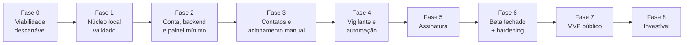

# Documento 5 — Roadmap, Critérios de Aceite e Matriz de Evidências

**Projeto:** Modo Rua
**Versão:** 2.3 | **Substitui:** versões 1.0, 2.0, 2.1 e 2.2
**Alteração da 2.2:** correções da segunda rodada de revisão (ARB2). A Fase 0 recebe a viabilidade de canal de alerta e regras de evidência para as medições; a Fase 4 recebe re-medição, carga do vigilante e orçamento de latência; itens `[ABERTO — FASE 0]` recebem marcador explícito.
**Autoridade:** este documento é a **fonte única de fases do projeto**. Documento 2 §38 e Documento 1 §28 remetem a ele; Documento 3 §48 mapeia-se às fases aqui numeradas.
**Posição na hierarquia:** nível 4 (Documento 4, núcleo §0).

---

## 1. Princípios

1. Validar primeiro o que pode inviabilizar o produto.
2. **Duas garantias distintas** (Documento 2, §4.5): a garantia local — ativar, registrar, temporizar, sobreviver a reinício — não depende de rede; a garantia externa — alguém fora do aparelho descobrir que o usuário parou de responder — depende do backend, sempre. Nenhuma fase pode confundir as duas.
3. Segurança e privacidade são requisitos funcionais.
4. Push, GPS, rede e execução em segundo plano são best-effort declarado.
5. Cada fase implementa somente seu escopo.
6. Ações irreversíveis não fazem parte do MVP.
7. Evidência inventada é falha crítica.
8. Revisão humana obrigatória em autenticação, criptografia, localização, billing, migrations, máquinas de estado e vigilante.

> **Uma fase não termina quando o código existe. Termina quando o comportamento foi comprovado.**

## 2. Timebox e corte de escopo

Cada fase recebe **alvo** e **limite duro** em semanas de calendário do fundador, definidos após decomposição em épicos, antes do início da fase. Ao atingir o limite, o escopo é reduzido segundo a prioridade do §8, e a redução consta do relatório de encerramento. **Fase sem timebox não inicia.**

## 3. Estados de entrega

| Estado | Significado |
|---|---|
| Não iniciado / Em especificação / Em desenvolvimento | Autoexplicativos |
| Implementado tecnicamente | Código existe, evidência incompleta |
| Em validação | Testes e evidências em curso |
| Aceito | Critérios atendidos e evidências aprovadas |
| Bloqueado | Dependência ou risco impede avanço |
| Redesenho necessário | Hipótese invalidada |
| Removido do escopo | Excluído do produto atual |

---

# Fase 0 — Viabilidade técnica (área descartável)

**Objetivo:** medir as hipóteses de plataforma e de loja que podem inviabilizar o produto, e produzir as declarações da Google Play.

**Natureza:** todo código desta fase é **descartável por definição**. Vive em `spike/`, fora da árvore de produção. Reuso exige reimplementação sob as regras do Documento 4.

**A isenção vale para o código, não para a evidência.** A Fase 0 é isenta das regras de código do Documento 4 — sem pisos de cobertura, sem expand-contract, sem PR pequena — sob a condição de que nada dela vá a produção. Não é isenta das regras de **evidência**, porque nesta fase a evidência *é* o entregável: o p99 medido vira `margem_de_rede` em produção e os limiares de bateria viram gate de release por ADR-0012. Portanto:

- o **método de medição é escrito e revisado antes da coleta**, não declarado depois por quem mediu;
- cada medição usa o template do Documento 4, §9, com executor humano identificado;
- as medições são **re-validadas na Fase 4 com o código de produção** (ver critérios daquela fase). O mecanismo de temporização do spike não é o de produção — o de produção nasce com `Clock` injetado, WorkManager configurado sob as regras do módulo 10 e sujeito às cotas de job do Android 16 —, logo o p99 do spike não é, por construção, o p99 do produto.

**Entregável real:** matriz de capacidade, medições e ADRs. Não é software.

### Escopo

- Protótipo mínimo: ativação, persistência de sessão e prazo, pedido de confirmação, registro de ausência, obtenção de localização, evento offline, sincronização posterior, recuperação após kill e reboot, notificação com tela bloqueada.
- Comparação dos candidatos de temporização (Documento 2, §12.2), agora com tipo de serviço em primeiro plano, timeout aplicável, viabilidade de retomada por `BOOT_COMPLETED` e efeito sobre a cota de jobs do Android 16.
- Cercas de proximidade: latência de transição, comportamento após reboot, por fabricante.
- Redação das declarações da Play (Documento 2, §34.6), incluindo o parecer de classificação como aplicativo de monitoramento — que é produzido **antes** do ADR-0007, porque pode eliminar candidato por política — e a decisão sobre `isMonitoringTool`.
- **Viabilidade do canal de alerta.** É a terceira hipótese crítica do Documento 1, §24.2, e é condição de interrupção em §32; a versão anterior a deixava para a Fase 3, isto é, depois de construir duas fases e meia. É trabalho de mesa, não de plataforma: três cotações reais de provedor de SMS; teste de entrega com números das **três principais operadoras**; medição de entrega e de tempo até entrega **por operadora**, com **link curto no corpo da mensagem**, porque operadoras brasileiras filtram SMS com URL; e planilha de custo por cadastro (a simulação de onboarding envia mensagem real), por alerta e por falso positivo, em três cenários de taxa. Saída: ADR-0011 provisório e plano B de affordance se o link for filtrado.

### Medições obrigatórias, por fabricante e por estado de bateria

| Medição | Saída |
|---|---|
| Atraso de disparo do pedido de confirmação | p50, p95 e **p99** — o p99 define a `margem_de_rede` do vigilante (Documento 2, §18.7) |
| Sobrevivência a reboot | possível / parcial / não comprovada, por conjunto de permissões |
| Sobrevivência a force-stop e a gerenciador de tarefas do fabricante | idem |
| Latência de transição de cerca de proximidade | p50 e p95 |
| Consumo em sessão de nível econômico | % por hora e % do ciclo diário, com método declarado |
| Notificação com Não Perturbe e tela bloqueada | descritivo |
| Invalidação de chave: novo cadastro biométrico, restauração, remoção de bloqueio de tela | efeito observado, **incluindo chave que aceita credencial de dispositivo** (Documento 2, §14.3) |
| Consumo com e sem heartbeat, e latência de detecção de aparelho inalcançável | % por hora; segundos até detecção — define a cadência provisória do ADR-0005 |
| Latência de execução de worker com o serviço em primeiro plano ativo versus sem ele, em Android 16 e 17 | p50/p95, por fabricante — mede o efeito da cota de jobs |
| Entrega de SMS com link curto, por operadora | taxa de entrega e tempo até entrega |
| Parcela do público-alvo sem tela de bloqueio segura | dado de mercado, para a decisão pendente do Documento 2, §14.3 |
| **Latência da confirmação: do prompt à assinatura verificada**, com biometria **e** com credencial do aparelho | p50, p95 e p99, por fabricante e por condição |
| **Custo de bateria de N confirmações por sessão**, na cadência provisória | % de carga por confirmação e por sessão, por fabricante |
| **Taxa de confirmação dentro do prazo**, sob as condições adversas da matriz de campo | taxa com **n declarado** e motivo de falha registrado — insumo do ADR-0012 |
| **Distribuição de versões do Android no público-alvo** | dado de mercado, com n e fonte — é o segundo critério que o ADR-0002 exige (Documento 2, §39) |

*Acrescentadas na 4ª rodada.* As três primeiras vêm do achado **ARB4-007**: o mecanismo do §16.8 exige autenticação a cada confirmação, várias vezes por sessão, com o celular no bolso, no metrô, com a mão molhada — e a **taxa de confirmação dentro do prazo** governa o falso positivo **externo**, que é o único que bloqueia release (módulo 40, §6). O ADR-0012 fecha esse limiar com dado desta fase, e o dado não estava sendo coletado. A quarta fecha o segundo critério do ADR-0002, que não tinha fonte prevista em nenhuma fase; é a mesma coleta, na mesma amostra, da linha anterior.

### Dependências

Quatro ou mais aparelhos reais (Samsung, Motorola, Xiaomi ou Redmi), **dois deles abaixo de API 33** — um no `minSdk` provisório 30 —, **um em Android 16 e um em Android 17**; servidor de teste; conta no Play Console; contas de teste em três operadoras; ADR-0001, 0002 e 0003 aprovados.

*Corrigido na 4ª rodada.* A dependência anterior declarava tres aparelhos, com apenas um no Android atual — e a medicao de latencia de worker exige **Android 16 e 17, por fabricante**. Com a matriz anterior a medicao nao era executavel em nenhuma das duas versoes: nao havia aparelho em 16, e um unico aparelho em 17 nao produz comparacao por fabricante.

### Critérios de aceite

- ☐ ativação local não depende de rede;
- ☐ prazo persiste com as três bases de tempo (Documento 2, §12.3) e sobrevive a reboot e a ajuste de relógio;
- ☐ evento offline sincroniza depois e reenvio não duplica efeito;
- ☐ localização exibe idade, precisão e fonte;
- ☐ **atraso de disparo medido com p99 por fabricante**;
- ☐ **consumo medido com método declarado e comparável**;
- ☐ efeito de invalidação de chave observado e documentado;
- ☐ limitações por fabricante documentadas em `docs/fabricantes/`;
- ☐ **matriz de permissões e políticas preenchida** (Documento 2, §34.5);
- ☐ **textos de declaração, roteiro de vídeo, divulgação proeminente e rascunho de Data Safety escritos** (Documento 2, §34.6);
- ☐ parecer escrito sobre a classificação como aplicativo de monitoramento;
- ☐ **entrega de SMS com link curto medida nas três principais operadoras, com plano B escrito se houver filtragem**;
- ☐ **custo por cadastro, por alerta e por falso positivo calculado em três cenários de taxa**;
- ☐ **método de medição escrito e revisado antes da coleta, com template do Documento 4, §9 preenchido por executor humano**;
- ☐ parecer de monitoramento concluído **antes** da proposta do ADR-0007, e decisão sobre `isMonitoringTool` registrada;
- ☐ ADR-0007 (temporização) e ADR-0008 (recurso principal declarado de localização em segundo plano) propostos com base nas medições;
- ☐ ADR-0011 provisório (provedor de SMS e cascata) proposto;
- ☐ **latência da confirmação medida do prompt à assinatura verificada, com biometria e com credencial do aparelho**;
- ☐ **taxa de confirmação dentro do prazo medida sob condições adversas, com n e motivo de falha declarados**, e registrada como insumo do ADR-0012;
- ☐ **distribuição de versões do Android no público-alvo levantada**, fechando o segundo critério do ADR-0002;
- ☐ **`VERIFICAR:` do Documento 2, §16.8.3 confirmado em aparelho**: `setUserAuthenticationParameters` com tempo zero implica autenticação por operação criptográfica, e não por sessão de chave — toda a garantia contra pré-assinatura repousa nisso;
- ☐ limiares provisórios de bateria e de falso positivo propostos (ADR-0012). **Este item é `[ABERTO — FASE 0]`** e só se fecha por ADR, com base em medição: nenhum agente adota número definitivo antes disso;
- ☐ nenhum arquivo promovido para a árvore de produção.

### Interromper ou redesenhar quando

A solução depender de Accessibility ou comportamento oculto; nenhum candidato de temporização entregar atraso compatível com a promessa; o consumo for incompatível com uso diário; o recurso principal de localização em segundo plano não tiver caminho de aprovação; **ou não existir canal de alerta viável a custo aceitável, inclusive por filtragem de SMS com link sem alternativa praticável** (Documento 1, §32).

---

# Fase 1 — Núcleo local validado

**Objetivo:** construir o núcleo local sob as regras do Documento 4. **Não é produto e não vai a usuário externo:** sem backend, ninguém é avisado de nada.

### Pré-condições de entrada

- ADR-0004 (chaves e backup) e **ADR-0005-A** (parâmetros provisórios) aprovados.
- **ADR-0013** (mecanismo de prova de autenticação da confirmação, Documento 2 §16.8) aprovado.
- **Decisão da tela de bloqueio segura tomada** (Documento 2, §14.3). Não é formalidade: `K_confirmacao` exige `setUserAuthenticationRequired(true)` e não é criável em aparelho sem tela de bloqueio, então o critério de aceite "confirmação assinada" é inatingível nessa classe de aparelho enquanto a decisão não existir. E a decisão depende do dado de mercado que a Fase 0 mede.
  - Alternativa, se a intenção for iniciar a Fase 1 antes de decidir: **escopar esta fase apenas para aparelhos com tela de bloqueio segura**, declarando isso como limitação **da fase**, não do produto, e movendo o teste do aparelho sem bloqueio para a fase em que a decisão existir. Essa alternativa também é escolha do fundador.

### Escopo

- Onboarding com limitações declaradas e permissões progressivas.
- Confirmação forte por biometria **ou credencial de tela de bloqueio do aparelho**. O papel do PIN interno e a exigência de tela de bloqueio segura estão **[PENDENTE — DECISÃO DO FUNDADOR]** (Documento 2, §14.3); enquanto pendente, nenhum agente implementa nenhuma das opções.
- Hierarquia de chaves `K_dados`, `K_leitura` e `K_confirmacao` (Documento 2, §14.3), com autenticação a cada uso, e política de backup nos **dois** formatos exigidos pelo `minSdk` 30 (ADR-0004).
- `StreetModeSession` conforme a tabela canônica (Documento 2, §10.1), em Kotlin puro, com evento append-only na mesma transação.
- Check-in com confirmação forte, prazo persistido nas três bases de tempo, graça e reidratação.
- Estado de cobertura visível, sempre `COBERTURA_INDISPONIVEL` nesta fase (Documento 2, §11.1 e §11.2, linha 7). **Não** `COBERTURA_LOCAL`: o texto obrigatório daquele estado promete que a conexão resolveria, e nesta fase não existe servidor a alcançar.
- Canal de notificação como pré-condição de sessão (Documento 2, §12.4).
- Retenção local e job de purga (Documento 2, §14.4).
- Fila local de sincronização, ainda sem destino.
- Histórico e configurações.

### Fora do escopo

Conta, backend, contato, painel, cobrança, escalonamento externo.

### Testes obrigatórios

**Biometria indisponível após reboot, com confirmação concluída pelo credencial do aparelho**; permissões aceitas, negadas e revogadas em sessão; **canal de notificação desativado durante sessão**; **perda de capacidade de disparo local durante sessão** (Documento 2, §12.4, item 6); tela bloqueada, processo encerrado, reboot, force-stop; relógio adiantado e atrasado; prazo vencido durante o kill; **restauração de backup por nuvem em aparelho no `minSdk` e transferência aparelho-a-aparelho, provando identidade de instalação nova nos dois casos**; **novo cadastro biométrico com sessão ativa**; **amostra de localização gravada, aplicativo morto, worker sincroniza sem qualquer autenticação do usuário**; **ação de notificação não conclui check-in**; migrations Room; estados degradados; **uma autenticação produzindo exatamente uma assinatura**; aparelho sem tela de bloqueio segura, com o comportamento definido pela decisão de entrada desta fase — se a fase foi escopada para aparelhos com bloqueio, o teste comprova a recusa explicada na ativação, não um caminho degradado.

### Critérios de aceite

- ☐ a interface declara que **esta versão não avisa contatos**, com o texto próprio de build sem backend do Documento 2 §11.1 — **não** com o texto de `COBERTURA_LOCAL`, que promete que a conexão resolveria e nesta fase é falso;
- ☐ nenhum segredo do aplicativo é usado para desbloquear chave do Keystore; a confirmação forte é concluída por biometria ou pelo credencial do aparelho, e é **assinada** por `K_confirmacao` sobre material do próprio aparelho (Documento 2, §16.8.1), **sem desafio do servidor**, com a assinatura verificada nos testes pela chave pública local — nesta fase não existe servidor, e o critério é verificável assim;
- ☐ **uma autenticação produz exatamente uma assinatura** (chave com autenticação a cada uso), comprovado em teste instrumentado;
- ☐ `K_dados` sobrevive a novo cadastro biométrico; `K_leitura` é invalidada e o app pede revinculação sem falhar em silêncio;
- ☐ **amostra de localização pendente é lida e enviada por worker sem autenticação, e apagada no ACK** — sem reencriptação e sem cópia sob `K_leitura`;
- ☐ **todas as transições da tabela de cobertura alcançáveis nesta fase — linhas 6 e 7 do Documento 2, §11.2 — têm teste**, e o texto exibido corresponde ao estado. As linhas 1 a 5 exigem servidor e são obrigação da **Fase 2**. *(Corrigido na 4ª rodada — ARB4-004: o critério anterior exigia "todas as transições", e cinco das sete são inalcançáveis nesta fase, porque o escopo fixa `COBERTURA_INDISPONIVEL`, que a linha 7 declara mutuamente exclusivo, e exclui o backend. Cumprir o critério exigiria simular servidor — proibido pelo núcleo §5 e pelo §18.7.2 — ou declarar atendido com duas de sete, que é a violação mais grave do núcleo §3.2.)*;
- ☐ **ação de notificação abre a confirmação e nunca a conclui**;
- ☐ prazo sobrevive a reboot e a ajuste de relógio;
- ☐ nenhum estado crítico só em memória;
- ☐ job de purga local funciona e é tratado como funcionalidade crítica;
- ☐ permissão negada não quebra o app; canal ausente impede a sessão com explicação e atalho;
- ☐ nenhum dado sensível em log;
- ☐ todas as transições da tabela canônica têm teste, válidas e inválidas relevantes;
- ☐ o aparelho não escala: nenhum caminho local abre protocolo ou notifica contato;
- ☐ gates de CI do Documento 4, §11 ativos e verdes;
- ☐ evidência de campo do marco arquivada em `docs/evidencias/`.

---

# Fase 2 — Conta, backend e painel mínimo

**Objetivo:** identidade, servidor, sincronização confiável e a base do painel. O servidor passa a **conhecer** sessões e prazos; ainda não age sobre eles.

### Escopo

- Cadastro, verificação, login, **sessão própria do backend** (Documento 2, §22.1), refresh com rotação e detecção de reuso, revogação testada, step-up.
- Modelo de identidade `user / device / installation` (Documento 2, §4.7); um aparelho ativo por conta; troca de aparelho com revogação.
- Vinculação explícita dos dados locais pré-conta.
- **Troca de aparelho que não encerra sessão ativa nem protocolo aberto** (Documento 2, §4.7).
- **Verificação de assinatura de confirmação no servidor** e registro da chave pública de `K_confirmacao` no vínculo da instalação (Documento 2, §16.8).
- **Fluxo de atendimento de direitos do titular** — acesso, correção, exportação e portabilidade — junto com a exclusão, no módulo `privacy` (Documento 3, §30.5).
- **Tabela de idempotência do Documento 2, §16.3 implementada por completo**, com gate de CI que reprova endpoint mutante sem linha.
- API `/api/v1` com OpenAPI; registro de sessão e prazos; heartbeat; ingestão em lote.
- `event_dedup`, cursor por instalação e **detecção de lacunas** (Documento 2, §16.6 e §19.5).
- Outbox transacional com `SKIP LOCKED` e métrica de lag (Documento 2, §20.1).
- PostgreSQL com schema pronto para particionamento; RLS com mecanismo completo ou ADR-0010 removendo-a; migrations com rollback; backups com restauração testada.
- **Painel:** login, MFA, status, cobertura, dispositivos, última comunicação e exclusão de conta.
- **Exclusão de conta no app, por endpoint e por página web pública.**
- Infraestrutura de e-mail: domínio, SPF, DKIM, DMARC, bounce, reputação (Documento 2, §25.3).
- Observabilidade com correlação; auditoria append-only.
- **Teste de carga sintético de ingestão** dimensionado para 100 mil usuários.

### Critérios de aceite

- ☐ autenticação não revela existência de conta;
- ☐ refresh reutilizado revoga a família e gera evento `SECURITY`;
- ☐ revogação de sessão comprovadamente efetiva;
- ☐ cada instalação tem identidade própria, não restaurável por backup;
- ☐ duplicatas não repetem efeito; eventos fora de ordem reconciliam; **lacuna de sequência é detectada e sinalizada**;
- ☐ **o painel exige MFA e step-up para dados sensíveis**;
- ☐ exclusão de conta funciona pelos três caminhos e está coerente com a Data Safety;
- ☐ **exportação e pedidos de acesso, correção e portabilidade funcionam, com step-up e registro em `privacy_requests`**;
- ☐ **troca de aparelho com sessão ativa e com protocolo aberto não desarma o vigilante**;
- ☐ **confirmação sem assinatura válida é rejeitada; `confirmation_type` é derivado da verificação, não declarado pelo cliente**;
- ☐ **evento acima da idade máxima é rejeitado com `EVENT_TOO_OLD` e registra lacuna** (Documento 2, §16.7);
- ☐ **as transições 1 a 5 da tabela de cobertura (Documento 2, §11.2) têm teste** — as que exigem servidor e por isso não eram alcançáveis na Fase 1 (ARB4-004);
- ☐ **confirmação assinada fora de ordem é aceita, não rejeitada**: `sequence` não contígua registra lacuna e a confirmação vale, desde que o `check_in_id` esteja sem uso e o evento esteja dentro da idade máxima (Documento 2, §16.8.1, alínea "Ordem" — ARB4-001);
- ☐ **decisão registrada de acionar ou não o ADR-0009 com base no resultado do teste de carga**;
- ☐ todo endpoint com identificador de recurso tem teste negativo de autorização;
- ☐ OpenAPI corresponde ao código;
- ☐ restauração de backup testada e registrada;
- ☐ `outbox_lag` instrumentado e alertado;
- ☐ e-mail transacional entregue e monitorado;
- ☐ teste de carga executado com resultado documentado.

---

# Fase 3 — Contatos e acionamento manual

**Objetivo:** rede de confiança consentida e o **caminho de emergência mais confiável do produto: o acionamento manual**. Sem automação.

### Escopo

- Convite com expiração, aceite explícito, criação de conta e MFA do contato **no aceite** (Documento 2, §24).
- Concessões com escopo, duração, revogação e auditoria visível ao titular.
- Antiabuso de convite: transparência pré-aceite, retenção curta, rate limit, recusa e bloqueio de reenvio.
- **Acionamento manual de emergência pelo titular**, abrindo protocolo em `ALERTANDO` (Documento 2, §10.2, linha 2).
- **Canal SMS** com provedor contratado (ADR-0011, já proposto na Fase 0) e cascata com registro de ciência (Documento 2, §25.1 e §25.2), com a affordance definida pelo resultado do teste de filtragem de link.
- Número de contatos no MVP conforme a decisão pendente do Documento 2, §10.2. Enquanto pendente, um contato, e a escalada entre contatos não é implementada.
- Página de emergência com token opaco, expiração, escopo, revogação, `noindex` e nenhum dado no path.
- **Simulação de protocolo**: marcada em todas as mensagens, limitada, auditada, exigindo contato que já aceitou, excluída das métricas reais.
- Painel: visão de emergência e histórico de acessos.

### Critérios de aceite

- ☐ aceite explícito, com conta e MFA criadas no aceite;
- ☐ convite expira, não é reutilizável e não pode ser sequestrado;
- ☐ concessão tem escopo e duração; revogação é imediata e comprovada;
- ☐ o contato não acessa histórico completo, não altera conta e **não altera estado de protocolo**;
- ☐ todo acesso à localização é auditado e visível ao titular;
- ☐ links não contêm coordenadas; SMS não contém coordenada, endereço nem nome completo;
- ☐ **tempo entre `ALERTANDO` e primeira ciência do contato medido e registrado**;
- ☐ simulação é inequivocamente identificada como teste e não polui métrica;
- ☐ textos revisados contra o Documento 3, §23.4;
- ☐ cenários de abuso testados: convite em massa, contato errado, link encaminhado, acesso após encerramento;
- ☐ revisão jurídica preliminar do convite e da base legal do tratamento pré-aceite.

---

# Fase 4 — Vigilante e automação

**Objetivo:** o servidor passa a agir sobre prazos vencidos, com escalonamento progressivo, reversível e protegido contra falha correlacionada.

### Escopo

- Vigilante idempotente de prazo (Documento 2, §18.7), com mecanismo de execução declarado (fila com entrega retardada mais varredura de segurança) e `margem_de_rede` derivada da medição da Fase 0.
- **Re-medição do atraso de disparo com o código de produção** na matriz mínima, e revalidação da `margem_de_rede`.
- **Limite do servidor sobre `expected_next_checkin_at` e `grace_seconds`** (Documento 2, §18.7, item 2a).
- **Orçamento de latência ponta a ponta** (Documento 2, §12.5) medido do prazo vencido à primeira ciência.
- **Teste de carga do vigilante** em pico sazonal e em tempestade de recuperação.
- Comportamento terminal de `ALERTANDO` e estado `SEM_CIENCIA` (Documento 2, §10.2).
- `EmergencyProtocol` completo (Documento 2, §10.2), incluindo `RETIDO`.
- Janela de reconciliação para eventos atrasados do aparelho.
- Guarda de anomalia correlacionada, com liberação humana registrada (Documento 2, §18.7.1).
- Supressão por indisponibilidade conhecida do próprio backend.
- Regra do canal de notificação desativado em sessão (Documento 2, §12.4): primeira verificação dirigida ao titular, não ao contato.
- Falso positivo: classificação, encerramento seguro, métrica em duas camadas.
- Encerramento autenticado que não depende do aparelho perdido.

### Critérios de aceite

- ☐ ausência de resposta **nunca** gera ação destrutiva;
- ☐ **o alerta dispara com o aparelho desligado, em modo avião, com bateria esgotada e após force-stop** — comprovado em aparelho físico;
- ☐ escalonamento é progressivo e todo estado é reversível;
- ☐ confirmação tardia do titular encerra com segurança e classifica o falso positivo;
- ☐ duplicatas não repetem alerta; eventos fora de ordem não reabrem protocolo encerrado;
- ☐ localização exibe idade, precisão e fonte; posição antiga nunca aparece como atual;
- ☐ o contato recebe apenas o necessário e não consegue alterar o protocolo;
- ☐ guarda de anomalia testada com simulação de falha correlacionada em massa **e com base de 30 sessões**, com comportamento definido nos dois regimes;
- ☐ **200 simulações em uma hora não afetam a guarda** — nem numerador, nem linha de base, nem denominador;
- ☐ **p99 de atraso re-medido com código de produção; `margem_de_rede` revalidada; ADR-0007 revisado se a divergência exceder o limiar declarado**;
- ☐ **soma ponta a ponta medida e dentro do teto do ADR-0005**;
- ☐ **agressor com aparelho desbloqueado não consegue desarmar o vigilante alterando intervalo ou graça**;
- ☐ **recuperação após indisponibilidade própria não gera abertura em massa: prazos vencidos na janela são suprimidos, reagendados com jitter e auditados**;
- ☐ **encerramento offline resolvido conforme a decisão pendente do Documento 2, §10.4, sem alerta sobre sessão legitimamente encerrada**;
- ☐ indisponibilidade do backend não gera protocolo;
- ☐ todas as transições da tabela canônica do servidor têm teste, e a matriz de precedência do Documento 2 §10.3 está coberta;
- ☐ recuperação de conta revoga sessões e concessões antigas.

---

# Fase 5 — Assinatura e operação comercial

### Escopo

Teste gratuito; Play Billing; planos mensal e anual; entitlements no backend; cancelamento; restauração; estados de assinatura; analytics sem dado sensível; suporte; termos; política de privacidade; runbooks; **matriz de bases legais por finalidade com revisão jurídica** (Documento 3, §30.3 e §31); custo por usuário e **por alerta**.

### Critérios de aceite

- ☐ entitlement validado no servidor; webhooks idempotentes; compra restaurável;
- ☐ **sessão ativa e protocolo aberto não são interrompidos por estado de cobrança**; a restrição incide só em nova ativação;
- ☐ encerrar protocolo, ver histórico próprio, exportar e excluir conta permanecem disponíveis sem assinatura;
- ☐ termos e política correspondem ao comportamento real; Data Safety coerente;
- ☐ base legal definida por finalidade, com teste de balanceamento onde houver legítimo interesse;
- ☐ analytics não recebe localização precisa;
- ☐ declaração de idade no cadastro e termos 18+ implementados;
- ☐ suporte e resposta a incidentes com procedimento escrito.

---

# Fase 6 — Beta fechado e hardening

**Etapas:** Beta A com 20 a 50 usuários acompanhados de perto; Beta B até 100, com maior diversidade, apenas após correções.

**Matriz mínima:** Samsung, Motorola, Xiaomi ou Redmi, aparelho no `minSdk`, Android atual, pouca RAM, economia extrema, operadoras e redes distintas.

**Testes de rua simulados:** caminhada, ônibus, carro, metrô, garagem, elevador, ausência de sinal, modo avião, bateria baixa, tela bloqueada, processo encerrado, force-stop, reboot. Nenhum teste simula crime real nem expõe participante a risco.

### Métricas

Conclusão de onboarding; primeira sessão; check-ins; **falso positivo interno e externo, separados**; atraso de alerta; **tempo até ciência do contato**; sync; lacunas; crash e ANR; consumo; permissões negadas; suporte; conversão de teste.

### Saída da fase — gate de hardening (Documento 3, §48.3)

- ☐ **pentest externo executado e achados críticos corrigidos**;
- ☐ **RIPD elaborado**;
- ☐ **testes antiabuso executados**: parceiro instala, contato compartilha, recuperação social, falso alerta deliberado, conta dominada, usuário coagido, administrador curioso;
- ☐ **restauração de backup comprovada**;
- ☐ **resposta a incidentes exercitada** e runbooks escritos, incluindo pedido de autoridade, descontinuidade do operador e falha correlacionada de alertas;
- ☐ **revisão jurídica concluída**;
- ☐ **plantão mínimo definido**, com alerta sonoro, runbook de três ações e contato técnico de contingência;
- ☐ limiares de bateria e falso positivo revisados por ADR com dados reais;
- ☐ nenhum bloqueador da lista canônica do Documento 3, §51 em aberto.

---

# Fase 7 — MVP público

**Gate de loja desta fase:** declaração de escopo mínimo de `ACCESS_FINE_LOCATION` submetida e aprovada, se o aplicativo já alvejar Android 17 ou superior (Documento 2, §34.5). O rascunho vem da Fase 0.

**Estratégia:** Rio de Janeiro, orçamento pequeno, rollout gradual (1%, 5%, 20%, 50%, 100%), suporte próximo, monitoramento diário, comunicação sem promessa absoluta. A limitação geográfica é de marketing, não restrição técnica artificial.

### Entrada da fase

Todos os itens de saída da Fase 6 concluídos. Sem exceção.

### Critérios de aceite

- ☐ rollout progressivo com critérios de avanço por faixa (Documento 4, módulo 50, §8);
- ☐ funil mensurável com **n declarado**;
- ☐ SLA de suporte definido e cumprido; correções críticas rápidas;
- ☐ nenhum incidente crítico aberto;
- ☐ degradação do backend comunicada ao usuário como cobertura suspensa, nunca silenciosa;
- ☐ reviews acompanhados; backlog orientado por dados.

---

# Fase 8 — Produto investível

**Entregáveis:** apresentação; vídeo com limitações honestas; demonstração em ambiente separado, com dados fictícios e nenhum recurso simulado como real; métricas; depoimentos autorizados; data room jurídico com termos, política, LGPD, RIPD, fornecedores, propriedade intelectual e documentação societária; plano de uso do capital.

### Critérios de aceite

- ☐ **toda métrica apresentada declara n e intervalo**; percentual sem denominador é proibido;
- ☐ sinal qualitativo e tração estatística apresentados separadamente;
- ☐ CAC e churn não são apresentados como estáveis com amostra pequena;
- ☐ hipótese e dado real separados;
- ☐ riscos principais documentados, incluindo continuidade do operador;
- ☐ due diligence básica preparada.

---

## 4. Gate geral de avanço

Uma fase avança quando: objetivo alcançado; entregáveis existem; testes obrigatórios executados; critérios de aceite atendidos; evidências arquivadas em `docs/evidencias/`; riscos críticos resolvidos; limitações declaradas; documentação atualizada; **ADRs pendentes da fase aprovados**; fundador aprovou; revisão humana ocorreu nas áreas críticas.

## 5. Condições de bloqueio

A lista canônica é o **Documento 3, §51**. Este documento não mantém cópia própria: qualquer cópia é gerada e validada automaticamente contra a origem (Documento 4, §11).

## 6. Matriz de evidências

| Área | Evidência mínima | Fases |
|---|---|---|
| Código | PR, commit, CI e revisão | Todas |
| Unitários | regras, máquinas de estado, tempo, precedência | 0–8 |
| Integração | API, banco, sync, outbox, vigilante, billing | 2–8 |
| Instrumentados | permissões, Room, agendamento, UI | 0–8 |
| Aparelho físico | por marco e por mudança de comportamento observável | 0, 1, 3, 4, 6, 7 |
| Offline e reboot | persistência, sincronização, reidratação | 0–8 |
| Bateria | medição com método declarado | 0, 1, 6, 7 |
| Localização | idade, precisão, fonte, retenção | 0, 2, 4, 6 |
| Autorização | teste negativo por endpoint | 2–8 |
| Antiabuso | parceiro, familiar, contato, convite | 3–8 |
| Vigilante | escalonamento com aparelho ausente; carga em pico e em recuperação; limite de parâmetros vindos do aparelho | 4–8 |
| Canal de alerta | entrega e tempo até entrega de SMS com link, por operadora; custo por cadastro, alerta e falso positivo | 0, 3, 6–8 |
| Chaves e confirmação | autenticação a cada uso; amostra pendente legível por worker; assinatura verificada; exclusão de backup por nuvem e por transferência | 0–8 |
| Billing | compra, cancelamento, restauração, expiração com protocolo aberto | 5–8 |
| Jurídico | termos, política, bases legais, RIPD | 5–8 |
| Mercado | ativação, retenção e CAC com n declarado | 6–8 |

Template de evidência: **Documento 4, §9** (canônico). Este documento não mantém template próprio.

## 7. Relatório de encerramento de fase

Objetivo; resultado alcançado; funcionalidades aceitas e não aceitas; testes executados; evidências; métricas; riscos remanescentes; limitações; incidentes; débitos técnicos; **itens cortados por timebox**; decisão (avançar, corrigir antes de avançar, redesenhar, interromper); aprovadores.

## 8. Prioridade do backlog

1. risco físico; 2. segurança e privacidade; 3. perda de dados; 4. confiabilidade do protocolo; 5. falsos positivos; 6. bloqueadores de publicação; 7. ativação; 8. retenção; 9. receita; 10. conveniência; 11. estética.

## 9. Sequência aprovada até o congelamento

1. Atualizar Documentos 1 a 5.
2. Criar ADRs estruturais (Documento 2, §39).
3. Implementar regras e CI mínimo (Documento 4, §11).
4. **Revisão de acompanhamento restrita aos itens críticos → congelamento → Fase 1.**

A Fase 0 corre em paralelo aos passos 1 a 3, em área descartável.

> **Sem evidência, não há aceite. Sem aceite, não há avanço.**
